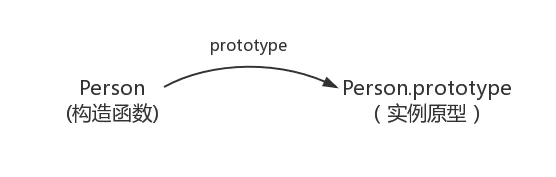
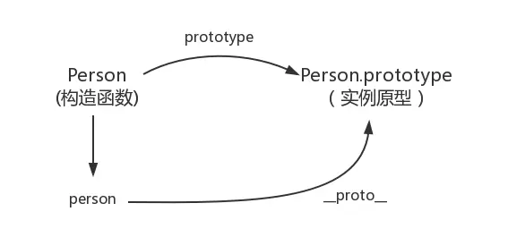
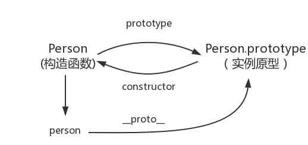

@[JS三座大山之原型和原型链](https://github.com/danygitgit/document-library)

> create by **db** on **2021-1-12 16:47:32**  
> Recently revised in **2021-1-13 19:36:35**
>
> **闲时要有吃紧的心思，忙时要有悠闲的趣味**

<a id="catalog">目录</a>

- [前言](#preface)

- [正文](#main-body)

- [总结](#summary)

# <a  id="preface">前言</a>

> [返回目录](#catalog)

&emsp;作为一个前端工程师，JavaScript 应该是我们赖以生存的本事了。那么，你知道所谓的 JavaScript 的三座大山是什么吗？

&emsp;对！那就是我们刚学习 js 时老师所强调的：

- 原型和原型链

- 作用域和闭包

- 异步和单线程

下面我们就来爬上第一座大山——原型和原型链，去领略一下吧。

# <a  id="main-body">正文</a>

> [返回目录](#catalog)

## 原型

### 什么是原型？

&emsp;要想知道这个问题的答案，为我们需要从 JavaScript 第一课——`数据类型`开始里聊起。

### JavaScript 数据类型

&emsp;众所周知，JavaScript 是一门弱类型语言，具有如下的数据类型

- **值类型(基本类型)：** 字符串（String）、数字(Number)、布尔(Boolean)、对空（Null）、未定义（Undefined）、Symbol。

- **引用数据类型：**对象(Object)、函数(Function)。

&emsp;而**原型**需要研究的就是引用数据类型——`object`和`function`，他们可以统称为**对象**

### 对象

&emsp;接口传参要对象，数据处理要对象，编程过程中，我们总是随手就 new 一对象，那到底什么是对象呢？

&emsp;那你就有可能说：**万物皆对象**

&emsp;——这话没毛病！

&emsp;在 JavaScript 的世界里，我们只有两个东西：`变量`和`函数`，变量拥有数据，而函数是会被执行的一些特殊的行为。我们将变量和函数保存到一个单元中，并将封装为完整实体，这就是`对象`。
&emsp;一言以蔽之，对象就是一些变量和函数的集合,举个栗子 🌰

```js
let laoWang = {
  name: '老王',
  feature: '热心肠',
  skill: function () {
    console.log('特长是修水管')
  },
}
```

### 构造函数

&emsp;说完了对象，我们来看看构造函数。

#### 什么是构造函数？

&emsp;当任意一个普通函数用于创建一个类对象时，它就被称作**构造函数**，或构造器。

它有几点特性：

1. 构造函数的首字母必须大写，用来区分于普通函数

2. 内部使用的 this 对象，来指向即将要生成的实例对象

3. 使用 New 来生成实例对象并返回此对象

举个栗子 🌰

```js
function Person(name, feature, skill) {
  this.name = name
  this.feature = feature
  this.skill = function () {
    console.log(skill)
  }
}
let laoWang = new Person('老王', '热心肠', '特长是修水管')

let laoLi = new Person('老李', '爱串门', '亲切问候邻居家孩子')

console.log(laoWang.skill === laoLi.skill) //false
```

&emsp;这样，我们就能只要传三个参数，就能很快的 new 出来一个`laoWang`。

#### 构造函数有啥用

&emsp;也许你要问了，这样 new 出来的`laoWang`跟自己定义的也没区别吗？何必多此一举呢？

&emsp;自定义对象的时候，我们把每一人的信息当做一个对象来处理。但是，我们会发现，我们重复地写了很多无意义的代码。比如 name、feature、skill 。如果老王有 60 个邻居，我们得重复写 60 遍。

&emsp;当创建构造函数以后， 我们就可以通过 new 关键字调用，也就是通过构造函数来创建对象了。

```js
let laoLi = new Person('老李', '爱串门', '亲切问候邻居家孩子')
let laoZhang = new Person('老张', '爱下棋', '打遍全村无敌手')
```

&emsp;此时你会发现，创建对象会变得非常方便。所以，虽然封装构造函数的过程会比较麻烦，但一旦封装成功，我们再创建对象就会变得非常轻松，这也是我们为什么要使用构造函数的原因。

### constructor(构造器)

&emsp;说完了对象和构造函数，那么他们来有啥关系呢？

```js
function Person(name) {
  this.name = name
}
const person = new Person('laoWang')
```

&emsp;在上面代码中，有构造函数 `Person` 和它的实例 `person`

&emsp;在 JavaScript 中，每个实例都会有个隐藏属性 `constructor。`

&emsp;而构造函数和实例存在一个等式：

```js
person.constructor === Person // true
```

所以我们得出一个结论，划重点：

**实例对象的属性 `constructor` 指向创建此实例的构造函数**

同时，这个函数的原型的 constructor 会指向这个函数：

```js
Person.prototype.constructor === Person // true
```

当然，这个构造函数的 `constructor` 会指向创建此函数的构造函数。即

```js
Person.constructor === Function // true
```

### prototype(原型)

&emsp;上面扯了半天对象和函数，到这里终于讲到本文的主要内容了--**原型(prototype)**。

&emsp;讲原型之前，要先说下构造函数的缺点：

- 所有的实例对象都可以继承构造器函数中的属性和方法。但是，不同对象实例之间，无法共享属性

啥意思呢？举个栗子 🌰

```JS
function Person(name, feature, skill) {
  this.name = name
  this.feature = feature
  this.skill = function () {
    console.log(skill)
  }
}

let laoWang = new Person('老王', '热心肠', '特长是修水管')
let laoLi = new Person('老李', '爱串门', '亲切问候邻居家孩子')

laoWang.skill()  // 特长是修水管
laoLi.skill()  // 亲切问候邻居家孩子

Person.skill = function () {
  console.log('我是Person，我喂自己袋盐')
}

laoWang.skill()  // 特长是修水管
laoLi.skill()  // 亲切问候邻居家孩子

console.log(laoWang.skill === laoLi.skill);  // false
```

&emsp;通过以上例子可以看出，`laoWang`和`laoLi`虽然都是同一构造函数`Person`创建的，但他们都是独立的个体，不会随着构造函数的更改而更改——儿大不由娘！

&emsp;这样的缺点就是：倘若我们我们需要修改或自改所有人的属性及方法的话，只能在函数初始化的时候修改，或者去每个实例对象挨个修改才行。

&emsp;那如果我们希望修改构造函数之后，其构造出来的示例对象也跟着改变，应该怎么办呢？答案就是**原型（prototyp）**

划重点：

&emsp;**在 JavaScript 中，每个`函数`都有一个 `prototype` 属性，这个属性的指向被称为这个函数的`原型对象`（简称原型）**



所谓原型，具体实现思路如下：

1. 我们给老王和他的朋友们搞一个老年活动中心（prototype）

2. 大家需要什么东西（重复使用或者公用），我们直接放在老年活动中心（prototype），统一更换维修

3. 老王和他的朋友们如果需要什么，就去老年活动中心（prototype）拿就好

举个栗子 🌰

```JS
function Person(name, feature, skill) {
  this.name = name
  this.feature = feature
  this.mySkill = skill
}

Person.prototype.skill = function() {
console.log(this.mySkill);
};

let laoWang = new Person('老王', '热心肠', '特长是修水管')
let laoLi = new Person('老李', '爱串门', '亲切问候邻居家孩子')

laoWang.skill()  // 特长是修水管
laoLi.skill()  // 亲切问候邻居家孩子

Person.prototype.skill = function () {
  console.log('我是Person，我喂自己袋盐')
}

laoWang.skill()  // 我是Person，我喂自己袋盐
laoLi.skill()  // 我是Person，我喂自己袋盐
console.log(laoWang.skill === laoLi.skill);  //true
```

&emsp;这样，我么通过更改构造函数的原型（即`Person.prototype`）的属性和方法，就能更改所有其构造出来的实例对象——很简单对吧。

### _ proto_（隐式原型）

&emsp;理解了`prototype`，我们看看`_ proto_`是什么？

&emsp;在上面，我们讲过 `Person` 有个属于自己的老年活动中心：`Person.prototype`。

&emsp;那么，对老王来说，怎么才能心走到老年活动中心呢？（`laoWang`怎么找到 `Person.prototype`）

继续划重点：

**JavaScript 中，所有的引用类型（对象）都有一个`__proto__`属性，指向它的构造函数的`prototype`属性**



看代码：

```js
function Person() {}
const person = new Person()

console.log(person.__proto__ === Person.prototype) // true
```

### 这就是原型

&emsp;至此，我们的线索就连上了。我们尝试着解释下原型是个啥：

- 原型是对象的一个属性（prototype），它也是个对象

- 原型的所有属性和方法，都会被构造函数的实例继承

- 所有的函数都有一个`prototype`对象属性，指向它的原型。

- 所有的引用类型（对象），都有一个`__proto__`属性，指向它的构造函数的原型



## 原型链

### 什么是原型链

&emsp;知道了什么是原型，我们再看看原型链。

&emsp;我们知道有供应链，区块链，他们有个相同点，那就是**链**。那么，原型链是怎样的一条链呢？

看例子:

```js
Object.prototype.firstSkill = function () {
  console.log('吃饭')
}

function Person() {}
Person.prototype.secondSkill = function () {
  console.log('睡觉')
}

let laoWang = new Person()

laoWang.thirdSkill = function () {
  console.log('修下水道')
}

laoWang.thirdSkill() //修下水道

laoWang.secondSkill() // 睡觉

laoWang.firstSkill() //吃饭

laoWang.fourthSkill() // TypeError: laoWang.fourthSkill is not a function
```

&emsp;我们分步理解一下这段代码：

1. 执行`thirdSkill()`

&emsp;这很好理解，这是老王自己的方法。

2. 执行 `secondSkill()`

&emsp;此时发生了什么？这里再记住一个重点

**当试图得到一个对象的某个属性时，如果这个对象本身没有这个属性，那么会去它的`_proto_`（即它的构造函数的 prototype）中寻找**
&emsp;因此 `laoWang` 就会找到 Person.prototype.secondSkill。

3. 执行 `firstSkill()`

&emsp;因为`laoWang`本身没有 `firstSkill()`，并且`laoWang.__proto__`（即`Person.prototype`）中也没有`firstSkill()`。这个问题还是得拿出刚才那句话——**当试图得到一个对象的某个属性时，如果这个对象本身没有这个属性，那么会去它的**proto**（即它的构造函数的 prototype）中寻找**。

&emsp;然后`laoWang`就开始了他的寻 skill 之旅：

- `laoWang.__proto__` 即 `Person.prototype`，没有找到`firstSkill()`，继续往上找

- `laoWang.__proto__.__proto__`即`Person.prototype.__proto__`。`Person.prototype`就是一个普通的对象，因此`Person.prototype.__proto__`就是`Object.prototype`，在这里可以找到`firstSkill()`

- 因此`laoWang.firstSkill()`最终对应到了`Object.prototype.firstSkill()`,这也生动的诠释了**万物皆对象**

&emsp;这样一直往上找，你会发现是一个链式的结构，所以叫做**原型链**。

4. 执行 `fourthSkill()`

&emsp;`laoWang`如果一直找到最上层都没有找到`fourthSkill()`，那么就宣告失败，返回`undefined`或者报错。

&emsp;那原型链的最上层是什么？别问，问就是`null`


```js
console.log(Object.prototype.__proto__ === null) // true
```

&emsp;所谓“无名，天地之始”，古人诚不欺我也。

### 其他

#### new

&emsp;我们 coding 的时候随手就 new 一个对象，那你知道 js 中的 new()到底做了什么?

&emsp;要创建 Person 的新实例，必须使用 new 操作符。以这种方式调用构造函数实际上会经历以下 4 个步骤：

1. 创建一个新对象；
2. 将构造函数的作用域赋给新对象（因此 this 就指向了这个新对象） ；
3. 执行构造函数中的代码（为这个新对象添加属性） ；
4. 返回新对象。

#### this

&emsp;先搞明白一个很重要的概念 —— `this` 的值是在执行的时候才能确认，定义的时候不能确认！ 为什么呢 —— 因为 this 是执行上下文环境的一部分，而执行上下文需要在代码执行之前确定，而不是定义的时候。

看如下例子

```js
var a = {
  name: 'A',
  fn: function () {
    console.log(this.name)
  },
}
a.fn() // this === a
a.fn.call({ name: 'B' }) // this === {name: 'B'}
var fn1 = a.fn
fn1() // this === window
```

this 执行会有不同，主要集中在这几个场景中

- 作为构造函数执行，构造函数中
- 作为对象属性执行，上述代码中 a.fn()
- 作为普通函数执行，上述代码中 fn1()
- 用于 call apply bind，上述代码中 a.fn.call({name: 'B'})

#### 继承

&emsp;为什么会说到继承呢，因为继承是通过原型链来体现的。我们先看一段代码：

```js
function Person() {}

var p1 = new Person()
Person.prototype.name = '老王'
Person.prototype.age = '99'

console.log(p1.name) //'老王'
```

&emsp;以上代码中，p1 是 Person 实例化出来的函数，我并没有给 p1 定义 name 这个属性，那 p1.name 是怎么来的--是从 Person.prototype 来的，因为 p1.* proto*指向 Person.prototype，当访问对象的某个属性时，现在这个对象本身去找，如果找不到那就顺着* proto*往上找，直到找到或者 Object.prototype 为止。

&emsp;由于所有的对象的原型链都会找到 Object.prototype，因此所有的对象都会有 Object.prototype 的方法。这就是所谓的**继承**。

# <a  id="summary">总结</a>

> [返回目录](#catalog)

&emsp;关于原型和原型链，就先说这些了。好好学习，天天向上。

&emsp;路漫漫其修远兮，与诸君共勉。
## 参考文档：

- [关于原型和原型链的详细理解 | 博客园-我住隔壁我姓吴 ](https://www.jianshu.com/p/700a2a579351)

- [jsliang 求职系列 - 02 - 原型与原型链 | 掘金-jsliang ](https://juejin.cn/post/6890716797436166152)

- [完全搞懂 js 中的 new()到底做了什么? | CSDN-一晌贪欢 i](https://blog.csdn.net/qq_27674439/article/details/99095336)


**后记：Hello 小伙伴们，如果觉得本文还不错，记得点个赞或者给个 star，你们的赞和 star 是我编写更多更丰富文章的动力！[GitHub 地址](https://github.com/danygitgit/document-library)**

# 文档协议

> <a rel="license" href="http://creativecommons.org/licenses/by-nc-sa/4.0/"></a><br /><a xmlns:dct="http://purl.org/dc/terms/" property="dct:title">**db** 的文档库</a> 由 <a xmlns:cc="http://creativecommons.org/ns#" href="db" property="cc:attributionName" rel="cc:attributionURL">db</a> 采用 <a rel="license" href="http://creativecommons.org/licenses/by-nc-sa/4.0/">知识共享 署名-非商业性使用-相同方式共享 4.0 国际 许可协议</a>进行许可。<br />基于<a xmlns:dct="http://purl.org/dc/terms/" href="https://github.com/danygitgit" rel="dct:source">https://github.com/danygitgit</a>上的作品创作。<br />本许可协议授权之外的使用权限可以从 <a xmlns:cc="http://creativecommons.org/ns#" href="https://creativecommons.org/licenses/by-nc-sa/2.5/cn/" rel="cc:morePermissions">https://creativecommons.org/licenses/by-nc-sa/2.5/cn/</a> 处获得。
