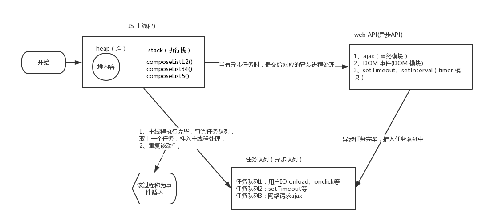
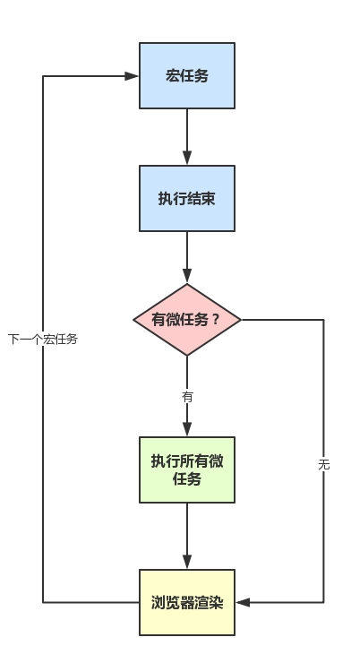

@[JS 三座大山之异步和单线程](https://github.com/danygitgit/document-library)

> create by **db** on **2021-1-22 16:47:32**  
> Recently revised in **2021-1-28 09:47:05**
>
> **闲时要有吃紧的心思，忙时要有悠闲的趣味**

<a id="catalog">目录</a>

- [前言](#preface)

- [正文](#main-body)

- [总结](#summary)

# <a  id="preface">前言</a>

> [返回目录](#catalog)

&emsp;作为一个前端工程师，javaScript 应该是我们赖以生存的本事了。那么，你知道所谓的 javaScript 的三座大山是什么吗？

&emsp;对！那就是我们刚学习 js 时老师所强调的：

- 原型和原型链

- 作用域和闭包

- 异步和单线程

下面我们就来爬上第一座大山——原型和原型链，去领略一下吧。

# <a  id="main-body">正文</a>

> [返回目录](#catalog)

## 异步和同步

### 同步（Synchronous）

&emsp;举个例子来说，一家餐厅吧来了 5 个客人，同步的意思就是说，来第一个点菜，点了个鱼，好， 厨师去捉鱼杀鱼，过了半小时鱼好了给第一位客人，开始下位一位客人，就这样一个一个来，按顺序来。

**同步的优点**

- 同步是按照顺序一个一个来，不会乱掉，更不会出现上面代码没有执行完就执行下面的代码，

**同步的缺点**

- 解析的速度没有异步的快；

举个栗子：

```js
console.log(100)

alert(200)

console.log(300)

// 100
// 300
// 200
```

&emsp;我们发现最开始输出 `100`，然后弹出了 `200`，再不点击`确认`的情况下，永远不会输出 `300`，这就是同步，顺序执行。

### 异步（Asynchronous）

&emsp;异步的意思就是来第一位客人，点什么，点鱼，给它一个牌子，让他去一边等吧，下一位客人接着点菜，点完接着点让厨师做去吧，哪个的菜先好就先端出来。

**异步的优点**

- 异步是接取一个任务，直接给后台，在接下一个任务，一直一直这样，谁的先读取完先执行谁的，

**异步的缺点**

- 没有顺序 ，谁先读取完先执行谁的 ，会出现上面的代码还没出来下面的就已经出来了，会报错；

举个栗子：

```js
console.log(100)

setTimeout(function () {
  console.log(200)
}, 1000)

console.log(300)

// 100
// 300
// 200
```

&emsp;运行之后我们会发现，先输出了 `100`，然后是 `300`，1 秒之后再输出了 `200`，这就是异步,即下面的代码不受上面代码的影响。

&emsp;对比之后我们发现，同步是有**阻塞**的，需要等待前面的执行完才会继续执行后面代码。而异步是**非阻塞**的，无需等待。

### 什么时候需要异步

**需要等待但是又不能阻塞程序的时候需要使用异步**

前端使用异步的场景有：

1. 定时任务

- setTimeout,setInverval

2. 网络请求

- ajax 请求，img 图片的动态加载

3. 事件绑定或者叫 DOM 事件

- 比如一个点击事件，我不知道它什么时候点，但是在它点击之前，我该干什么还是干什么。用 addEventListener 注册一个类型的事件的时候，浏览器会有一个单独的模块去接收这个东西，当事件被触发的时候，浏览器的某个模块，会把相应的函数扔到异步队列中，如果现在执行栈中是空的，就会直接执行这个函数。

4. ES6 中的 Promise

## 单线程与多线程

### 什么是进程？

**进程就像一个车间**

&emsp;当一个程序开始运行时，它就是一个进程，进程包括运行中的程序和程序所使用到的内存和系统资源。

&emsp;而一个进程又是由多个线程所组成的。

### 什么是线程？

**线程就像车间里的工人**

&emsp;线程是程序中的一个执行流，每个线程都有自己的专有寄存器(栈指针、程序计数器等)，但代码区是共享的，

&emsp;即不同的线程可以执行同样的函数。

### 什么是多线程？

&emsp;多线程是指程序中包含多个执行流，即在一个程序中可以同时运行多个不同的线程来执行不同的任务。

&emsp;也就是说允许单个程序创建多个并行执行的线程来完成各自的任务。

**多线程的好处：**

- 可以提高 CPU 的利用率。在多线程程序中，一个线程必须等待的时候，CPU 可以运行其它的线程而不是等待，

- 这样就大大提高了程序的效率。

**多线程的不利方面：**

- 线程也是程序，所以线程需要占用内存，线程越多占用内存也越多；
- 多线程需要协调和管理，所以需要 CPU 时间跟踪线程；
- 线程之间对共享资源的访问会相互影响，必须解决竞用共享资源的问题；
- 线程太多会导致控制太复杂，最终可能造成很多 Bug；

### 什么是单线程？

&emsp;单线程是指程序中仅包含 1 个执行流，即一次只能执行一个任务

&emsp;也就是说程序执行时，所跑的程序路径（处理的东西）是连续顺序下来的，必须前面的处理好，后面的才会执行到。

**单线程的优点：**

- 单线程顺序执行任务的方式比较符合编程人员按顺序思考的思维方式，不需要考虑太多状况，实现起来比较简单，执行环境相对单纯；

**单线程的缺点：**

- 效率低，只要有一个任务耗时很长，后面的任务都必须排队等着，会拖延整个程序的执行

## js实现异步的解决方案

### JavaScript 是单线程的

&emsp;我们都知道，avaScript是一门**单线程、非阻塞**的脚本语言

&emsp;那为什么不设计成多线程？

- 假设有个 `DOM` 节点，现在有线程 `A` 操作它，删除了这个 `DOM`；
- 然后线程 `B` 又操作它，修改了这个 `DOM` 某部分。
- 那么现在问题来了，咱听谁的？
- 
&emsp;所以，为了避免复杂性，从一诞生，JavaScript 就是单线程，这已经成了这门语言的核心特征，将来也不会改变。

&emsp;哪怕后期 `HTML5` 出了个 `Web Worker` ，但是仅仅能进行计算任务，不能操作 DOM，所以本质上还是单线程。

### 浏览器内核是多线程的

&emsp;而 JavaScript 是运行在浏览器或者 nodeJS 中的， 浏览器内核是怎样的呢？

&emsp;浏览器内核是多线程的，在内核控制下各线程相互配合以保持同步，一个浏览器通常由以下常驻线程组成：

- GUI 渲染线程：解析 HTML、CSS 等。在 JavaScript 引擎线程运行脚本期间，GUI 渲染线程处于挂起状态，也就是被 “冻结” 了。
- JavaScript 引擎线程：负责处理 JavaScript 脚本。
- 定时触发器线程：setTimeout、setInterval 等。事件触发线程会将计数完毕后的事件加入到任务队列的尾部，等待 JS 引擎线程执行。
- 事件触发线程：负责将准备好的事件交给 JS 引擎执行。
- 异步 http 请求线程：负责执行异步请求之类函数的线程，例如 Promise.then()、ajax 等。

&emsp;以 Chrome 浏览器中为例，当你打开一个 Tab 页时，其实就是创建了一个进程。

&emsp;一个进程中可以有多个线程，比如渲染线程、JS 引擎线程、HTTP 请求线程等等。

&emsp;当你发起一个请求时，其实就是创建了一个线程，当请求结束后，该线程可能就会被销毁。

### 为什么需要异步？

&emsp;这时候又有问题了，如果调用某个接口（`Ajax`），或者加载某张图片的时候，我们卡住了，这样页面是不是就一直不能渲染？

&emsp;然后因为单线程只能先让前面的程序走完，即便这个接口或者图片缓过来了，我下面还有其他任务没做呢，这不就卡死了么？

&emsp;所以这时候**异步**来了：

&emsp; JavaScript 通过将需要时间等待的任务交给相应的异步模块去处理，主线程的效率大大提升，可以并行的去处理其他的操作。

&emsp;当异步处理完成，主线程空闲时，主线程读取相应的 callback，进行后续的操作，这样就实现了宏观上的持续运行。

## 任务队列和事件循环

&emsp;那么 JavaScript 是如何区协调主线程与异步模块之间的工作的呢？

&emsp;靠的就是**任务队列"（task queue）**和**事件循环（Event Loop）**，来协调主线程与异步模块之间的工作。

### 任务队列（task queue）

&emsp;JavaScript 将所有任务都分成两种，一种是`同步任务（synchronous）`，另一种是`异步任务（asynchronous）`。

- **同步任务** 指的是，在主线程上排队执行的任务，只有前一个任务执行完毕，才能执行后一个任务；

- **异步任务** 指的是，不进入主线程、而进入`任务队列"（task queue）`的任务，只有`任务队列`通知主线程，某个异步任务可以执行了，该任务才会进入主线程执行。


&emsp;**任务队列** 可以理解为一个静态的队列存储结构，非线程，只做存储，里面存的是一堆异步成功后的回调函数，肯定是先成功的异步的回调函数在队列的前面，后成功的在后面。

&emsp;**注意**：是异步成功后，才把其回调函数扔进队列中，而不是一开始就把所有异步的回调函数扔进队列。比如setTimeout 3秒后执行一个函数，那么这个函数是在3秒后才进队列的。

### 事件循环（Event Loop）

&emsp;具体来说，异步执行的运行机制如下。（同步执行也是如此，因为它可以被视为没有异步任务的异步执行。）

1. 主线程读取 JS 代码，此时为同步环境，形成相应的堆和执行栈；
2. 主线程遇到异步任务，指给对应的异步进程进行处理（WEB API）;
3. 异步进程处理完毕（Ajax 返回、DOM 事件处罚、Timer 到等），将相应的异步任务推入**任务队列**；
4. 主线程执行完毕，查询任务队列，如果存在任务，则取出一个任务推入主线程处理（先进先出）；
5. 重复执行 2、3、4；称为**事件循环**，又叫**事件轮询**。

流程图如下：



&emsp;其中的异步进程有：

- a、类似 onclick 等，由浏览器内核的 DOM binding 模块处理，事件触发时，回调函数添加到任务队列中；
- b、setTimeout 等，由浏览器内核的 Timer 模块处理，时间到达时，回调函数添加到任务队列中；
- c、Ajax，由浏览器内核的 Network 模块处理，网络请求返回后，添加到任务队列中。


## 宏任务和微任务

&emsp;翻开规范《ECMAScript® 2015 Language Specification》，找到事件循环 `6.1.4 Event loops`。

&emsp;规范中中提到，**一个浏览器环境，只能有一个事件循环，而一个事件循环可以多个任务队列**，每个任务都有一个任务源（Task source）。

&emsp;也就是说，任务队列存在多个，同一任务队列内，按队列顺序被主线程取走；不同任务队列之间，存在着优先级，优先级高的优先获取（如用户 I/O）。


&emsp;在JavaScript中，不同的异步任务被分为两类：`宏任务（macrotask）`和`微任务（microtask）`。

&emsp;在一个事件循环中，异步事件返回结果后会被放到一个任务队列中。然而，根据这个异步事件的类型，这个事件实际上会被对应的**宏任务队列**或者**微任务队列**中去。
<!-- 
并且在当前执行栈为空的时候，主线程会 查看微任务队列是否有事件存在。如果不存在，那么再去宏任务队列中取出一个事件并把对应的回到加入当前执行栈；如果存在，则会依次执行队列中事件对应的回调，直到微任务队列为空，然后去宏任务队列中取出最前面的一个事件，把对应的回调加入当前执行栈…如此反复，进入循环。 -->

### 宏任务（macrotask）

&emsp;宏任务（macrotask），可以理解是每次`执行栈`执行的代码就是一个宏任务（包括每次从事件队列中获取一个事件回调并放到执行栈中执行）。

#### 分类：

| #                     | 浏览器 | Node |
| --------------------- | ------ | ---- |
| script(整体代码)      | ✅      | ✅    |
| I/O                   | ✅      | ✅    |
| setTimeout            | ✅      | ✅    |
| setInterval           | ✅      | ✅    |
| setImmediate          | ❌      | ✅    |
| requestAnimationFrame | ✅      | ❌    |

#### 特性：

- 宏任务所处的队列就是宏任务队列

- 第一个宏任务队列中只有一个任务：执行主线程上的JS代码；如果遇到上方表格中的异步任务，会创建出一个新的宏任务队列，存放这些异步函数执行完成后的回调函数。

- 宏任务队列可以有多个

- 宏任务中可以创建微任务，但是在宏任务中创建的微任务不会影响当前宏任务的执行。

- 当一个宏任务队列中的任务全部执行完后，会查看是否有微任务队列，如果有就会优先执行微任务队列中的所有任务，如果没有就查看是否有宏任务队列

&emsp;浏览器为了能够使得 JS 内部 macrotask 与 DOM 任务能够有序的执行，会在一个 macrotask 执行结束后，在下一个 macrotask 执行开始前，对页面进行重新渲染，流程如下：

> macrotask -> 渲染 -> macrotask -> ...


#### 微任务(microtask)

&emsp;微任务(microtask),可以理解是在当前 task 执行结束后立即执行的任务。也就是说，在当前 task 任务后，下一个 task 之前，在渲染之前。

&emsp;所以它的响应速度相比 setTimeout（setTimeout 是 task）会更快，因为无需等渲染。也就是说，在某一个 macrotask 执行完后，就会将在它执行期间产生的所有 microtask 都执行完毕（在渲染前）。
#### 分类：

| #                          | 浏览器 | Node |
| -------------------------- | ------ | ---- |
| process.nextTick           | ❌      | ✅    |
| MutationObserver           | ✅      | ❌    |
| Promise.then catch finally | ✅      | ✅    |
#### 特性：

- 微任务所处的队列就是微任务队列

- 在上一个宏任务队列执行完毕后，如果有微任务队列就会执行微任务队列中的所有任务

- new promise((resolve)=>{ 这里的函数在当前队列直接执行 }).then( 这里的函数放在微任- 务队列中执行 )

- 微任务队列上创建的微任务，仍会阻碍后方将要执行的宏任务队列 

- 由微任务创建的宏任务，会被丢在异步宏任务队列中执行 
  

### 运行机制

&emsp;在事件循环中，每进行一次循环操作称为 tick，每一次 tick 的任务处理模型是比较复杂的，但关键步骤如下：

- 执行一个宏任务（栈中没有就从事件队列中获取）
- 执行过程中如果遇到微任务，就将它添加到微任务的任务队列中
- 宏任务执行完毕后，立即执行当前微任务队列中的所有微任务（依次执行）
- 当前宏任务执行完毕，开始检查渲染，然后 GUI 线程接管渲染
- 渲染完毕后，JS 线程继续接管，开始下一个宏任务（从事件队列中获取）
- 循环往复，直到两个队列中的任务都取完

如图：




&emsp;我们只需记住当当前执行栈执行完毕时会立刻先处理**所有**微任务队列中的事件，然后再去宏任务队列中取出**一个**事件。


**注意**：

- **同一次事件循环中，微任务永远在宏任务之前执行。**

- **在当前的微任务没有执行完成时，是不会执行下一个宏任务的**。

### 浏览器环境中的执行顺序

&emsp;所以，浏览器环境中，js 执行任务的流程是这样的：

1. 第一个事件循环，先执行 script 中的所有同步代码（即 macrotask 中的第一项任务）
2. 再取出 microtask 中的全部任务执行（先清空 process.nextTick 队列，再清空 promise.then 队列）
3. 下一个事件循环，再回到 macrotask 取其中的下一项任务
4. 再重复 2
5. 反复执行事件循环…


### NodeJS 引擎中的执行顺序

&emsp;NodeJS 引擎中：

1. 先执行 script 中的所有同步代码，过程中把所有异步任务压进它们各自的队列（假设维护有 process.nextTick 队列、promise.then 队列、setTimeout 队列、setImmediate 队列等 4 个队列）
2. 按照优先级（process.nextTick > promise.then > setTimeout > setImmediate），选定一个 不为空 的任务队列，按先进先出的顺序，依次执行所有任务，执行过程中新产生的异步任务继续压进各自的队列尾，直到被选定的任务队列清空。
3. 重复 2...
   
&emsp;也就是说，NodeJS 引擎中，每清空一个任务队列后，都会重新按照优先级来选择一个任务队列来清空，直到所有任务队列被清空。


## 例题
### EXP1: 在主线程上添加宏任务与微任务

执行顺序：主线程 => 主线程上创建的微任务 => 主线程上创建的宏任务
```JS
console.log('-------start--------');

setTimeout(() => {
  console.log('setTimeout');  // 将回调代码放入另一个宏任务队列
}, 0);

new Promise((resolve, reject) => {
  for (let i = 0; i < 5; i++) {
    console.log(i);
  }
  resolve()
}).then(()=>{
  console.log('Promise实例成功回调执行'); // 将回调代码放入微任务队列
})

console.log('-------end--------')
```
结果：

```js
-------start--------
0
1
2
3
4
-------end--------
Promise实例成功回调执行
setTimeout
```

由EXP1，我们可以看出，当JS执行完主线程上的代码，会去检查在主线程上创建的微任务队列，执行完微任务队列之后才会执行宏任务队列上的代码

### EXP2: 在微任务中创建微任务
执行顺序：主线程 => 主线程上创建的微任务1 => 微任务1上创建的微任务2 => 主线程上创建的宏任务
```js
setTimeout(_ => console.log(4))

new Promise(resolve => {
  resolve()
  console.log(1)
}).then(_ => {
  console.log(3)
  Promise.resolve().then(_ => {
    console.log('before timeout')
  }).then(_ => {
    Promise.resolve().then(_ => {
      console.log('also before timeout')
    })
  })
})

console.log(2)
```
结果：
```js
1
2
3
before timeout
also before timeout
4
```
由EXP2，我们可以看出，在微任务队列执行时创建的微任务，还是会排在主线程上创建出的宏任务之前执行

### EXP3: 宏任务中创建微任务
执行顺序：主线程 => 主线程上的宏任务队列1 => 宏任务队列1中创建的微任务
```js
// 宏任务队列 1
setTimeout(() => {
  // 宏任务队列 2.1
  console.log('timer_1');
  setTimeout(() => {
    // 宏任务队列 3
    console.log('timer_3')
  }, 0)
  new Promise(resolve => {
    resolve()
    console.log('new promise')
  }).then(() => {
    // 微任务队列 1
    console.log('promise then')
  })
}, 0)

setTimeout(() => {
  // 宏任务队列 2.2
  console.log('timer_2')
}, 0)

console.log('========== Sync queue ==========')

// 执行顺序：主线程（宏任务队列 1）=> 宏任务队列 2 => 微任务队列 1 => 宏任务队列 3

```
结果：
```js
========== Sync queue ==========
timer_1
new promise
promise then
timer_2
timer_3
```
### EXP4：微任务队列中创建的宏任务
执行顺序：主线程 => 主线程上创建的微任务 => 主线程上创建的宏任务 => 微任务中创建的宏任务

异步宏任务队列只有一个，当在微任务中创建一个宏任务之后，他会被追加到异步宏任务队列上（跟主线程创建的异步宏任务队列是同一个队列）
```js
// 宏任务1
new Promise((resolve) => {
  console.log('new Promise(macro task 1)');
  resolve();
}).then(() => {
  // 微任务1
  console.log('micro task 1');
  setTimeout(() => {
    // 宏任务3
    console.log('macro task 3');
  }, 0)
})

setTimeout(() => {
  // 宏任务2
  console.log('macro task 2');
}, 1000)

console.log('========== Sync queue(macro task 1) ==========');
```
结果：
```js
========== Sync queue(macro task 1) ==========
micro task 1
macro task 3
macro task 2
```

记住，如果把
setTimeout(() => { // 宏任务2 console.log('macro task 2'); }, 1000)改为立即执行setTimeout(() => { // 宏任务2 console.log('macro task 2'); }, 0)
那么它会在macro task 3之前执行，因为定时器是过多少毫秒之后才会加到事件队列里


 
### 总结

&emsp;微任务队列优先于宏任务队列执行，微任务队列上创建的宏任务会被后添加到当前宏任务队列的尾端，微任务队列中创建的微任务会被添加到微任务队列的尾端。只要微任务队列中还有任务，宏任务队列就只会等待微任务队列执行完毕后再执行。

最后上一张几乎涵盖基本情况的例图和例子

```js

console.log('======== main task start ========');
new Promise(resolve => {
  console.log('create micro task 1');
  resolve();
}).then(() => {
  console.log('micro task 1 callback');
  setTimeout(() => {
    console.log('macro task 3 callback');
  }, 0);
})

console.log('create macro task 2');
setTimeout(() => {
  console.log('macro task 2 callback');
  new Promise(resolve => {
    console.log('create micro task 3');
    resolve();
  }).then(() => {
    console.log('micro task 3 callback');
  })
  console.log('create macro task 4');
  setTimeout(() => {
    console.log('macro task 4 callback');
  }, 0);
}, 0);

new Promise(resolve => {
  console.log('create micro task 2');
  resolve();
}).then(() => {
  console.log('micro task 2 callback');
})

console.log('======== main task end ========');

```
结果：
```js

======== main task start ========
create micro task 1
create macro task 2
create micro task 2
======== main task end ========
micro task 1 callback
micro task 2 callback
macro task 2 callback
create micro task 3
create macro task 4
micro task 3 callback
macro task 3 callback
macro task 4 callback
```
# <a  id="summary">总结</a>

> [返回目录](#catalog)

&emsp;路漫漫其修远兮，与诸君共勉。

## 参考文档：

- [Javascript异步编程的4种方法 | 阮一峰的网络日志 - 阮一峰 ](http://www.ruanyifeng.com/blog/2012/12/asynchronous%EF%BC%BFjavascript.html)
- [JavaScript 运行机制详解：再谈Event Loop | 阮一峰的网络日志 - 阮一峰 ](http://www.ruanyifeng.com/blog/2014/10/event-loop.html)
- [js中的宏任务与微任务 | segmentfault - tigerHee ](https://segmentfault.com/a/1190000020225668)
- [从浏览器多进程到JS单线程，JS运行机制最全面的一次梳理 | segmentfault - 撒网要见鱼 ](https://segmentfault.com/a/1190000012925872?utm_source=tag-newest)
- [微任务、宏任务、同步、异步、Promise、Async、await | 博客园 - 鬼小妞 ](https://www.cnblogs.com/jiangyuzhen/p/11064408.html)
- [jsliang 求职系列 - 06 - Event Loop | 掘金 - jsliang ](https://juejin.cn/post/6892164887456251918)
- [单线程与多线程的区别 | 博客园 - 牧童遥指杏花村 ](https://www.cnblogs.com/onesea/p/13608642.html)

**后记：Hello 小伙伴们，如果觉得本文还不错，记得点个赞或者给个 star，你们的赞和 star 是我编写更多更丰富文章的动力！[GitHub 地址](https://github.com/danygitgit/document-library)**

# 文档协议

> <a rel="license" href="http://creativecommons.org/licenses/by-nc-sa/4.0/"></a><br /><a xmlns:dct="http://purl.org/dc/terms/" property="dct:title">**db** 的文档库</a> 由 <a xmlns:cc="http://creativecommons.org/ns#" href="db" property="cc:attributionName" rel="cc:attributionURL">db</a> 采用 <a rel="license" href="http://creativecommons.org/licenses/by-nc-sa/4.0/">知识共享 署名-非商业性使用-相同方式共享 4.0 国际 许可协议</a>进行许可。<br />基于<a xmlns:dct="http://purl.org/dc/terms/" href="https://github.com/danygitgit" rel="dct:source">https://github.com/danygitgit</a>上的作品创作。<br />本许可协议授权之外的使用权限可以从 <a xmlns:cc="http://creativecommons.org/ns#" href="https://creativecommons.org/licenses/by-nc-sa/2.5/cn/" rel="cc:morePermissions">https://creativecommons.org/licenses/by-nc-sa/2.5/cn/</a> 处获得。
