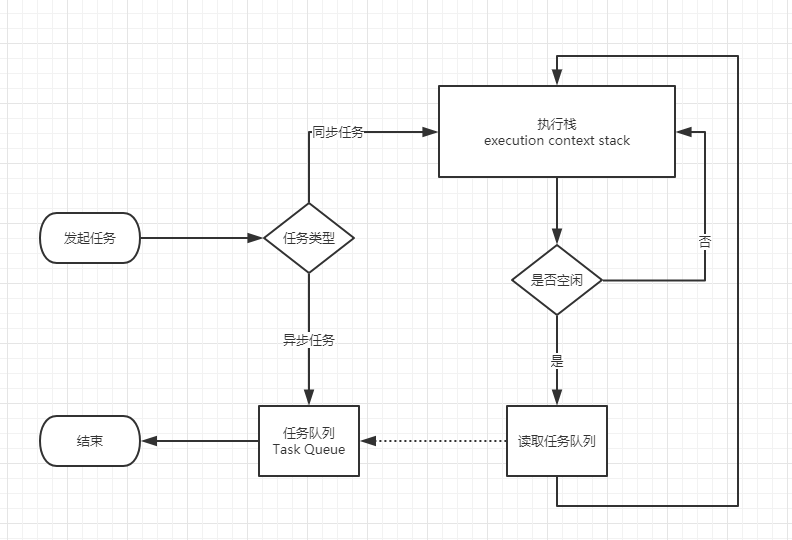

@[JS 三座大山之异步和单线程](https://github.com/danygitgit/document-library)

> create by **db** on **2021-1-12 16:47:32**  
> Recently revised in **2021-1-12 16:47:37**
>
> **闲时要有吃紧的心思，忙时要有悠闲的趣味**

<a id="catalog">目录</a>

- [前言](#preface)

- [正文](#main-body)

- [总结](#summary)

# <a  id="preface">前言</a>

> [返回目录](#catalog)

&emsp;作为一个前端工程师，javaScript 应该是我们赖以生存的本事了。那么，你知道所谓的 javaScript 的三座大山是什么吗？

&emsp;对！那就是我们刚学习 js 时老师所强调的：

- 原型和原型链

- 作用域和闭包

- 异步和单线程

下面我们就来爬上第一座大山——原型和原型链，去领略一下吧。

# <a  id="main-body">正文</a>

> [返回目录](#catalog)

## 异步和同步

### 同步（Synchronous）

&emsp;举个例子来说，一家餐厅吧来了 5 个客人，同步的意思就是说，来第一个点菜，点了个鱼，好， 厨师去捉鱼杀鱼，过了半小时鱼好了给第一位客人，开始下位一位客人，就这样一个一个来，按顺序来。

**同步的优点**

- 同步是按照顺序一个一个来，不会乱掉，更不会出现上面代码没有执行完就执行下面的代码，

**同步的缺点**

- 解析的速度没有异步的快；

举个栗子：

```js
console.log(100)

alert(200)

console.log(300)

// 100
// 300
// 200
```

&emsp;我们发现最开始输出 `100`，然后弹出了 `200`，再不点击`确认`的情况下，永远不会输出 `300`，这就是同步，顺序执行。

### 异步（Asynchronous）

&emsp;异步的意思就是来第一位客人，点什么，点鱼，给它一个牌子，让他去一边等吧，下一位客人接着点菜，点完接着点让厨师做去吧，哪个的菜先好就先端出来。

**异步的优点**

- 异步是接取一个任务，直接给后台，在接下一个任务，一直一直这样，谁的先读取完先执行谁的，

**异步的缺点**

- 没有顺序 ，谁先读取完先执行谁的 ，会出现上面的代码还没出来下面的就已经出来了，会报错；

举个栗子：

```js
console.log(100)

setTimeout(function () {
  console.log(200)
}, 1000)

console.log(300)

// 100
// 300
// 200
```

&emsp;运行之后我们会发现，先输出了 `100`，然后是 `300`，1 秒之后再输出了 `200`，这就是异步,即下面的代码不受上面代码的影响。

&emsp;对比之后我们发现，同步是有**阻塞**的，需要等待前面的执行完才会继续执行后面代码。而异步是**非阻塞**，无需等待的。

### 什么时候需要异步

&emsp;**需要等待但是又不能阻塞程序的时候需要使用异步**

前端使用异步的场景有：

1. 定时任务

- setTimeout,setInverval

2. 网络请求

- ajax 请求，img 图片的动态加载

3. 事件绑定或者叫 DOM 事件

- 比如一个点击事件，我不知道它什么时候点，但是在它点击之前，我该干什么还是干什么。用 addEventListener 注册一个类型的事件的时候，浏览器会有一个单独的模块去接收这个东西，当事件被触发的时候，浏览器的某个模块，会把相应的函数扔到异步队列中，如果现在执行栈中是空的，就会直接执行这个函数。

4. ES6 中的 Promise

## 单线程与多线程

### 什么是进程？

&emsp;当一个程序开始运行时，它就是一个进程，进程包括运行中的程序和程序所使用到的内存和系统资源。

&emsp;而一个进程又是由多个线程所组成的。

### 什么是线程？

&emsp;线程是程序中的一个执行流，每个线程都有自己的专有寄存器(栈指针、程序计数器等)，但代码区是共享的，

&emsp;即不同的线程可以执行同样的函数。

### 什么是多线程？

&emsp;多线程是指程序中包含多个执行流，即在一个程序中可以同时运行多个不同的线程来执行不同的任务。

&emsp;也就是说允许单个程序创建多个并行执行的线程来完成各自的任务。

**多线程的好处：**

- 可以提高 CPU 的利用率。在多线程程序中，一个线程必须等待的时候，CPU 可以运行其它的线程而不是等待，

- 这样就大大提高了程序的效率。

**多线程的不利方面：**

- 线程也是程序，所以线程需要占用内存，线程越多占用内存也越多；
- 多线程需要协调和管理，所以需要 CPU 时间跟踪线程；
- 线程之间对共享资源的访问会相互影响，必须解决竞用共享资源的问题；
- 线程太多会导致控制太复杂，最终可能造成很多 Bug；

### 什么是单线程？

&emsp;单线程是指程序中仅包含 1 个执行流，即一次只能执行一个任务

&emsp;也就是说程序执行时，所跑的程序路径（处理的东西）是连续顺序下来的，必须前面的处理好，后面的才会执行到。

**单线程的优点：**

- 单线程顺序执行任务的方式比较符合编程人员按顺序思考的思维方式，不需要考虑太多状况，实现起来比较简单，执行环境相对单纯；

**单线程的缺点：**

- 效率低，只要有一个任务耗时很长，后面的任务都必须排队等着，会拖延整个程序的执行

## 关于 JavaScript

### JavaScript 是单线程语言

&emsp;我们都知道，**JavaScript 是一个单线程的语言。**

&emsp;那为什么不设计成多线程？

- 假设有个 `DOM` 节点，现在有线程 `A` 操作它，删除了这个 `DOM`；
- 然后线程 `B` 又操作它，修改了这个 `DOM` 某部分。
- 那么现在问题来了，咱听谁的？
- 所以，为了避免复杂性，从一诞生，JavaScript 就是单线程，这已经成了这门语言的核心特征，将来也不会改变。
- 哪怕后期 `HTML5` 出了个 `Web Worker` ，但是仅仅能进行计算任务，不能操作 DOM，所以本质上还是单线程。

### 浏览器内核是多线程的

&emsp;而 JavaScript 是运行在浏览器或者 nodeJS 中的， 浏览器内核是怎样的呢？

&emsp;浏览器内核是多线程的，在内核控制下各线程相互配合以保持同步，一个浏览器通常由以下常驻线程组成：

- GUI 渲染线程：解析 HTML、CSS 等。在 JavaScript 引擎线程运行脚本期间，GUI 渲染线程处于挂起状态，也就是被 “冻结” 了。
- JavaScript 引擎线程：负责处理 JavaScript 脚本。
- 定时触发器线程：setTimeout、setInterval 等。事件触发线程会将计数完毕后的事件加入到任务队列的尾部，等待 JS 引擎线程执行。
- 事件触发线程：负责将准备好的事件交给 JS 引擎执行。
- 异步 http 请求线程：负责执行异步请求之类函数的线程，例如 Promise.then()、ajax 等。

&emsp;以 Chrome 浏览器中为例，当你打开一个 Tab 页时，其实就是创建了一个进程。

&emsp;一个进程中可以有多个线程，比如渲染线程、JS 引擎线程、HTTP 请求线程等等。

&emsp;当你发起一个请求时，其实就是创建了一个线程，当请求结束后，该线程可能就会被销毁。

### 为什么需要异步？

&emsp;这时候又有问题了，如果调用某个接口（`Ajax`），或者加载某张图片的时候，我们卡住了，这样页面是不是就一直不能渲染？

&emsp;然后因为单线程只能先让前面的程序走完，即便这个接口或者图片缓过来了，我下面还有其他任务没做呢，这不就卡死了么？

&emsp;所以这时候**异步**来了：

&emsp;通过将任务交给相应的异步模块去处理，主线程的效率大大提升，可以并行的去处理其他的操作。

&emsp;当异步处理完成，主线程空闲时，主线程读取相应的 callback，进行后续的操作，最大程度的利用 CPU。

<!-- &emsp;在涉及某些需要等待的操作的时候，我们就选择让程序继续运行。

&emsp;等待接口或者图片返回过来后，就通知程序我做好了，你可以继续调用了。 -->

### 任务队列和事件循环

&emsp;那么 JavaScript 是如何区协调主线程与异步模块之间的工作的呢？

&emsp;靠的就是**任务队列"（task queue）**和**事件循环（Event Loop）**，来协调主线程与异步模块之间的工作。

#### 事件循环（Event Loop）

&emsp;JavaScript 将所有任务都分成两种，一种是`同步任务（synchronous）`，另一种是`异步任务（asynchronous）`。

- 、**同步任务**指的是，在主线程上排队执行的任务，只有前一个任务执行完毕，才能执行后一个任务；

- **异步任务**指的是，不进入主线程、而进入`任务队列"（task queue）`的任务，只有`任务队列`通知主线程，某个异步任务可以执行了，该任务才会进入主线程执行。

&emsp;具体来说，异步执行的运行机制如下。（同步执行也是如此，因为它可以被视为没有异步任务的异步执行。）

1. 主线程读取 JS 代码，此时为同步环境，形成相应的堆和执行栈；
2. 主线程遇到异步任务，指给对应的异步进程进行处理（WEB API）;
3. 异步进程处理完毕（Ajax 返回、DOM 事件处罚、Timer 到等），将相应的异步任务推入**任务队列**；
4. 主线程执行完毕，查询`任务队列`，如果存在任务，则取出一个任务推入主线程处理（先进先出）；
5. 重复执行 2、3、4；称为**事件循环**，又叫**事件轮询**。

流程图如下：


&emsp;其中的异步进程有：

- a、类似 onclick 等，由浏览器内核的 DOM binding 模块处理，事件触发时，回调函数添加到任务队列中；
- b、setTimeout 等，由浏览器内核的 Timer 模块处理，时间到达时，回调函数添加到任务队列中；
- c、Ajax，由浏览器内核的 Network 模块处理，网络请求返回后，添加到任务队列中。

#### 任务队列

&emsp;翻开规范《ECMAScript® 2015 Language Specification》，找到事件循环 `6.1.4 Event loops`。

&emsp;规范中中提到，**一个浏览器环境，只能有一个事件循环，而一个事件循环可以多个任务队列**，每个任务都有一个任务源（Task source）。

&emsp;也就是说，任务队列存在多个，同一任务队列内，按队列顺序被主线程取走；不同任务队列之间，存在着优先级，优先级高的优先获取（如用户 I/O）

&emsp;在 JS 引擎中，我们可以按性质把任务分为两类，macrotask（宏任务）和 microtask（微任务）。

#### 宏任务（macrotask）

&emsp;宏任务（macrotask），可以理解是每次执行栈执行的代码就是一个宏任务（包括每次从事件队列中获取一个事件回调并放到执行栈中执行）。

&emsp;浏览器为了能够使得 JS 内部 macrotask 与 DOM 任务能够有序的执行，会在一个 macrotask 执行结束后，在下一个 macrotask 执行开始前，对页面进行重新渲染，流程如下：

macrotask->渲染->macrotask->...

宏任务包含：

```js
script(整体代码)
setTimeout
setInterval
I/O
UI 交互事件
postMessage
MessageChannel
setImmediate(Node.js 环境)
```

#### 微任务(microtask)

&emsp;微任务(microtask),可以理解是在当前 task 执行结束后立即执行的任务。也就是说，在当前 task 任务后，下一个 task 之前，在渲染之前。

&emsp;所以它的响应速度相比 setTimeout（setTimeout 是 task）会更快，因为无需等渲染。也就是说，在某一个 macrotask 执行完后，就会将在它执行期间产生的所有 microtask 都执行完毕（在渲染前）。

微任务包含：

```js
Promise.then
Object.observe
MutaionObserver
process.nextTick(Node.js 环境)
```

#### 运行机制

&emsp;在事件循环中，每进行一次循环操作称为 tick，每一次 tick 的任务处理模型是比较复杂的，但关键步骤如下：

- 执行一个宏任务（栈中没有就从事件队列中获取）
- 执行过程中如果遇到微任务，就将它添加到微任务的任务队列中
- 宏任务执行完毕后，立即执行当前微任务队列中的所有微任务（依次执行）
- 当前宏任务执行完毕，开始检查渲染，然后 GUI 线程接管渲染
- 渲染完毕后，JS 线程继续接管，开始下一个宏任务（从事件队列中获取）
如图：
<!--
&emsp;那么我们如何判定任务队列的优先级呢？

#### macrotask（宏任务）和 microtask（微任务）。

&emsp;在 JS 引擎中，我们可以按性质把任务分为两类，macrotask（宏任务）和 microtask（微任务）。 -->

<!-- - **microtask queue（宏任务队列）** ：唯一，整个事件循环当中，仅存在一个；执行为同步，同一个事件循环中的 microtask 会按队列顺序，串行执行完毕；
- **macrotask queue（微任务队列）**：不唯一，存在一定的优先级（用户 I/O 部分优先级更高）；异步执行，同一事件循环中，只执行一个 -->

浏览器 JS 引擎中：

- **macrotask**（按优先级顺序排列）: script(你的全部 JS 代码，“同步代码”）, setTimeout, setInterval, setImmediate, I/O,UI rendering
- **microtask**（按优先级顺序排列）:process.nextTick,Promises（这里指浏览器原生实现的 Promise）, Object.observe, MutationObserver
  JS 引擎首先从 macrotask queue 中取出第一个任务，执行完毕后，将 microtask queue 中的所有任务取出，按顺序全部执行；
  然后再从 macrotask queue（宏任务队列）中取下一个，执行完毕后，再次将 microtask queue（微任务队列）中的全部取出；
  循环往复，直到两个 queue 中的任务都取完。
  所以，浏览器环境中，js 执行任务的流程是这样的：

第一个事件循环，先执行 script 中的所有同步代码（即 macrotask 中的第一项任务）
再取出 microtask 中的全部任务执行（先清空 process.nextTick 队列，再清空 promise.then 队列）
下一个事件循环，再回到 macrotask 取其中的下一项任务
再重复 2
反复执行事件循环…
NodeJS 引擎中：

先执行 script 中的所有同步代码，过程中把所有异步任务压进它们各自的队列（假设维护有 process.nextTick 队列、promise.then 队列、setTimeout 队列、setImmediate 队列等 4 个队列）
按照优先级（process.nextTick > promise.then > setTimeout > setImmediate），选定一个 不为空 的任务队列，按先进先出的顺序，依次执行所有任务，执行过程中新产生的异步任务继续压进各自的队列尾，直到被选定的任务队列清空。
重复 2...
也就是说，NodeJS 引擎中，每清空一个任务队列后，都会重新按照优先级来选择一个任务队列来清空，直到所有任务队列被清空。

=========================================

&emsp;在 JS 引擎中，我们可以按性质把任务分为两类，macrotask（宏任务）和 microtask（微任务）。

浏览器 JS 引擎中：

macrotask（按优先级顺序排列）: script(你的全部 JS 代码，“同步代码”）, setTimeout, setInterval, setImmediate, I/O,UI rendering
microtask（按优先级顺序排列）:process.nextTick,Promises（这里指浏览器原生实现的 Promise）, Object.observe, MutationObserver
JS 引擎首先从 macrotask queue 中取出第一个任务，执行完毕后，将 microtask queue 中的所有任务取出，按顺序全部执行；
然后再从 macrotask queue（宏任务队列）中取下一个，执行完毕后，再次将 microtask queue（微任务队列）中的全部取出；
循环往复，直到两个 queue 中的任务都取完。
所以，浏览器环境中，js 执行任务的流程是这样的：

第一个事件循环，先执行 script 中的所有同步代码（即 macrotask 中的第一项任务）
再取出 microtask 中的全部任务执行（先清空 process.nextTick 队列，再清空 promise.then 队列）
下一个事件循环，再回到 macrotask 取其中的下一项任务
再重复 2
反复执行事件循环…
NodeJS 引擎中：

先执行 script 中的所有同步代码，过程中把所有异步任务压进它们各自的队列（假设维护有 process.nextTick 队列、promise.then 队列、setTimeout 队列、setImmediate 队列等 4 个队列）
按照优先级（process.nextTick > promise.then > setTimeout > setImmediate），选定一个 不为空 的任务队列，按先进先出的顺序，依次执行所有任务，执行过程中新产生的异步任务继续压进各自的队列尾，直到被选定的任务队列清空。
重复 2...
也就是说，NodeJS 引擎中，每清空一个任务队列后，都会重新按照优先级来选择一个任务队列来清空，直到所有任务队列被清空。

##### 任务队列的类型

任务队列存在两种类型，一种为 microtask queue，另一种为 macrotask queue。
　　　　图中所列出的任务队列均为 macrotask queue，而 ES6 的 promise［ECMAScript 标准］产
　　 3.2、两者的区别生的任务队列为 microtask queue。

microtask queue：唯一，整个事件循环当中，仅存在一个；执行为同步，同一个事件循环中的 microtask 会按队列顺序，串行执行完毕；
　　　　 macrotask queue：不唯一，存在一定的优先级（用户 I/O 部分优先级更高）；异步执行，同一事件循环中，只执行一个。

3.3、更完整的事件循环流程  
　　　　将 microtask 加入到 JS 运行机制流程中，则：
　　　　　　 step1、2、3 同上，
　　　　　　 step4：主线程查询任务队列，执行 microtask queue，将其按序执行，全部执行完毕；
　　　　　　 step5：主线程查询任务队列，执行 macrotask queue，取队首任务执行，执行完毕；
　　　　　　 step6：重复 step4、step5。
　　　　 microtask queue 中的所有 callback 处在同一个事件循环中，而 macrotask queue 中的 callback 有自己的事件循环。
　　　　简而言之：同步环境执行 -> 事件循环 1（microtask queue 的 All）-> 事件循环 2(macrotask queue 中的一个) -> 事件循环 1（microtask queue 的 All）-> 事件循环 2(macrotask queue 中的一个)...
　　　　利用 microtask queue 可以形成一个同步执行的环境，但如果 Microtask queue 太长，将导致 Macrotask 任务长时间执行不了，最终导致用户 I/O 无响应等，所以使用需慎重。

<!-- - 相同任务源的任务，只能放到一个任务队列中。

- 不同任务源的任务，可以放到不同任务队列中。

&emsp;又举了一个例子说，客户端可能实现了一个包含鼠标键盘事件的任务队列，还有其他的任务队列，而给鼠标键盘事件的任务队列更高优先级，例如75%的可能性执行它。这样就能保证流畅的交互性，而且别的任务也能执行到了。同一个任务队列中的任务必须按先进先出的顺序执行，但是不保证多个任务队列中的任务优先级，具体实现可能会交叉执行。

&emsp;结论：**一个事件循环可以有多个任务队列，队列之间可有不同的优先级，同一队列中的任务按先进先出的顺序执行，但是不保证多个任务队列中的任务优先级，具体实现可能会交叉执行。** -->

=========================================

6. 所有同步任务都在主线程上执行，形成一个执行栈（execution context stack）。

7. 主线程之外，还存在一个"任务队列"（task queue）。只要异步任务有了运行结果，就在"任务队列"之中放置一个事件。

8. 一旦"执行栈"中的所有同步任务执行完毕，系统就会读取"任务队列"，看看里面有哪些事件。那些对应的异步任务，于是结束等待状态，进入执行栈，开始执行。

9. 主线程不断重复上面的第三步。



作者：jsliang
链接：https://juejin.cn/post/6892164887456251918
来源：掘金
著作权归作者所有。商业转载请联系作者获得授权，非商业转载请注明出处。

作者：jsliang
链接：https://juejin.cn/post/6892164887456251918
来源：掘金
著作权归作者所有。商业转载请联系作者获得授权，非商业转载请注明出处。

https://www.cnblogs.com/hity-tt/p/6733062.html

# <a  id="summary">总结</a>

> [返回目录](#catalog)

&emsp;路漫漫其修远兮，与诸君共勉。
https://segmentfault.com/a/1190000012925872?utm_source=tag-newest

http://www.ruanyifeng.com/blog/2012/12/asynchronous%EF%BC%BFjavascript.html

https://segmentfault.com/a/1190000020225668

http://www.ruanyifeng.com/blog/2014/10/event-loop.html

作者：jsliang
链接：https://juejin.cn/post/6892164887456251918
来源：掘金
著作权归作者所有。商业转载请联系作者获得授权，非商业转载请注明出处。

https://www.cnblogs.com/onesea/p/13608642.html
**后记：Hello 小伙伴们，如果觉得本文还不错，记得点个赞或者给个 star，你们的赞和 star 是我编写更多更丰富文章的动力！[GitHub 地址](https://github.com/danygitgit/document-library)**

# 文档协议

> <a rel="license" href="http://creativecommons.org/licenses/by-nc-sa/4.0/"></a><br /><a xmlns:dct="http://purl.org/dc/terms/" property="dct:title">**db** 的文档库</a> 由 <a xmlns:cc="http://creativecommons.org/ns#" href="db" property="cc:attributionName" rel="cc:attributionURL">db</a> 采用 <a rel="license" href="http://creativecommons.org/licenses/by-nc-sa/4.0/">知识共享 署名-非商业性使用-相同方式共享 4.0 国际 许可协议</a>进行许可。<br />基于<a xmlns:dct="http://purl.org/dc/terms/" href="https://github.com/danygitgit" rel="dct:source">https://github.com/danygitgit</a>上的作品创作。<br />本许可协议授权之外的使用权限可以从 <a xmlns:cc="http://creativecommons.org/ns#" href="https://creativecommons.org/licenses/by-nc-sa/2.5/cn/" rel="cc:morePermissions">https://creativecommons.org/licenses/by-nc-sa/2.5/cn/</a> 处获得。
