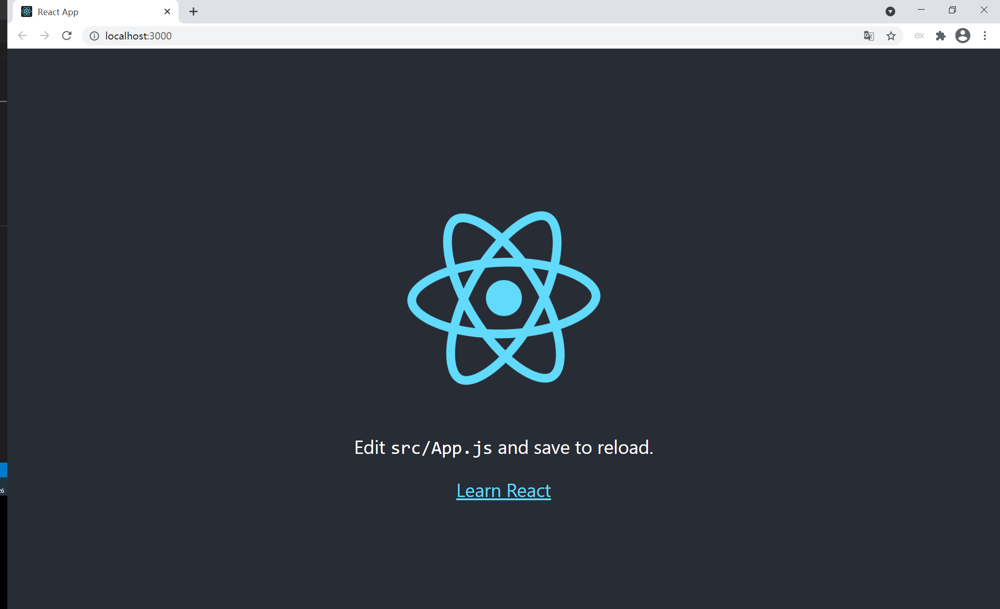
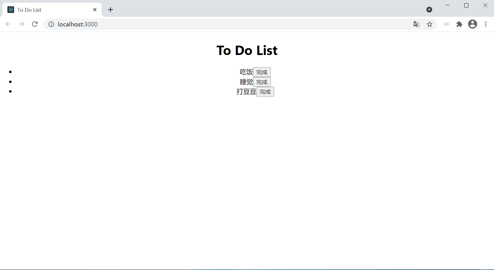

@[React 搭建待办事项项目](https://github.com/danygitgit/document-library)

> create by **db** on **2019-3-10 16:28:10**  
> Recently revised in **2019-4-1 17:06:13**

&emsp;**Hello 小伙伴们，如果觉得本文还不错，麻烦点个赞或者给个 star，你们的赞和 star 是我前进的动力！[GitHub 地址](https://github.com/danygitgit/document-library)**

&emsp;作为一只前端菜鸟，本篇文章旨在记录自己的学习心得，如有不足，还请多多指教，谢谢大家。

# 前言

> I hear and I fogorget.

> I see and I remember.

> I do and I understand.

&emsp;最近有在了解一些 React 相关知识，于是使用 React 搭建了一个待办事项项目，谨以此文做个记录。

- 注：本项目基于 React 17.0.1 框架实现搭建

&emsp;倘若对 React 项目不是特别了解，请先参考：

- [React 官网](https://react.docschina.org/)

# 正文

## 一、搭建 React 项目：

### 1、安装 node 及脚手架

&emsp;首先要你需要在你的机器上安装 Node >= 8.10 和 npm >= 5.6。node.js 的官方地址为：`https://nodejs.org/en/download/`，下载相应版本。


安装好 node 之后，以管理员身份打开 cmd 管理工具，，输入 `node -v `，回车，查看 node 版本号，出现版本号则说明安装成功。

> npx create-react-app my-app

&emsp;安装脚手架:

> npm install create-react-app -g

&emsp;安装好 node 之后，以管理员身份打开 cmd 管理工具，，输入 `create-react-app -V`，回车，查看 node 版本号，出现版本号则说明安装成功。

### 2、创建新项目

&emsp;进入你需要创建在项目的文件夹，打开命令行。

> <font color=red>npx create-react-app</font> react-todolist

&emsp;最后出现如下代码

```
We suggest that you begin by typing:

  cd react-todolist
  yarn start

Happy hacking!
```

&emsp;说明已经初始化成功，项目搭建完成。

### 3、进入你的项目文件夹

&emsp;项目搭建好了，现在就可以进入项目文件夹。

输入以下命令，回车进入新建的项目。

> <font color=red>cd</font> react-todolist

### 4、启动项目

&emsp;一切环境依赖安装准备就绪，我们来测试一下自己新建的 vue 项目的运行情况。

输入以下命令，回车启动项目

> <font color=red>yarn start</font>

结果会弹出一个浏览器访问地址默认为 `http://localhost:3000`，如下：

```
Compiled successfully!

You can now view react-todolist in the browser.

  Local:            http://localhost:3000
  On Your Network:  http://xxx.xxx.xxx.xxx:3000

Note that the development build is not optimized.
To create a production build, use yarn build.
```

&emsp;在浏览器中打开`http://localhost:3000`，就能看到你的项目了



## 二、项目结构一览

&emsp;脚手架生成目录之后，需要对目录有一些基本认知。我们看一下 React 脚手架生成目录和文件的作用。

注：版本不同可能导致目录文件不同。我自己的脚手架版本为：4.0.3。需要查询自己版本号在终端里面输入如下代码：

> create-react-app -V

```js
│---.gitignore     // 一般来说,每个Git项目中都需要一个“.gitignore”文件，这个文件的作用就是告诉Git哪些文件不需要添加到版本管理中,项目开发中，很多文件都是不需要加入版本管理的，比如java字节码文件.class，安卓虚拟机文件.dex和一些包含密码的配置文件等。这个文件的内容是一些规则，Git会根据这些规则来判断是否将文件添加到版本控制中
│---filename.txt
│---package.json   // 定义了这个项目所需要的各种模块，以及项目的配置信息（比如名称、版本、许可证等元数据）。npm install 命令根据这个配置文件，自动下载所需的模块，也就是配置项目所需的运行和开发环境。目前不需要改动。
│---README.md      // README.md:(README.md文件是一个项目的入门手册，里面介绍了整个项目达到什么样子的效果、需要搭建什么样的环境、具备什么样的技能等等。
│---yarn.lock      // 该文件是锁定安装时的版本号，需要上传到Git，以保证其他人 yarn 时依赖能一致。
│---node_modules   // 包含了react项目中会用到的一些组件，install的时候下载下来的
│---public         // 该文件夹都是一些项目中使用的公共文件。
  │---favicon.ico  // 网站或者项目图标，一般在浏览器左上角显示。
  │---index.html   // 项目中的启动页面，react比较适合单页面项目应用开发，所以暂时只包含一个index.html，并且这也是react工程的入口页面
  │---logo192.png  // 静态图片
  │---logo512.png
  │---manifest.json// 移动端配置文件。
  │---robots.txt  // 告诉爬虫者，不可爬的页面。只起警告作用。没实质性作用。
└─src             // 包含了一些我们自己使用的js文件，css文件，img文件等。系统默认将index.html对准了index.js。index.js也就是我们的入口js，他和index.html所对应
  │---App.css     //组件的css
  │---App.js      // 相当于一个方法模块，也是一个简单的模块化编程。也叫一个组件。
  │---App.test.js
  │---index.css  // index.js里的css文件
  │---index.js   // 项目的入口文件
  │---logo.svg
  │---reportWebVitals.js //谷歌新出的关于浏览器性能优化的库。(新增的文件)
  │---setupTests.js     //针对index.js的单元测试文件
```

## 三、开始实现 ToDoList

&emsp;介绍完 React 的项目结构，我们就可以开始实现 ToDoList 项目了。

### 1、创建 ToDoList 组件

&emsp;我们可以将`/src`中`App.css`文件改名为`ToDoList.css`,的`App.js`文件改名为`ToDoList.js`,并且引入`React`及`useState`，将其`App`方法改名为`ToDoList`,其中中不必要的内容删除，如下：

```js
import './ToDoList.css'
// 引入React及useState
import React, { useState } from 'react'

function ToDoList() {
  return (
    <div className="App">
      <h1>To Do List</h1>
    </div>
  )
}

export default ToDoList
```

### 2、引入注册 ToDoList 组件

&emsp;在`/src`中的`index.js`文件中,将原先注册`App`的全改为`ToDoList`,如下：

```js
import React from 'react'
import ReactDOM from 'react-dom'
import './index.css'
import ToDoList from './ToDoList'
import reportWebVitals from './reportWebVitals'

ReactDOM.render(
  <React.StrictMode>
    <ToDoList />
  </React.StrictMode>,
  document.getElementById('root')
)

// If you want to start measuring performance in your app, pass a function
// to log results (for example: reportWebVitals(console.log))
// or send to an analytics endpoint. Learn more: https://bit.ly/CRA-vitals
reportWebVitals()
```

&emsp;OK，以上两步做完，我们的项目运行起来是这样子的：


### 3、创建并渲染列表

&emsp;接下来，我们在`ToDoList`函数中创建一个数组 `items`以及用来更新 items 的函数 Hook -- `setItems` ，关于 Hook 的使用，可以参考[Hook 概览](https://react.docschina.org/docs/hooks-overview.html)。

&emsp;然后声明一个列表渲染函数组件`ItemList`，使用 `map` 实现列表的循环，如下：

```js
// 待办事项列表组件
function ItemList(props) {
  // 使用map遍历传入数组，返回渲染后的列表
  const ItemLists = props.items.map((item, index) => (
    // 在 map() 方法中的元素需要设置 key 属性。
    <li key={item.id}>
      {item.title}
      <button>完成</button>
    </li>
  ))
  return ItemLists
}

function ToDoList() {
  // 初始化待办事项数组
  const [items, setItems] = useState([
    {
      id: 1,
      title: '吃饭',
    },
    {
      id: 2,
      title: '睡觉',
    },
    {
      id: 3,
      title: '打豆豆',
    },
  ])
  return (
    <div className="App">
      <h1>To Do List</h1>
      {/* 待办事项列表 */}
      <ul>
        {/* 将待办事项数组传入组件 */}
        <ItemList items={items}></ItemList>
      </ul>
    </div>
  )
}

export default ToDoList
```

&emsp;渲染后的结果如下：



**注：**

1. key 帮助 React 识别哪些元素改变了，比如被添加或删除。因此你应当给数组中的每一个元素赋予一个确定的标识。一个元素的 key 最好是这个元素在列表中拥有的一个独一无二的字符串。通常，我们使用数据中的 id 来作为元素的 key：。详情请参考 -- [深入解析为什么 key 是必须的](https://react.docschina.org/docs/reconciliation.html#recursing-on-children)

### 4、绑定删除事件

&emsp;接下来我们使用按钮绑定删除事件

```html
<button onClick={() => clickDelete(index)}>完成</button>
```

&emsp;这里我们增加了`onClick`方法，方法名为`clickDelete`，参数为数组下标`index`（数字类型）。

&emsp;，我们接着在组件`ItemList`中定义`clickDelete`事件，因为要更改父元素的`items`数组，所以我们触发父组件的`deleteItem`事件

```javascript
// 点击完成，触发父组件方法
function clickDelete(index) {
  props.deleteItem(index)
}
```

&emsp;接下来我们给父组件`ToDoList`绑定删除触发事件`deleteItem`，目的是被触发时候，将列表中相应的选项删除。

```html
<ItemList deleteItem="{deleteItem}" items="{items}"></ItemList>
```

&emsp;最后完成数组`items`删除事件`deleteItem`,删除数组中被触发的选项，给数组重新赋值。

```javascript
// 完成待办
function deleteItem(index) {
  items.splice(index, 1)
  setItems([...items])
}
```

**注：**

&emsp;使用 JSX 语法时你需要传入一个函数作为事件处理函数，而不是一个字符串。

&emsp;因为我们需要将参数`index`传出去，因此可以在回调中使用箭头函数来传参，并且这样可以确保 `handleClick` 内的 `this` 已被绑定。

### 5、使用 input 输入框添加新事项

&emsp;截至目前我们使用的都是现成的列表，接下来我们使用输入框来动态为列表添加条目；

&emsp;列表渲染组件我们使用的**函数组件**，然后我们使用**class 组件**实现新增待办事项组件。

```js
// 新增代办表单组件
class ItemForm extends React.Component {
  constructor(props) {
    super(props)
    this.state = { value: '' }
    // 为了在回调中使用 `this`，这个绑定是必不可少的
    this.handleChange = this.handleChange.bind(this)
    this.handleSubmit = this.handleSubmit.bind(this)
  }
  // 输入框内容更改，更新state
  handleChange(event) {
    this.setState({ value: event.target.value })
  }
  // 点击提交按钮，保存选项，请空输入内容
  handleSubmit(event) {
    event.preventDefault()
    if (!this.state.value) {
      return
    }
    this.props.addNewItem(this.state.value)
    this.setState({ value: '' })
  }

  render() {
    return (
      <form onSubmit={this.handleSubmit}>
        <label>
          待办事项:
          <input
            type="text"
            value={this.state.value}
            onChange={this.handleChange}
          />
        </label>
        <input type="submit" value="提交" />
      </form>
    )
  }
}
```

&emsp;然后我们在`ToDoList`组件引入该组件,并绑定添加事件

```js
{
  /* 新增代办表单 */
}
;<ItemForm addNewItem={addNewItem}></ItemForm>
```

&emsp;在 `ToDoList`组件中，我们声明一个变量`id`默认为 4。输入框输入内容后，点击添加按钮 数组items 中 push 一条内容，其中包括 id 与 title，然后 id 自增，并且最后更新数组。

```javascript
// 初始化id
const [itemId, setItemId] = useState(4)
// 新增待办
function addNewItem(data) {
  let obj = {
    id: itemId,
    title: data,
  }
  items.push(obj)
  setItemId(itemId + 1)
  setItems(items)
}
```

# 总结

&emsp;通过以上，我们最终就实现了 ToDoList 的基本功能，效果如下：


&emsp;如果喜欢，可以再加一些样式。

&emsp;大家可以在后续的学习过程中加入更多的功能，巩固自己学到的知识。

&emsp;路漫漫其修远兮，与诸君共勉。

**附 ToDoList.js 代码**
```js
import './ToDoList.css';
// 引入React及useState
import React, { useState } from 'react'

// 新增代办表单组件
class ItemForm extends React.Component {
  constructor(props) {
    super(props)
    this.state = { value: '' }
    // 为了在回调中使用 `this`，这个绑定是必不可少的
    this.handleChange = this.handleChange.bind(this)
    this.handleSubmit = this.handleSubmit.bind(this)
  }
  // 输入框内容更改，更新state
  handleChange(event) {
    this.setState({ value: event.target.value })
  }
  // 点击提交按钮，保存选项，请空输入内容
  handleSubmit(event) {
    event.preventDefault()
    if(!this.state.value){
      return
    }
    this.props.addNewItem(this.state.value)
    this.setState({ value: '' })
  }
  
  render() {
    return (
      <form onSubmit={this.handleSubmit}>
        <label>
          待办事项:
          <input
            type="text"
            value={this.state.value}
            onChange={this.handleChange}
          />
        </label>
        <input type="submit" value="提交" />
      </form>
    )
  }
}

// 待办事项列表组件
function ItemList(props) {
  // 点击完成，触发父组件方法
  function clickDelete(index) {
    props.deleteItem(index)
  }
  // 使用map遍历传入数组，返回渲染后的列表
  const ItemLists = props.items.map((item, index) => (
    // 在 map() 方法中的元素需要设置 key 属性。
    <li key={item.id}>
      {item.title}
      <button onClick={() => clickDelete(index)}>完成</button>
    </li>
  ))
  return ItemLists
}

function ToDoList() {
  // 初始化id
  const [itemId, setItemId] = useState(4)
  // 初始化待办事项数组
  const [items, setItems] = useState([
    {
      id: 1,
      title: '吃饭',
    },
    {
      id: 2,
      title: '睡觉',
    },
    {
      id: 3,
      title: '打豆豆',
    }
  ])
   // 完成待办
   function deleteItem(index) {
    items.splice(index,1)
    setItems([...items])
  }
  // 新增待办
  function addNewItem(data) {
    let obj= {
      id:itemId,
      title:data
    }
    items.push(obj)
    setItemId(itemId + 1)
    setItems(items)
  }
  return (
    <div className="App">
      <h1>To Do List</h1>
      {/* 新增代办表单 */}
      <ItemForm addNewItem={addNewItem}></ItemForm>
      <ul>
        {/* 将待办事项数组传入组件，并绑定删除方法 */} 
        <ItemList deleteItem={deleteItem} items={items}></ItemList>
      </ul>
    </div>
  );
}

export default ToDoList;

```

**后记：Hello 小伙伴们，如果觉得本文还不错，记得点个赞或者给个 star，你们的赞和 star 是我编写更多更丰富文章的动力！[GitHub 地址](https://github.com/danygitgit/document-library/blob/master/JavaScript-library/Vue/Vue%E9%A1%B9%E7%9B%AE%E5%AE%9E%E6%88%98%EF%BC%88%E4%B8%80%EF%BC%89%E2%80%94%E2%80%94ToDoList.md)**

> <a rel="license" href="http://creativecommons.org/licenses/by-nc-sa/4.0/"></a><br /><a xmlns:dct="http://purl.org/dc/terms/" property="dct:title">**db** 的文档库</a> 由 <a xmlns:cc="http://creativecommons.org/ns#" href="db" property="cc:attributionName" rel="cc:attributionURL">db</a> 采用 <a rel="license" href="http://creativecommons.org/licenses/by-nc-sa/4.0/">知识共享 署名-非商业性使用-相同方式共享 4.0 国际 许可协议</a>进行许可。<br />基于<a xmlns:dct="http://purl.org/dc/terms/" href="https://github.com/danygitgit" rel="dct:source">https://github.com/danygitgit</a>上的作品创作。<br />本许可协议授权之外的使用权限可以从 <a xmlns:cc="http://creativecommons.org/ns#" href="https://creativecommons.org/licenses/by-nc-sa/2.5/cn/" rel="cc:morePermissions">https://creativecommons.org/licenses/by-nc-sa/2.5/cn/</a> 处获得。
