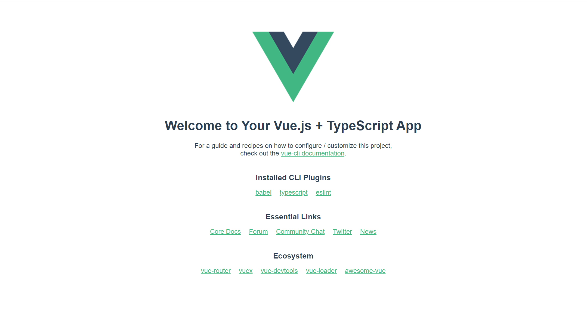
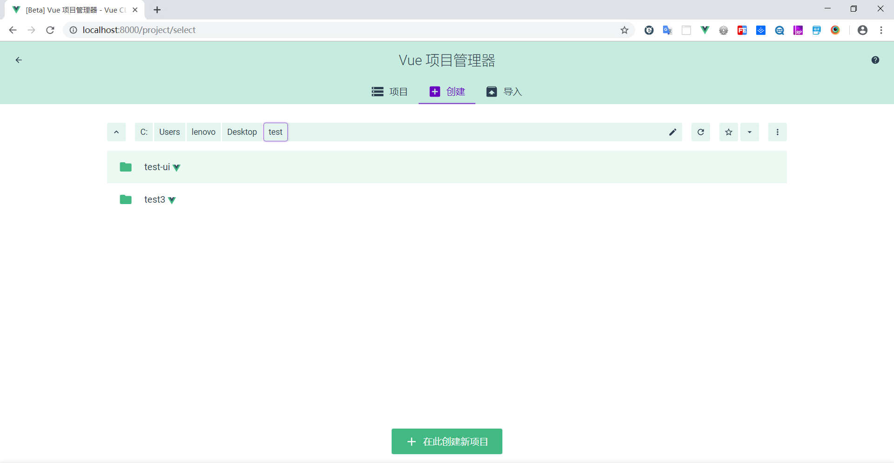
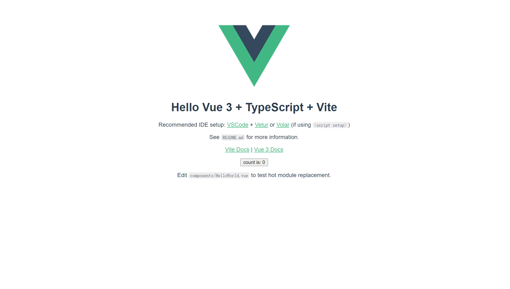

@[Vue 小白课（五）——Vue3 + Vite 及 VueCLI4项目搭建](https://github.com/danygitgit/document-library/blob/master/JavaScript-library)

> create by **db** on **2021-3-16 16:21:55**
> Recently revised in **2021-3-16 19:00:51**

**闲时要有吃紧的心思，忙时要有悠闲的趣味**

&emsp;盼望着，盼望着，2020 年 9 月 ，Vuejs 3.0 发布了；2021 年 2 月，Vite 2.0 发布了。

&emsp;尤小右用实际行动告诉我们——只要学不死，就往死里学……

&emsp;没办法，撸起袖子干吧！下面我们就来看看如何用 Vue_CLI4 及 Vite 搭建 vVue 3.0 项目。

# 前言

## Vue 3.0 简介

**更新更快更强！**

&emsp;Vue.js 3.0 给我们带来了那些新特性呢：

- Performance：性能比 vue2.x 块 1.2 ～ 2 倍
- Tree shaking support：支持按需编译，体积更小
- Composition API：组合 API，类似 React Hooks
- Custom Renderer API：暴露了自定义渲染 API
- Fragment，Teleport（Protal），Suspense：新增三个组件
- Better TypeScript support：更好的支持 TS

## Vue-CLI 4 简介

**让开发更简单！**

&emsp;Vue-CLI 4 是 vue 官方团队推出的一款快速开发 vue 项目的构建工具，基于 Vue.js 进行快速开发的完整系统，提供：

- 通过 @vue/cli 实现的交互式的项目脚手架。
- 通过 @vue/cli + @vue/cli-service-global 实现的零配置原型开发。
  - 一个运行时依赖 (@vue/cli-service)，该依赖：
  - 可升级；
  - 基于 webpack 构建，并带有合理的默认配置；
  - 可以通过项目内的配置文件进行配置；
  - 可以通过插件进行扩展。
- 一个丰富的官方插件集合，集成了前端生态中最好的工具。
- 一套完全图形化的创建和管理 Vue.js 项目的用户界面。

## Vite 简介

**让项目更快！**

&emsp;Vite 是一个基于 Vue3 单文件组件的非打包开发服务器，它做到了本地快速开发启动：

- 快速的冷启动，不需要等待打包操作；
- 即时的热模块更新，替换性能和模块数量的解耦让更新飞起；
- 真正的按需编译，不再等待整个应用编译完成，这是一个巨大的改变。

&emsp;此笔记旨在帮助 Vue 小白了解并应用 Vue3 + Vite 及 VueCLI4 项目的命令行搭建过程，希望能帮得到大家。

&emsp;参考文献：

- [Vue3 官网](https://v3.cn.vuejs.org/guide/introduction.html#vue-js-%E6%98%AF%E4%BB%80%E4%B9%88)

- [Vue CLI 官网](https://cli.vuejs.org/zh/guide/)

- [Vite 官网](https://cli.vuejs.org/)

- [TypeScript 官方文档](https://www.tslang.cn/docs/handbook/declaration-files/introduction.html)

# 正文

## 安装相应工具

### 1、更新 npm 到最新版本

&emsp;Vue CLI 4.x 需要 Node.js v8.9 或更高版本 (推荐 v10 以上)

&emsp;命令运行

> npm install -g npm

&emsp;npm 就自动为我们更新到最新版本

&emsp;更新完成之后，以管理员身份打开 cmd 管理工具，，输入 `node -v `，回车，可查看 node 版本号.

### 2、安装全局 Vue-CLI4.x 脚手架

&emsp;首先查看我们当前 Vue CLI 版本号，在命令行输入

> vue -V

&emsp;如果出现`2.X.X`，则说明我们现在安装的 Vue-CLI2；

然后我们就需要更新升级了，命令行输入以下命令，回车；

> npm install -g @vue/cli

&emsp;再次查看 Vue-CLI 的版本号`4.x.x`，则说明更新成功；

### 3、安装全局 Vue 3.x

&emsp;命令运行

> $ npm install vue@next

## Vue3 + Vue CLI 4 搭建项目

### 1、通过 Vue-CLI4 创建一个 vue 项目

&emsp;进入你需要创建项目的文件夹，打开命令行。

输入以下命令，回车

> <font color=red> vue create</font> vue3-cli4-demo

&emsp;这里`vue3-cli4-demo`指的是项目名，该命令执行后会创建一个名为`vue3-cli4-demo`的目录，也就是我们所搭建的项目。

此处有三个选择：

- `Default ([Vue 2] babel, eslint)`：默认套餐，使用`Vue 2`提供`babel`和`eslint`支持
- `Default (Vue 3 Preview) ([Vue 3] babel, eslint)`：默认套餐，使用`Vue 3`，提供`babel`和`eslint`支持
- `Manually select features`：自己去选择需要的功能，提供更多的特性选择。比如如果想要支持 `TypeScript` ，就应该选择这一项。

&emsp;可以使用<kbd>上下方向键</kbd>来切换选项。如果只需要 `babel` 和 `eslint` 支持，那么选择第一项，就完事了，静静等待 vue 初始化项目。

&emsp;Vue-CLI4 内置支持了 10 个功能特性，可以多选：使用<kbd>方向键</kbd>在特性选项之间切换，使用<kbd>空格键</kbd>选中当前特性，使用<kbd> a </kbd>键切换选择所有，使用<kbd> i </kbd>键翻转选项。

对于每一项的功能，此处做个简单描述：

```
? Check the features needed for your project: (Press <space> to select, <a> to toggle all, <i> to invert selection)
>(*) Choose Vue version              //选择vue版本，这个不选的话默认是使用vue 2
 ( ) Babel                           //转码器，可以将ES6代码转为ES5代码，从而在现有环境执行。
 ( ) TypeScript                      // TypeScript是一个JavaScript（后缀.js）的超集（后缀.ts）包含并扩展了 JavaScript 的语法，需要被编译输出为 JavaScript在浏览器运行，目前较少人再用
 ( ) Progressive Web App (PWA) Support// 渐进式Web应用程序
 ( ) Router                           // vue-router（vue路由）
 ( ) Vuex                             // vuex（vue的状态管理模式）
 ( ) CSS Pre-processors               // CSS 预处理器（如：less、sass）
 ( ) Linter / Formatter               // 代码风格检查和格式化（如：ESlint）
 ( ) Unit Testing                     // 单元测试（unit tests）
 ( ) E2E Testing                      // e2e（end to end） 测试
```

我选择了 `TypeScript`，`CSS Pre-processors`，`Linter / Formatter`

按住`enter`进入下一步，接下来都是对之前每项选项的更详细的选择。

- css:选择 SCSS/SASS

- Linter / Formatter:选择 prettier

&emsp;这一步就是要选择配置文件的位置了。对于 `Babel` 、` PostCSS` 等，都可以有自己的配置文件： `.babelrc` 、 `.postcssrc` 等等，同时也可以把配置信息放在 `package.json` 里面。此处出于对编辑器（ Visual Studio Code ）的友好支持（编辑器一般默认会在项目根目录下寻找配置文件），选择把配置文件放在外面，选择 `In dedicated config files`

**补充**

`Save this as a preset for future projects?`:这个就是问要不要把当前的这一系列选项配置保存起来，方便下一次创建项目时复用。选择 y。

选完之后， Vue-CLI 就根据前面选择的内容，开始初始化项目了。

&emsp;最后出现如下代码

```
🎉  Successfully created project vue3-cli4-demo.
👉  Get started with the following commands:

 $ cd vue3-cli4-demo
 $ npm run serve
```

&emsp;说明已经初始化成功，Vue-CLI4 已经将项目搭建完成。

### 2、进入你的项目文件夹

&emsp;项目搭建好了，现在就可以进入项目文件夹。

输入以下命令，回车进入新建的项目。

> <font color=red>cd</font> vue3-cli4-demo

### 3、启动项目

&emsp;一切环境依赖安装准备就绪，我们来测试一下自己新建的 vue 项目的运行情况。

输入以下命令，回车启动项目

> <font color=red>npm run serve</font>

结果会弹出一个浏览器访问地址默认为`localhost:8080`，如下：

```
 App running at:
  - Local:   http://localhost:8080/
  - Network: http://***.***.***.***:8080/

  Note that the development build is not optimized.
  To create a production build, run npm run build.
```

&emsp;在浏览器中打开`http://localhost:8080`或者 Network 的地址，就能看到你的项目了


### vue ui 图形化界面创建项目

&emsp;Vue-CLI4.x 给我们同样提供了图形化界面,用来管理和创建项目

命令行输入

> vue ui

然后会自动打浏览器页面：


&emsp;然后就可以按照也页面按钮一步步常见项目了。

### 项目打包

&emsp;在开发完项目之后，就应该打包上线了。 Vue-CLI4 也提供了打包的命令，在项目根目录下执行：

> npm run build

&emsp;执行完之后，可以看到在项目根目录下多出了一个 `dist `目录，该目录下就是打包好的所有静态资源，直接部署到静态资源服务器就好了。

&emsp;实际上，在部署的时候要注意，假设静态服务器的域名是 `http://static.baidu.com` ，那么对应到访问 `<项目根目录>/dist/index.html` 的 URL 一定要是 `http://static.baidu.com/index.html` ，其他的静态资源以此类推。

### 项目目录

```
│  .browserslistrc
│  .gitignore
│  .postcssrc.js // postcss 配置
│  babel.config.js
│  cypress.json
│  package.json // 依赖
│  README.md
│  tsconfig.json // ts 配置
│  eslint.json // eslint 配置
│  yarn.lock
│
├─public // 静态页面
│  │  favicon.ico
│  │  index.html
│  │  manifest.json
│  │  robots.txt
│  │
│  └─img
│      └─icons
│
├─src // 主目录
│  │  App.vue // 页面主入口
│  │  main.ts // 脚本主入口
│  │  registerServiceWorker.ts // PWA 配置
│  │  router.ts // 路由
│  │  shims-tsx.d.ts // 相关 tsx 模块注入
│  │  shims-vue.d.ts // Vue 模块注入
│  │  store.ts // vuex 配置
│  │
│  ├─assets // 静态资源
│  │      logo.png
│  │
│  ├─components // 组件
│  │      HelloWorld.vue
│  │
│  └─views // 页面
│          About.vue
│          Home.vue
│
└─tests // 测试用例
    ├─e2e
    │  ├─plugins
    │  │      index.js
    │  ├─specs
    │  │      test.js
    │  └─support
    │          commands.js
    │          index.js
    └─unit
            HelloWorld.spec.ts
```

## Vue3 + Vite 搭建项目

### 1、通过 Vite 创建一个 vue 项目

&emsp;进入你需要创建项目的文件夹，打开命令行。

输入以下命令，回车

> <font color=red> npm init @vitejs/app</font> vue3-vite-demo

&emsp;这里`vue3-vite-demo`指的是项目名，该命令执行后会创建一个名为`vue3-vite-demo`的目录，也就是我们所搭建的项目。

此处可以选择支持的模板，包括：

```
? Select a template: ...
> vanilla
  vue
  vue-ts
  react
  react-ts
  preact
  preact-ts
  lit-element
  lit-element-ts
```

&emsp;可以使用<kbd>上下方向键</kbd>来切换选项。使用<kbd>Enter</kbd>来确定模板，就完事了，静静等待 vue 初始化项目。

我选择了 `vue-ts`

按住`enter`进入下一步，

&emsp;最后出现如下代码

```
√ Select a template: · vue-ts

Done. Now run:

  cd vue3-vite-demo
  npm install
  npm run dev
```

&emsp;说明已经初始化成功，vue3-vite-demo 项目搭建完成。

### 2、进入你的项目文件夹

&emsp;项目搭建好了，现在就可以进入项目文件夹。

输入以下命令，回车进入新建的项目。

> <font color=red>cd</font> cd vue3-vite-demo

### 3、安装依赖

&emsp;因为各个模板之间都是相互依赖的，所以现在我们要安装依赖。

输入以下命令，回车安装依赖

> <font color=red>npm install</font>

### 4、启动项目

&emsp;一切环境依赖安装准备就绪，我们来测试一下自己新建的 vue 项目的运行情况。

输入以下命令，回车启动项目

> <font color=red>npm run dev</font>

结果会弹出一个浏览器访问地址默认为`localhost:3000`，如下：

```
vite v2.1.0 dev server running at:

> Network:  http://***.***.***.***:3000/
> Local:    http://localhost:3000/

ready in 885ms.
```

&emsp;在浏览器中打开`http://localhost:3000`或者 Network 的地址，就能看到你的项目了


&emsp;一个由 Vite 构建的 Vue3 项目就搭建好了，支持 TypeScript 语法，CSS 预处理器为 Sass，使用 ESLint 和 prettierrc 风格格式化代码

**Tips**：安装新依赖请添加【–save】：

```js
  npm i xxx --save
  // 或
  cnpm i xxx --save
  // 或
  yarn add xxx --save
  // --save不写的话，新的依赖文件不会写进package.json文件中
```

### 项目目录

```
|-node_modules        -- 项目依赖包的目录
|-public              -- 项目公用文件
  |--favicon.ico      -- 网站地址栏前面的小图标
|-src                 -- 源文件目录，程序员主要工作的地方
  |-assets            -- 静态文件目录，图片图标，比如网站logo
  |-components        -- Vue3.x的自定义组件目录
  |--App.vue          -- 项目的根组件，单页应用都需要的
  |--index.css        -- 一般项目的通用CSS样式写在这里，main.ts引入
  |--main.ts          -- 项目入口文件，SPA单页应用都需要入口文件
|--.gitignore         -- git的管理配置文件，设置那些目录或文件不管理
|-- index.html        -- 项目的默认首页，Vue的组件需要挂载到这个文件上
|-- package-lock.json --项目包的锁定文件，用于防止包版本不一样导致的错误
|-- package.json      -- 项目配置文件，包管理、项目名称、版本和命令
|-- tsconfig.json     -- TypeScript配置文件，主要包含指定待编译文件和定义编译选项。
|-- vite.config.ts    -- vite总配置文件
```

# 总结

&emsp;至此，我们的 Vue3.0 项目就搭建完成了。万里长征第一步，加油！

&emsp;如需进一步了解关于 vue 的基础知识，请戳

- [Vue 小白课（一）——CLI 搭建项目（Vue2.x）](https://juejin.cn/post/6844903761333190664)
- [Vue 小白课（二）——项目结构解析（Vue2.x）](https://juejin.cn/post/6844903761475797006)
- [Vue 小白课（三）——CLI 搭建项目（Vue CLI 3.x）](https://juejin.cn/post/6844903793339940871)
- [Vue 小白课（四）——项目结构解析（Vue CLI 3.x）](https://juejin.cn/post/6844903807122407437)

&emsp;路漫漫其修远兮，与诸君共勉。

**后记：Hello 小伙伴们，如果觉得本文还不错，记得点个赞或者给个 star，你们的赞和 star 是我编写更多更丰富文章的动力！[GitHub 地址](https://github.com/danygitgit/document-library/blob/master/JavaScript-library/Vue/Vue%E5%B0%8F%E7%99%BD%E8%AF%BE%EF%BC%88%E4%B8%89%EF%BC%89%E2%80%94%E2%80%94CLI%E6%90%AD%E5%BB%BA%E9%A1%B9%E7%9B%AE%EF%BC%88Vue3.x%EF%BC%89.md)**

> <a rel="license" href="http://creativecommons.org/licenses/by-nc-sa/4.0/"></a><br /><a xmlns:dct="http://purl.org/dc/terms/" property="dct:title">**db** 的文档库</a> 由 <a xmlns:cc="http://creativecommons.org/ns#" href="db" property="cc:attributionName" rel="cc:attributionURL">db</a> 采用 <a rel="license" href="http://creativecommons.org/licenses/by-nc-sa/4.0/">知识共享 署名-非商业性使用-相同方式共享 4.0 国际 许可协议</a>进行许可。<br />基于<a xmlns:dct="http://purl.org/dc/terms/" href="https://github.com/danygitgit" rel="dct:source">https://github.com/danygitgit</a>上的作品创作。<br />本许可协议授权之外的使用权限可以从 <a xmlns:cc="http://creativecommons.org/ns#" href="https://creativecommons.org/licenses/by-nc-sa/2.5/cn/" rel="cc:morePermissions">https://creativecommons.org/licenses/by-nc-sa/2.5/cn/</a> 处获得。
