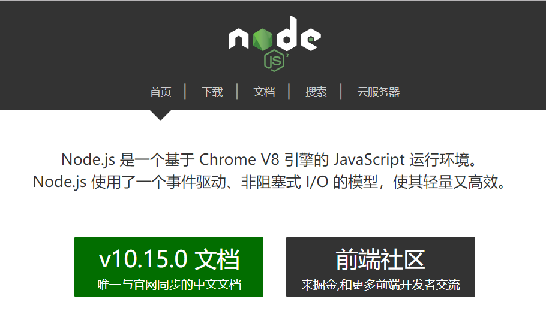
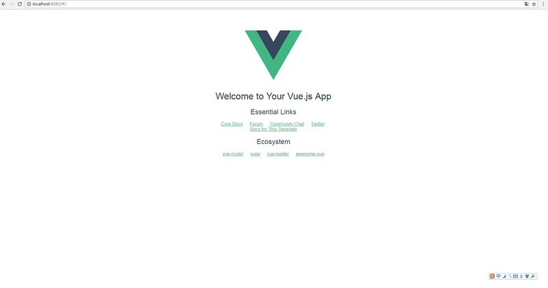

@[vue-cli搭建项目](https://github.com/danygitgit/document-library/blob/master/JavaScript-library/Vue/Vue-cli%E5%85%A5%E9%97%A8%EF%BC%88%E4%B8%80%EF%BC%89%E2%80%94%E2%80%94%E9%A1%B9%E7%9B%AE%E6%90%AD%E5%BB%BA.md)

> create by **db** on **2019-1-10 16:28:10**
> Recently revised in **2019-1-14 23:19:07**

&emsp;**Hello 小伙伴们，如果觉得本文还不错，麻烦点个赞或者给个 star，你们的赞和 star 是我前进的动力！[GitHub 地址](https://github.com/danygitgit/document-library/blob/master/JavaScript-library/Vue/vue-cli%E6%90%AD%E5%BB%BA%E9%A1%B9%E7%9B%AE.md)**

&emsp;查阅网上诸多资料，并结合自己的学习经验，写下这篇Vue2.0学习笔记，以记录自己的学习心得。现分享给大家，以供参考。

&emsp;作为一只前端菜鸟，这是我掘金分享的第四篇文章。如有不足，还请多多指教，谢谢大家。

# 前言

&emsp;作为一款前端框架，Vue 因其易上手，轻量级，受到广泛的应用。

&emsp;vue-cli作为Vue的脚手架工具，集成了webpack环境及主要依赖，只需要几分钟的时间就可以运行起来一个项目。对于项目的搭建、打包、维护管理等都非常方便快捷。

&emsp;此笔记旨在帮助Vue小白了解并应用Vue2.0项目搭建过程，希望能帮得到大家。

&emsp;参考文献：

- [vue-cli搭建项目 | 思否-villelee](https://segmentfault.com/a/1190000015475645)
- [windows下搭建vue开发环境 | 充电实践 ](https://www.liaoxuefeng.com/wiki/0013739516305929606dd18361248578c67b8067c8c017b000)
- [十分钟上手-搭建vue开发环境（新手教程） | 简书-祈澈菇凉](https://www.jianshu.com/p/0c6678671635)
- [vue-cli入门（一）——项目搭建 | 思否-Reachel](https://segmentfault.com/a/1190000009151389)
  
&emsp;另：个人以为，学习vue最好的途径还是[官方文档](https://cn.vuejs.org/)

# 正文

## 搭建Vue开发环境

### 1、安装node

&emsp;Vue项目通常通过webpack工具来构建，而webpack命令的执行是依赖node.js的环境的，所以首先要安装node.js。node.js的官方地址为：`https://nodejs.org/en/download/`，下载相应版本


安装好node之后，以管理员身份打开cmd管理工具，，输入 `node -v `，回车，查看node版本号，出现版本号则说明安装成功。

> node -v

### 2、安装淘宝npm镜像
&emsp;由于npm是国外的，使用起来比较慢，我们这里使用淘宝的cnpm镜像来安装vue.

&emsp;淘宝的cnpm命令管理工具可以代替默认的npm管理工具。

输入以下命令，回车；
> npm install -g cnpm --registry=https://registry.npm.taobao.org

### 3、安装全局vue-cli脚手架

&emsp;vue-cli是vue官方提供的一个命令行工具，可用于快速搭建大型单页应用。该工具提供开箱即用的构建工具配置，带来现代化的前端开发流程。只需一分钟即可启动带热重载、保存时静态检查以及可用于生产环境的构建配置的项目。

&emsp;淘宝镜像安装成功之后，我们就可以安装全局vue-cli脚手架。

输入以下命令，回车；

> cnpm install --global vue-cli

&emsp;验证是否安装成功，在命令行输入`vue -V`，出来vue的版本号，则说明安装成功；

## 创建vue项目

### 1、通过vue-cli创建一个vue项目

&emsp;进入你需要创建在项目的文件夹，打开命令行。

输入以下命令，回车
> <font color=red> vue init webpack</font> test

&emsp;这里test指的是项目名，该命令执行后会创建一个名为test的目录，也就是我们所搭建的项目。

接下来会要求你进行一些选项设置，其实就是初始化项目：
```
? Project name (test)        // 项目名称，按Enter确定就好 
? Project name test
? Project description (A Vue.js project)        // 项目描述，按Enter确定就好 
? Project description A Vue.js project
? Author (villelee)        // 作者，按Enter确定就好 
? Author villelee
? Vue build (Use arrow keys)        // 开始选项设置，按Enter确定就好 
? Vue build standalone
? Install vue-router? (Y/n) Y        // 安装路由，需要的话可以选Y，不需要就选n
? Install vue-router? Yes
? Use ESLint to lint your code? (Y/n) Y        // 是否使用ESlint统一代码风格，编码规范，建议选Y
? Use ESLint to lint your code? Yes
? Pick an ESLint preset (Use arrow keys)
> Standard (https://github.com/standard/standard)
? Pick an ESLint preset Airbnb
? Set up unit tests (Y/n) n        // 是否安装单元测试
? Set up unit tests No
? Setup e2e tests with Nightwatch? (Y/n) n        // 是否安装e2e测试编码规范
? Setup e2e tests with Nightwatch? No
? Should we run `npm install` for you after the project has been created? (recom
? Should we run `npm install` for you after the project has been created? (recom
mended) npm
   vue-cli · Generated "test".
```
&emsp;最后出现如下代码
```
To get started:

  cd test
  npm run dev
```
&emsp;说明已经初始化成功，vue-cli已经将项目搭建完成。

### 2、进入你的项目文件夹

&emsp;项目搭建好了，现在就可以进入项目文件夹。

输入以下命令，回车进入新建的项目。

> <font color=red>cd</font> test

### 3、通过cnpm在项目里安装依赖

&emsp;因为各个模板之间都是相互依赖的，所以现在我们要安装依赖。

输入以下命令，回车安装依赖
> <font color=red>cnpm install</font>

### 4、启动项目

&emsp;一切环境依赖安装准备就绪，我们来测试一下自己新建的vue项目的运行情况。

输入以下命令，回车启动项目

> <font color=red>npm run dev</font>

结果会弹出一个浏览器访问地址默认为localhost:8080，如下：

```
$ npm run dev

> test@1.0.0 dev D:\ptest\test
> webpack-dev-server --inline --progress --config build/webpack.dev.conf.js

 95% emitting DONE  Compiled successfully in 5547ms11:59:13

 I  Your application is running here: http://localhost:8080
```
&emsp;在浏览器中打开`http://localhost:8080`，就能看到你的项目了


### 项目打包

运行`npm run build`

运行后打包成功会在项目中生成dist文件夹

部署服务器是把文件夹中的文件丢上服务器即可

# 总结 

&emsp;至此，我们的Vue项目就搭建完成了。万里长征第一步，加油！

&emsp;如需进一步了解关于vue项目结构的基础知识，请戳[Vue小白课（二）——项目结构解析（Vue2.x）](https://github.com/danygitgit/document-library/blob/master/JavaScript-library/Vue/Vue%E5%B0%8F%E7%99%BD%E8%AF%BE%EF%BC%88%E4%BA%8C%EF%BC%89%E2%80%94%E2%80%94%E9%A1%B9%E7%9B%AE%E7%BB%93%E6%9E%84%E8%A7%A3%E6%9E%90%EF%BC%88Vue2.x%EF%BC%89.md)

&emsp;路漫漫其修远兮，与诸君共勉。

&emsp;祝大家2019更上一层楼！

**后记：Hello 小伙伴们，如果觉得本文还不错，记得点个赞或者给个 star，你们的赞和 star 是我编写更多更丰富文章的动力！[GitHub 地址](https://github.com/danygitgit/document-library/blob/master/JavaScript-library/Vue/Vue-cli%E5%85%A5%E9%97%A8%EF%BC%88%E4%B8%80%EF%BC%89%E2%80%94%E2%80%94%E9%A1%B9%E7%9B%AE%E6%90%AD%E5%BB%BA.md)**

> <a rel="license" href="http://creativecommons.org/licenses/by-nc-sa/4.0/"></a><br /><a xmlns:dct="http://purl.org/dc/terms/" property="dct:title">**db** 的文档库</a> 由 <a xmlns:cc="http://creativecommons.org/ns#" href="db" property="cc:attributionName" rel="cc:attributionURL">db</a> 采用 <a rel="license" href="http://creativecommons.org/licenses/by-nc-sa/4.0/">知识共享 署名-非商业性使用-相同方式共享 4.0 国际 许可协议</a>进行许可。<br />基于<a xmlns:dct="http://purl.org/dc/terms/" href="https://github.com/danygitgit" rel="dct:source">https://github.com/danygitgit</a>上的作品创作。<br />本许可协议授权之外的使用权限可以从 <a xmlns:cc="http://creativecommons.org/ns#" href="https://creativecommons.org/licenses/by-nc-sa/2.5/cn/" rel="cc:morePermissions">https://creativecommons.org/licenses/by-nc-sa/2.5/cn/</a> 处获得。