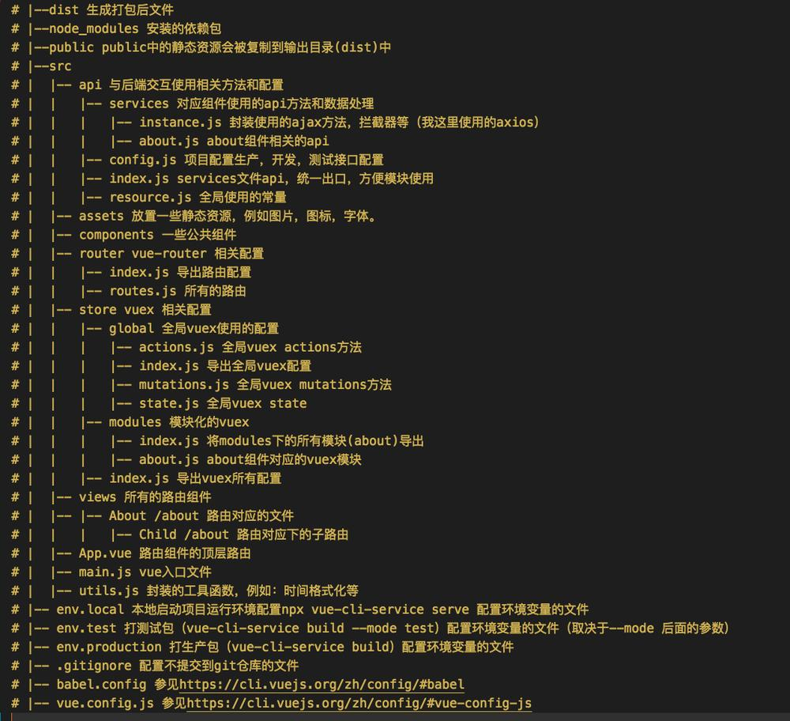

@[Vue项目结构解析](https://github.com/danygitgit/document-library/blob/master/JavaScript-library/Vue/Vue%E5%B0%8F%E7%99%BD%E8%AF%BE%EF%BC%88%E5%9B%9B%EF%BC%89%E2%80%94%E2%80%94%E9%A1%B9%E7%9B%AE%E7%BB%93%E6%9E%84%E8%A7%A3%E6%9E%90%EF%BC%88Vue3.x%EF%BC%89.md)

> create by **db** on **2019-1-10 16:28:10**
> Recently revised in **2019-3-9 21:52:41**

&emsp;**Hello 小伙伴们，如果觉得本文还不错，麻烦点个赞或者给个 star，你们的赞和 star 是我前进的动力！[GitHub 地址](https://github.com/danygitgit/document-library/blob/master/JavaScript-library/Vue/Vue%E5%B0%8F%E7%99%BD%E8%AF%BE%EF%BC%88%E5%9B%9B%EF%BC%89%E2%80%94%E2%80%94%E9%A1%B9%E7%9B%AE%E7%BB%93%E6%9E%84%E8%A7%A3%E6%9E%90%EF%BC%88Vue3.x%EF%BC%89.md)**

&emsp;查阅网上诸多资料，并结合自己的学习经验，写下这篇Vue3.0学习笔记，现分享给大家，以供参考。

&emsp;作为一只前端菜鸟，本篇文章旨在记录自己的学习心得，如有不足，还请多多指教，谢谢大家。
# 前言

&emsp;在上一篇项目搭建文章中，我们已经下载安装了node环境以及Vue-CLI3，并且已经成功构建了一个Vue-CLI3项目——见[Vue小白课（三）——CLI搭建项目（Vue3.x）](https://github.com/danygitgit/document-library/blob/master/JavaScript-library/Vue/Vue%E5%B0%8F%E7%99%BD%E8%AF%BE%EF%BC%88%E4%B8%89%EF%BC%89%E2%80%94%E2%80%94CLI%E6%90%AD%E5%BB%BA%E9%A1%B9%E7%9B%AE%EF%BC%88Vue3.x%EF%BC%89.md)。那么接下来，我们来梳理一下Vue-CLI3项目的结构。

&emsp;参考文献：

- [Vue3.x官方文档](https://cli.vuejs.org/)

- [利用vue-cli3快速搭建vue项目详细过程 | 简书-zhyzhyzz](https://www.jianshu.com/p/8105d6c16d80)

- [vue-cli3.0项目结构 | 简书-戴眼镜的松鼠](https://www.jianshu.com/p/2edcf71f7730)

# 正文

&emsp;vue-cli3.0默认项目目录与2.0的相比，更加精简:
1. 移除的配置文件根目录下的，build和config等目录，
2. 移除了static文件夹，新增了public文件夹，并且index.html移动到public中。
3. 在src文件夹中新增了views文件夹，用于分类 试图组件 和 公共组件 。
4. 大部分配置 都集成到 vue.config.js这里,在项目根目录下

## Vue-CLI3项目结构一览

 
# 总结

&emsp;Vue-CLI3给创建vue项目提供了很大的便利。但是同时大量的第三方库的使用，会让打包后的js变的很大，所以还是要熟悉配置,熟悉第三方插件的使用，才可以开发更高效的开发web应用。这里把Vue-CLI3的一些相关内容给自己做一个总结，便于以后查阅。也是希望对其他开发者有帮助。有不足之处请指正。

&emsp;路漫漫其修远兮，与诸君共勉。

**后记：Hello 小伙伴们，如果觉得本文还不错，记得点个赞或者给个 star，你们的赞和 star 是我编写更多更丰富文章的动力！[GitHub 地址](https://github.com/danygitgit/document-library/blob/master/JavaScript-library/Vue/Vue%E5%B0%8F%E7%99%BD%E8%AF%BE%EF%BC%88%E5%9B%9B%EF%BC%89%E2%80%94%E2%80%94%E9%A1%B9%E7%9B%AE%E7%BB%93%E6%9E%84%E8%A7%A3%E6%9E%90%EF%BC%88Vue3.x%EF%BC%89.md)**

>  <a xmlns:dct="http://purl.org/dc/terms/" property="dct:title">**db** 的文档库</a> 由 <a xmlns:cc="http://creativecommons.org/ns#" href="wzh" property="cc:attributionName" rel="cc:attributionURL">db</a> 采用 <a rel="license" href="http://creativecommons.org/licenses/by-nc-sa/4.0/">知识共享 署名-非商业性使用-相同方式共享 4.0 国际 许可协议</a>进行许可。 基于<a xmlns:dct="http://purl.org/dc/terms/" href="https://github.com/danygitgit" rel="dct:source">https://github.com/danygitgit</a>上的作品创作。 本许可协议授权之外的使用权限可以从 <a xmlns:cc="http://creativecommons.org/ns#" href="https://creativecommons.org/licenses/by-nc-sa/2.5/cn/" rel="cc:morePermissions">https://creativecommons.org/licenses/by-nc-sa/2.5/cn/</a> 处获得。