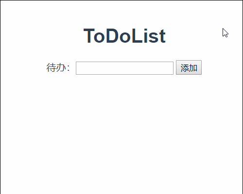

@[Vue组件通信](https://github.com/danygitgit/document-library/blob/master/JavaScript-library/Vue/Vue%E9%A1%B9%E7%9B%AE%E5%AE%9E%E6%88%98%EF%BC%88%E4%B8%80%EF%BC%89%E2%80%94%E2%80%94ToDoList.md)

> create by **db** on **2019-4-28 17:13:46**   
> Recently revised in **2019-4-28 17:13:53**

&emsp;**Hello 小伙伴们，如果觉得本文还不错，麻烦点个赞或者给个 star，你们的赞和 star 是我前进的动力！[GitHub 地址](https://github.com/danygitgit/document-library/blob/master/JavaScript-library/Vue/Vue%E9%A1%B9%E7%9B%AE%E5%AE%9E%E6%88%98%EF%BC%88%E4%B8%80%EF%BC%89%E2%80%94%E2%80%94ToDoList.md)**

&emsp;查阅网上诸多资料，并结合自己的学习经验，写下这篇Vue学习笔记，以记录自己的学习心得。现分享给大家，以供参考。

&emsp;作为一只前端菜鸟，本篇文章旨在记录自己的学习心得，如有不足，还请多多指教，谢谢大家。

# 前言

> I hear and I fogorget.

> I see and I remember.

> I do and I understand.

&emsp;Vue中实现组件之间的通信方式有很多种，eventBus, props, vuex, v-on, ref...等等。自己在很多时候用的没有章法，简单的想着实现功能就可以了，以至于逻辑混论，后期很难维护。所以给自己做个总结，方法并不是唯一，只是我现在认为的解决方案。

&emsp;参考文献：

- [Vue组件通信 | 思否-老虎不长牙 ](https://segmentfault.com/a/1190000015040856#articleHeader8)
- [vue组件通信全揭秘(共7章) | 掘金-混元霹雳手 ](https://juejin.im/post/5bd97e7c6fb9a022852a71cf#heading-87)

# 正文
&emsp;组件通信包括：子组件与父组件之间，兄弟组件之间，模块之间

## 父子组件通信
### props
**`props`是响应式的，可以做数据绑定**
&emsp;`index.vue`父组件相关的代码

&emsp;如果传给子组件的是一个变量或者数字，则需要前面加上：(v-bind的缩写)绑定。

&emsp;这边的imgHeight是一个变量,closeFuction是一个方法
```html
<template>
    <div>
        <child :img-width="344" :img-height="imgHeight" title="静态文字" :before-close="closeFuction"></child>
    </div>
</template>
```
&emsp;`child.vue`子组件中的,使用的话直接可以用 `this.imgWidth`形式获取到。

```javascript
props:{
    imgWidth: {
        type: Number,
        default: 300
    },
    imgHeight: {
        type: Number
    },
    title: {
        type: String,
        default: ''
    },
    beforeClose: {
        type: Function,
        default: function() {
            console.warn('need a init submitHandle Prop!');
        }
    }
}
```
&emsp;因为html对于大小写并不敏感，所以子组件中驼峰命名在父组件中建议采用下划线。传递给子组件的方法类似于一个回调函数。调用之后可以更改父组件中的内容，也算是子组件向父组件通信了。另外值得注意的是，根据Vue风格指南中建议的，prop 的定义应该尽量详细，至少需要指定其类型。

### v-on

&emsp;在使用组件时，经常会用到v-model。官方解释是 v-model 本质上不过是语法糖。它负责监听用户的输入事件以更新数据。

clipboard.png

&emsp;对于`v-on `官网解释是用在普通元素上时，只能监听原生 DOM 事件。用在自定义元素组件上时，也可以监听子组件触发的自定义事件。
所以前面的例子我们改一改

index.vue父组件相关的代码

```html
<template>
    <div>
        <child :img-width="344" :img-height="imgHeight" title="静态文字" @before-close="closeFuction"></child>
    </div>
</template>
```
`closeFuction`是一个方法,带参数

```javascript
closeFuction(val) {
console.log(val);
    // todo
}
```
child.vue子组件

```javascript
methods: {
    doSomething() {
        // todo
        const val = '需要传给父组件的参数';
        this.$emit('before-close', val);
        console.log('在需要调用的地方 用this.$emit触发');
    }
}
```
理解v-on在组件上的机制，就可以更好的认识到，为什么v-model仅仅是个语法糖。

$ref
ref 被用来给元素或子组件注册引用信息。就是绑定在普通元素上，则获取到这个DOM元素，若是绑定在组件上，则获取到的是这个组件的Vue实例vm。

同一个vue中：

<div ref="child"></div>
mounted() {
    let domA = document.querySelector('[ref=child]');
    let domB = this.$ref.child;
    console.log('domA与domB是等价的，但是用$ref可以减少获取dom节点的消耗')
}
index.vue

<template>
    <div>
        <child ref="childName"></child>
    </div>
</template>


----------
mounted(){
    let childData = this.$ref.childName.$data.childData;
    let childMethod = this.$ref.childName.doSomething;
    console.log('都可以访问到');
}
child.vue子组件

data(){
    return {
        childData: 'xxxx'
    }
},
methods: {
    doSomething() {
        // todo
    }
}
注意：
vue更新数据是异步的,我们需要等到DOM更新完成，所以使用$ref进行DOM操作的时候，需要放在created的$nextTick(() => {})，或者直接放在mounted。
因为绑定组件的话返回的是vm实例，所以参考实例属性获取想要的数据等。
$refs 也不是响应式的，因此不应该试图用它在模板中做数据绑定。

兄弟组件通信
兄弟组件通信有两种方法，eventBus，vuex。但是我跟愿意将eventBus放在模块之间的通信来讲。

vuex
当非父子组件之间通信较多时，用eventBus很容易逻辑混乱，较难维护。vuex将状态管理单独拎出来，应用统一的方式进行处理，可以理解为组件间公用的一个全局对象。

使用Vuex

安装

npm install --save vuex
其实一般来说，用到vuex的时候，业务逻辑都已经比较复杂，所以我就讲我自己在用的时候，项目文件的处理。

clipboard.png

store/index.js

import Vuex from 'vuex';
import Vue from 'vue';
Vue.use(Vuex);
console.log("必须引入vuex");
const store = new Vuex.Store({
    state: {
        stateName: 'xxxx'
    },
    mutations: {
       mutationsName(state, {params}) {
           state.stateName = params;
            console.log("只有在mutations中才能直接改变state中的值")
       } 
    },
    actions: {
        actionName({ state,commit}, {params}) {
        let actionParam = 'mmm';
            commit('mutationsName', actionParam );
            console.log(" 触发mutation 方法要用commit分发，以此改变state");
        }
    }
       
});
export default store;
main.js

console.log("store为实例化生成的");
import store from './store/index.js';
new Vue({
  el: '#app',
  store,
  console.log("将store挂载到vue实例上")
  render: h => h(App)
})
在组件中使用
child.vue js部分

import { mapActions, mapMutations, mapState } from 'vuex';
export default {
    computed: {
        ...mapState({ stateName })
    },
    methods: {
        ...mapActions(['actionName']),
        ...mapMutations(['mutationName'])
        console.log("使用辅助函数mapMutations直接将触发函数映射到methods上")
    }
    
    // 接下来在实例中就可以用this.stateName,this.actionName来调用

}
当兄弟组件很多，涉及到的处理数据庞大的时候，可以用到vuex中的modules，使得结构更加清晰

const moduleA = {
  state: { ... },
  mutations: { ... },
  actions: { ... },
  getters: { ... }
}

const moduleB = {
  state: { ... },
  mutations: { ... },
  actions: { ... }
}

const store = new Vuex.Store({
  modules: {
    a: moduleA,
    b: moduleB
  }
})

store.state.a // -> moduleA 的状态
store.state.b // -> moduleB 的状态
vuex讲细篇幅很长，更多更复杂的内容，参考官方教程

模块通信
eventBus
eventBus的原理是引入一个新的vue实例，然后通过分别调用这个实例的事件触发和监听来实现通信和参数传递。
eventBus.js 一般会直接用公共一个文件来存放vue实例

import Vue from 'vue';  
export default new Vue();  
我们在apple.vue中监听一个事件
apple.vue

import eventBus from 'eventBus.js'; 
// 我们在create钩子中监听方法
create(){
    console.log("this.getTarget是一个带参数的方法，但是这边只要将两者关联起来");
    eventBus .$on('getTarget', this.getTarget); 
},
beforeDestroy() {
    console.log("组件销毁前需要解绑事件。否则会出现重复触发事件的问题");
    bus.$off('getTarget', this.getTarget);
},
methods: {
    getTarget(param) {
        // todo
    }
}
在orange.vue中触发

import eventBus from 'eventBus.js'; 
// 必须引入同一个实例

methods： {
    doSomething() {
        eventBus.$emit("getTarget", 22);
        console.log("向getTarget方法传参22");
    }
}
总结
eventBus其实非常方便，任何的组件通信都能用它来完成。但是，我们会根据情况来选择更易维护的方式。因为eventBus比较不好找到对应的监听或者触发事件具体实现的地方，所以一般组件通信更考虑上面的实现方式。在模块之间通信利用eventBus，然后在模块内部，利用vuex通信，维护数据，会在逻辑上比较清晰。


## 6、总结

&emsp;通过以上几个关键的知识点，我们最终就实现了ToDoList的基本功能，效果如下：



&emsp;如果喜欢，可以再加一些样式。

&emsp;大家可以在后续的学习过程中加入更多的功能，巩固自己学到的知识。

&emsp;路漫漫其修远兮，与诸君共勉。

**后记：Hello 小伙伴们，如果觉得本文还不错，记得点个赞或者给个 star，你们的赞和 star 是我编写更多更丰富文章的动力！[GitHub 地址](https://github.com/danygitgit/document-library/blob/master/JavaScript-library/Vue/Vue%E9%A1%B9%E7%9B%AE%E5%AE%9E%E6%88%98%EF%BC%88%E4%B8%80%EF%BC%89%E2%80%94%E2%80%94ToDoList.md)**

> <a rel="license" href="http://creativecommons.org/licenses/by-nc-sa/4.0/"></a><br /><a xmlns:dct="http://purl.org/dc/terms/" property="dct:title">**db** 的文档库</a> 由 <a xmlns:cc="http://creativecommons.org/ns#" href="wzh" property="cc:attributionName" rel="cc:attributionURL">db</a> 采用 <a rel="license" href="http://creativecommons.org/licenses/by-nc-sa/4.0/">知识共享 署名-非商业性使用-相同方式共享 4.0 国际 许可协议</a>进行许可。<br />基于<a xmlns:dct="http://purl.org/dc/terms/" href="https://github.com/danygitgit" rel="dct:source">https://github.com/danygitgit</a>上的作品创作。<br />本许可协议授权之外的使用权限可以从 <a xmlns:cc="http://creativecommons.org/ns#" href="https://creativecommons.org/licenses/by-nc-sa/2.5/cn/" rel="cc:morePermissions">https://creativecommons.org/licenses/by-nc-sa/2.5/cn/</a> 处获得。