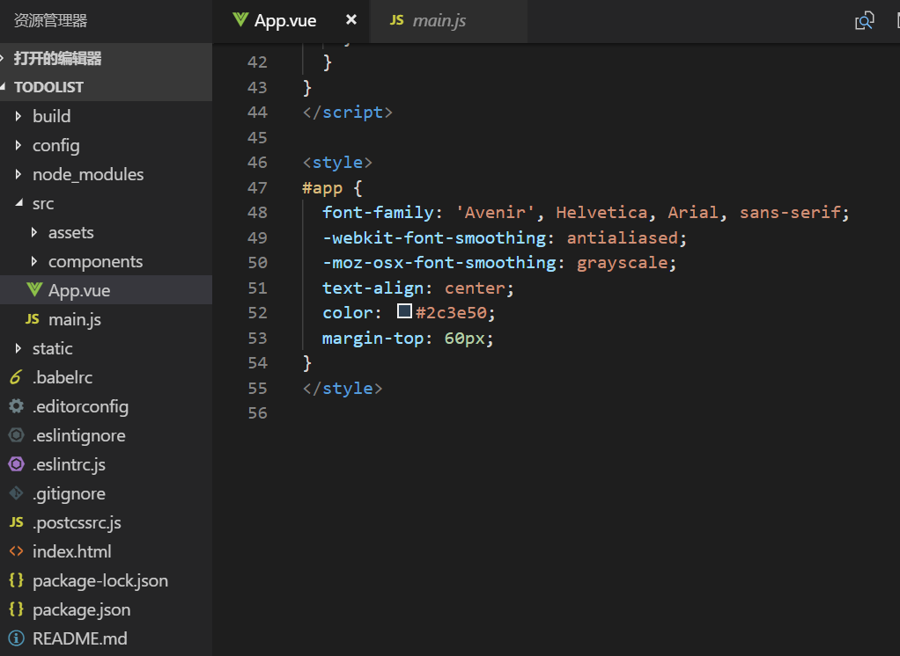

@[vue-cli搭建项目](https://github.com/danygitgit/document-library/blob/master/other-library/Git%E7%AC%94%E8%AE%B0/Git%E5%91%BD%E4%BB%A4%E5%85%A5%E9%97%A8.md)

> create by **db** on **2019-1-10 16:28:10**   
> Recently revised in **2019-1-10 19:37:50**

&emsp;**Hello 小伙伴们，如果觉得本文还不错，麻烦点个赞或者给个 star，你们的赞和 star 是我前进的动力！[GitHub 地址](https://github.com/danygitgit/document-library/blob/master/JavaScript-library/Vue/vue-cli%E6%90%AD%E5%BB%BA%E9%A1%B9%E7%9B%AE.md)**

&emsp;查阅网上诸多资料，并结合自己的学习经验，写下这篇Vue学习笔记，以记录自己的学习心得。现分享给大家，以供参考。

&emsp;作为一只前端菜鸟，这是我掘金分享的第六篇文章。如有不足，还请多多指教，谢谢大家。

# 前言

&emsp;作为国人写的一个框架，vue 因其易上手，轻量级，受到广泛的应用。

&emsp;参考文献：

- [Vue之ToDoList实战 | CSDN -充电实践 ](https://blog.csdn.net/wu__di/article/details/54918454 )
- [简单实现一个todo-list | FatDong1 ](https://segmentfault.com/a/1190000010487690#vue)

# 正文

&emsp;之前的文章windows下搭建vue开发环境，我们已经搭建好了vue的环境，并且写了Vue系列之WebPack与Eslint，对vue项目的整体情况有了了解，这篇文章我们就来练习一下vue，实现ToDoList项目。

以下是我们的项目目录结构：



&emsp;就是初始化项目后，将`HelloWorld.vue`文件删除掉，保留其他目录结构。

&emsp;在这个ToDoList当中，涉及到知识点包括以下内容:

## 1、创建Vue实例：

&emsp;在main.js中，我们看到vue-cli默认的

```javascript
new Vue({
  el: '#app',
  components: { App },
  template: '<App/>'
})
```

&emsp;其中，`el`是vue实例化的选项，提供一个在页面上已存在的 DOM 元素作为 Vue 实例的挂载目标。可以是 CSS 选择器，也可以是一个 HTMLElement 实例。

&emsp;`template`，作为 Vue 实例的标识使用。模板将会替换挂载的元素。挂载元素的内容都将被忽略，除非模板的内容有分发 slot。

&emsp;`components`，组件（Component）是 Vue.js 最强大的功能之一。组件可以扩展 HTML 元素，封装可重用的代码。在较高层面上，组件是自定义元素， Vue.js 的编译器为它添加特殊功能。在有些情况下，组件也可以是原生 HTML 元素的形式，以 js 特性扩展。

## 2、data的使用

&emsp;`data`是Vue 实例的数据对象。

&emsp;Vue 将会递归将 data 的属性转换为 getter/setter，从而让 data 的属性能够响应数据变化。

```javascript
<script>
export default {
  name: 'App',
  data() {
    return {
      title: 'ToDoList'
    }
  }
}
</script>
```

&emsp;上面的js代码，我们在App.vue中使用data，来返回title，我们的目的是title能够展现到页面上，那么这条数据如何绑定呢？

```javascript
<template>
  <div id="app">
    <h1 v-text="title"></h1>
  </div>
</template>
```

&emsp;我们定义标签h1，使用v-text绑定title，这样就显示了title。

请点击此处输入图片描述

&emsp;改变title的值，显示的内容也会立即刷新。如果title的内容包含html元素，比如

`title: '<span></span>this is a todo list'`

&emsp;那么使用v-text显示会是：

请点击此处输入图片描述

而使用v-htm会自动替换html元素：

请点击此处输入图片描述

## 2、列表渲染

&emsp;接下来，我们使用v-for指令来实现列表的渲染：

```html
<template>
  <div id="app">
    <h1 v-text="title"></h1>
    <ul>
      <li
        v-for="item in items"
        :key="item.id">
        <!-- 待办事项 -->
        <span v-text="item.title" ></span>
        <!-- 完成按钮 -->
        <button v-bind="item.id">删除</button>
      </li>
    </ul>
  </div>
</template>

<script>
export default {
  name: 'App',
  data () {
    return {
      title: 'ToDoList',
      items: [
        {
          id: 1,
          title: '吃饭',
          isdelete: true
        },
        {
          id: 2,
          title: '睡觉',
          isdelete: true
        },
        {
          id: 3,
          title: '打豆豆',
          isdelete: true
        }
      ]
    }
  }
}
</script>
```
**注：**

&emsp;vue中列表循环需加:key="唯一标识" 唯一标识可以是item里面id index等，因为vue组件高度复用增加Key可以标识组件的唯一性，为了更好地区别各个组件 key的作用主要是为了高效的更新虚拟DOM。详情请参考[VUE中演示v-for为什么要加key](https://www.jianshu.com/p/4bd5e745ce95)

&emsp;在data中，我们又返回了items数组，其中每个元素包括id,title，我们将items使用v-for绑定到列表中，渲染后的结果如下：


### 3、绑定事件

接下来我们使用v-on来绑定事件，目的是删除按钮的时候，将列表中相应的选项删除。


请点击此处输入图片描述

这里我们增加了click方法，方法名为toggleFinish，参数为字符串item。

4、methods的使用

紧接着上面定义的toggleFinish方法，vue使用methods来添加各种不同的事件：


请点击此处输入图片描述

toggleFinish方法对当前item的属性isFinished取反。

5、使用input

截至目前我们使用的都是现成的列表，接下来我们使用输入框来动态输入：


请点击此处输入图片描述

使用指令v-model在表单控件或者组件上创建双向绑定，即绑定newItem，使用v-on来绑定事件监听器，输入框输完内容按下回车后会响应事件addNew，addNew同样在methods中编写如下：

请点击此处输入图片描述

在data中，items默认为空，newItem也为空，输入内容回车后items中push一条内容，其中的label为输入框输入的内容，isFinished默认为false，表示不带下划线，并且最后将输入框清空。

6、总结

通过以上几个关键的知识点，我们最终就实现了ToDoList的基本功能，效果如下：

请点击此处输入图片描述

大家可以在后续的学习过程中加入更多的功能，巩固自己学到的知识。

# 总结 

&emsp;路漫漫其修远兮，希望Git及GitHub可以帮我们记录每一个脚印，每一步成长。与诸君共勉。

&emsp;祝大家2019更上一层楼！

**后记：Hello 小伙伴们，如果觉得本文还不错，记得点个赞或者给个 star，你们的赞和 star 是我编写更多更丰富文章的动力！[GitHub 地址](https://github.com/danygitgit/document-library/blob/master/JavaScript-library/Vue/vue-cli%E6%90%AD%E5%BB%BA%E9%A1%B9%E7%9B%AE.md)**

> <a rel="license" href="http://creativecommons.org/licenses/by-nc-sa/4.0/"></a><br /><a xmlns:dct="http://purl.org/dc/terms/" property="dct:title">**db** 的文档库</a> 由 <a xmlns:cc="http://creativecommons.org/ns#" href="wzh" property="cc:attributionName" rel="cc:attributionURL">db</a> 采用 <a rel="license" href="http://creativecommons.org/licenses/by-nc-sa/4.0/">知识共享 署名-非商业性使用-相同方式共享 4.0 国际 许可协议</a>进行许可。<br />基于<a xmlns:dct="http://purl.org/dc/terms/" href="https://github.com/danygitgit" rel="dct:source">https://github.com/danygitgit</a>上的作品创作。<br />本许可协议授权之外的使用权限可以从 <a xmlns:cc="http://creativecommons.org/ns#" href="https://creativecommons.org/licenses/by-nc-sa/2.5/cn/" rel="cc:morePermissions">https://creativecommons.org/licenses/by-nc-sa/2.5/cn/</a> 处获得。