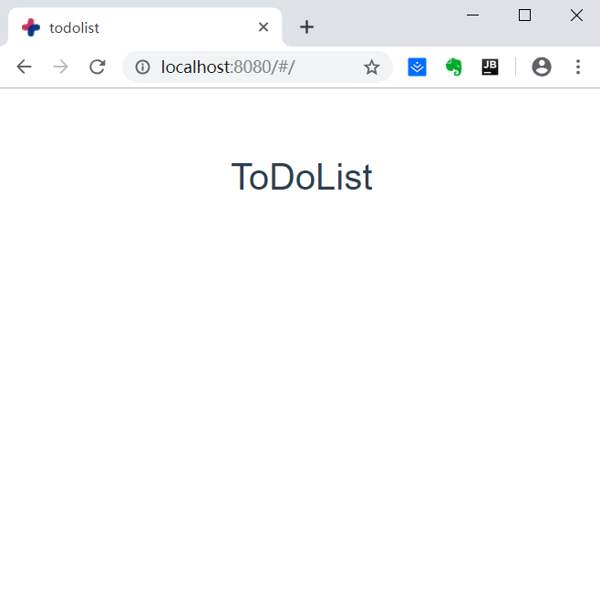
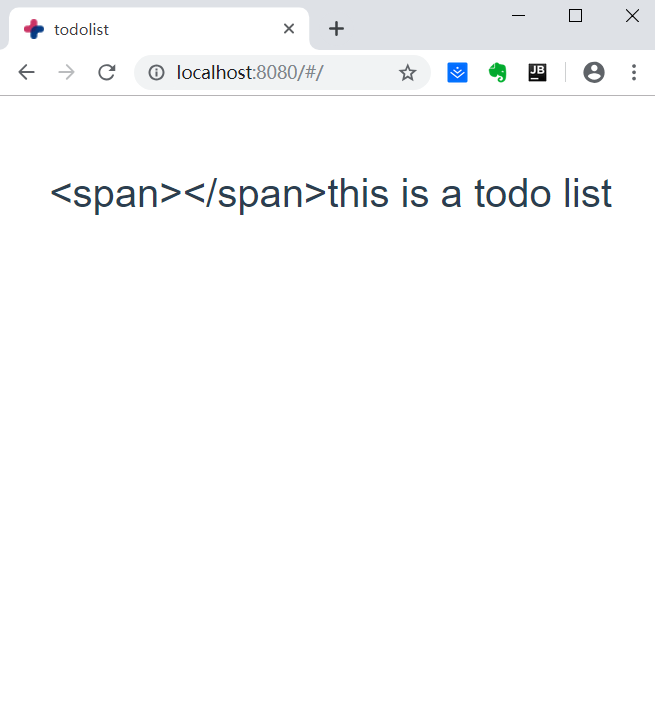
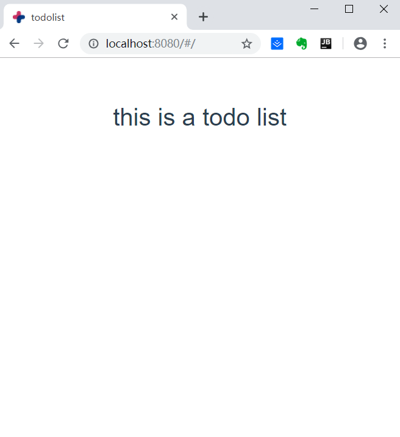
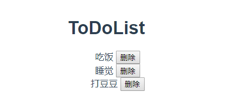

@[vue-cli2搭建待办事项项目](https://github.com/danygitgit/document-library/blob/master/JavaScript-library/Vue/Vue%E9%A1%B9%E7%9B%AE%E5%AE%9E%E6%88%98%EF%BC%88%E4%B8%80%EF%BC%89%E2%80%94%E2%80%94ToDoList.md)

> create by **db** on **2019-3-10 16:28:10**   
> Recently revised in **2019-4-1 17:06:13**

&emsp;**Hello 小伙伴们，如果觉得本文还不错，麻烦点个赞或者给个 star，你们的赞和 star 是我前进的动力！[GitHub 地址](https://github.com/danygitgit/document-library/blob/master/JavaScript-library/Vue/Vue%E9%A1%B9%E7%9B%AE%E5%AE%9E%E6%88%98%EF%BC%88%E4%B8%80%EF%BC%89%E2%80%94%E2%80%94ToDoList.md)**

&emsp;查阅网上诸多资料，并结合自己的学习经验，写下这篇Vue学习笔记，以记录自己的学习心得。现分享给大家，以供参考。

&emsp;作为一只前端菜鸟，本篇文章旨在记录自己的学习心得，如有不足，还请多多指教，谢谢大家。

# 前言
> I hear and I fogorget.

> I see and I remember.

> I do and I understand.

&emsp;小白课系列告一段落，下面开始我们的实战课程吧！
* 注：本项目基于VueCLI2框架实现搭建

&emsp;参考文档：

- [Vue之ToDoList实战 | CSDN -充电实践 ](https://blog.csdn.net/wu__di/article/details/54918454 )
- [简单实现一个todo-list | FatDong1 ](https://segmentfault.com/a/1190000010487690#vue)
- [TodoMVC Example | Vue官网](https://cn.vuejs.org/v2/examples/todomvc.html)

# 正文

&emsp;如果看完了《Vue小白课》，那么对Vue项目的整体情况有了一定了解，并且搭建好了vue的环境。本篇我们就来练习一下Vue，实现ToDoList项目。

&emsp;倘若对VueCLI项目不是特别了解，请先参考：
- [Vue小白课（一）——CLI搭建项目（Vue2.x）](https://juejin.im/post/5c3d46b76fb9a04a053fecc9)
- [Vue小白课（二）——项目结构解析（Vue2.x）](https://juejin.im/post/5c3d65df518825258604df96)

以下是我们的搭建好的项目目录结构：


&emsp;在这个ToDoList当中，涉及到知识点包括以下内容:

## 一、创建Vue实例：

&emsp;在 main.js 中，我们看到vue-cli默认的

```javascript
new Vue({
  el: '#ToDoList',
  router,
  components: { ToDoList },
  template: '<ToDoList/>'
}
```

&emsp;其中，`el`是Vue实例化的选项，提供一个在页面上已存在的 DOM 元素（#ToDoList）作为 Vue 实例的挂载目标。可以是 CSS 选择器，也可以是一个 HTMLElement 实例。

&emsp;`router`是Vue的路由。vue-router是Vue.js官方的路由插件，它和vue.js是深度集成的，适合用于构建单页面应用。vue的单页面应用是基于路由和组件的，路由用于设定访问路径，并将路径和组件映射起来。传统的页面应用，是用一些超链接来实现页面切换和跳转的。在vue-router单页面应用中，则是路径之间的切换，也就是组件的切换。路由模块的本质 就是建立起url和页面之间的映射关系。

&emsp;至于我们为啥不能用a标签，这是因为用Vue做的都是单页应用，就相当于只有一个主的index.html页面，所以你写的<a></a>标签是不起作用的，你必须使用vue-router来进行管理。

&emsp;`components`，组件（Component）是 Vue.js 最强大的功能之一。组件可以扩展 HTML 元素，封装可重用的代码。在较高层面上，组件是自定义元素， Vue.js 的编译器为它添加特殊功能。在有些情况下，组件也可以是原生 HTML 元素的形式，以 js 特性扩展。

&emsp;`template`，模板,作为 Vue 实例的标识使用。模板将会替换挂载的元素。挂载元素的内容都将被忽略，除非模板的内容有分发 slot。

## 二、配置路由

&emsp;`/src/router`中的`index.js`文件是Vue项目的路由配置文件。

&emsp;要使用路由我们首先要在`router/index.js`文件中创建路由并配置路由映射。我们可以将vue-cli默认的`HelloWorld`组件改名为`ToDoList`,如下：
```javascript
// 引入路由模块并使用它
import Vue from 'vue'
import Router from 'vue-router'
import ToDoList from '@/components/ToDoList'

Vue.use(Router)

// 创建路由实例并配置路由映射  
export default new Router({
  routes: [
    {
      path: '/',
      name: 'ToDoList',
      component: ToDoList
    }
  ]
})
```

## 三、编写页面

### 1、创建ToDoList组件

&emsp;既然我们配置了ToDoList的路由，就必须创建其相对应的组件。

&emsp;我们可以将`/src/components`中的`HelloWorld.vue`文件改名为`ToDoList.vue`,并且将其`<template>`标签的内容删除，只需要保留一个div根组件就好。如下，我们在组件模板中新建一个`My ToDoList`的标题：
```html
<template>
  <div class="ToDoList">
    <h1>My ToDoList</h1>
  </div>
</template>
```
### 2、绑定数据

&emsp;Vue是一个MVVM框架，那么最基础的就是数据绑定，怎样实现数据绑定呢？

&emsp;首先来认识一下**data**

> `data`就是Vue 实例的数据对象。

&emsp;在 ToDoList.vue 中，Vue 将会递归将 `data` 的属性转换为 getter/setter，从而让 data 的属性能够响应数据变化。

```javascript
<script>
export default {
  name: 'ToDoList',
  data () {
    return {
      title: 'ToDoList'
    }
  }
}
</script>
```

&emsp;上面的js代码，我们在ToDoList.vue中使用data，来返回title，我们的目的是title能够展现到页面上，那么这条数据如何展现呢？

```html
<template>
  <div class="ToDoList">
    <h1 v-text="title">My ToDoList</h1>
  </div>
</template>
```

&emsp;在组件模板的标题h1中，我们使用`v-text`命令绑定title，这样就会自动替换原本html文本,显示了title。



&emsp;改变title的值，显示的内容也会立即刷新。如果title的内容包含html元素，比如

`title: '<span></span>this is a todo list'`

&emsp;那么使用v-text显示会是：



而使用`v-html`命令会自动替换html元素：



### 3、创建并渲染列表

&emsp;接下来，我们使用v-for指令来实现列表的渲染：

```html
<template>
  <div class="ToDoList">
    <h1 v-html="title"></h1>
    <ul>
      <li
      v-for="item in items"
      :key="item.id">
        <!-- 待办事项 -->
        <span v-text="item.title"></span>
        <!-- 完成按钮 -->
        <button>完成</button>
      </li>
    </ul>
  </div>
</template>

<script>
export default {
  name: 'ToDoList',
  data () {
    return {
      title: 'ToDoList', //标题名称
      //待办事项列表
      items: [
        {
          id: 1,
          title: '吃饭'
        },
        {
          id: 2,
          title: '睡觉'
        },
        {
          id: 3,
          title: '打豆豆'
        }
      ]
    }
  }
}
</script>
```
**注：**

&emsp;vue中列表循环需加:key="唯一标识" 唯一标识可以是item里面id、index等，因为vue组件高度复用，增加Key可以标识组件的唯一性。为了更好地区别各个组件， key的作用主要是为了高效的更新虚拟DOM。详情请参考

[VUE中演示v-for为什么要加key](https://www.jianshu.com/p/4bd5e745ce95)

&emsp;在data中，我们又返回了items数组，其中每个元素包括id,title，我们将items使用v-for绑定到列表中，渲染后的结果如下：



### 4、绑定删除事件

接下来我们使用`v-on`来为按钮绑定事件，目的是点击删除按钮的时候，将列表中相应的选项删除。

```html
<button v-on:click="toggleFinish(recycleItem)">完成</button>
```

这里我们增加了`click`方法，方法名为`toggleFinish`，参数为字符串`item`。

* methods的使用

紧接着上面定义的toggleFinish方法，vue使用methods来添加各种不同的事件：

```javascript
methods: {
// 点击完成按钮，删除对应事项
  toggleFinish (recycleItem) {
    // 使用map遍历
    this.items.map((item, index) => {
      if (item.id === recycleItem.id) {
        // 删除对应事项
        this.items.splice(index, 1)
      }
    })
  }
}
```
### 5、使用input输入框添加新事项

&emsp;截至目前我们使用的都是现成的列表，接下来我们使用输入框来动态为列表添加条目：

```html
<div>
  <input type="text" v-model="newItem">
  <button @click="addNewItem">添加</button>
</div>
```

&emsp;使用指令`v-model`在表单控件或者组件上创建双向绑定，即绑定newItem，使用`@`来绑定事件监听器，点击日添加按钮会响应事件`addNewItem`。

`addNewItem`同样在`methods`中编写如下：

```javascript
// 点击添加按钮，添加新的待办事项
addNewItem () {
  // 使用push为数组添加新元素
  this.items.push({
    id: this.id, // id 唯一且自增
    title: this.newItem // todo 标题
  })
  // id 自增
  this.id++;
  // 清空输入框
  this.newItem = ''
}
}
```

&emsp;在data中，我们声明一个变量`id`默认为0，`items`默认为空，`newItem`也为空。输入框输入内容后，点击添加按钮items中push一条内容，其中包括id与title，然后id自增，并且最后将输入框清空。

## 6、总结

&emsp;通过以上几个关键的知识点，我们最终就实现了ToDoList的基本功能，效果如下：


&emsp;如果喜欢，可以再加一些样式。

&emsp;大家可以在后续的学习过程中加入更多的功能，巩固自己学到的知识。

&emsp;路漫漫其修远兮，与诸君共勉。

**后记：Hello 小伙伴们，如果觉得本文还不错，记得点个赞或者给个 star，你们的赞和 star 是我编写更多更丰富文章的动力！[GitHub 地址](https://github.com/danygitgit/document-library/blob/master/JavaScript-library/Vue/Vue%E9%A1%B9%E7%9B%AE%E5%AE%9E%E6%88%98%EF%BC%88%E4%B8%80%EF%BC%89%E2%80%94%E2%80%94ToDoList.md)**

> <a rel="license" href="http://creativecommons.org/licenses/by-nc-sa/4.0/"></a><br /><a xmlns:dct="http://purl.org/dc/terms/" property="dct:title">**db** 的文档库</a> 由 <a xmlns:cc="http://creativecommons.org/ns#" href="db" property="cc:attributionName" rel="cc:attributionURL">db</a> 采用 <a rel="license" href="http://creativecommons.org/licenses/by-nc-sa/4.0/">知识共享 署名-非商业性使用-相同方式共享 4.0 国际 许可协议</a>进行许可。<br />基于<a xmlns:dct="http://purl.org/dc/terms/" href="https://github.com/danygitgit" rel="dct:source">https://github.com/danygitgit</a>上的作品创作。<br />本许可协议授权之外的使用权限可以从 <a xmlns:cc="http://creativecommons.org/ns#" href="https://creativecommons.org/licenses/by-nc-sa/2.5/cn/" rel="cc:morePermissions">https://creativecommons.org/licenses/by-nc-sa/2.5/cn/</a> 处获得。