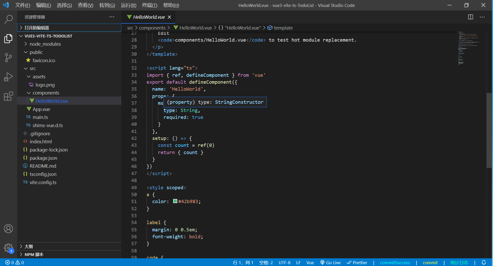

@[Vue3+Vite+TypeScript 实现 ToDoList](https://github.com/danygitgit/document-library)

> create by **db** on **2021-3-22 11:59:40**  
> Recently revised in **2021-3-22 16:36:44**

&emsp;**Hello 小伙伴们，如果觉得本文还不错，麻烦点个赞或者给个 star，你们的赞和 star 是我前进的动力！[GitHub 地址](https://github.com/danygitgit/document-library)**

&emsp;作为一只前端菜鸟，本篇文章旨在记录自己的学习心得，如有不足，还请多多指教，谢谢大家。

# 前言

> I hear and I fogorget.

> I see and I remember.

> I do and I understand.

&emsp;小白课系列完成，下面开始我们的实战课程吧！

- 注：本项目基于 Vue3 + Vite + TypeScript 框架实现搭建

# 正文

&emsp;如果看完了《Vue 小白课》，那么对 Vue3 项目的整体情况有了一定了解，并且搭建好了 Vue3 的环境。本篇我们就来练习一下 Vue3，实现 ToDoList 项目。

&emsp;倘若对 VueCLI 项目不是特别了解，请先参考：

- [Vue 小白课（五）——Vue3 + Vite 及 VueCLI4 项目搭建](https://juejin.im/post/5c3d46b76fb9a04a053fecc9)

以下是我们的搭建好的项目目录结构：



## 主要文件介绍

&emsp;在这个 ToDoList 当中，涉及到知识点包括以下内容:

### 入口文件 -- `main.js`

&emsp;我们首先看下 `main.js`文件， 在 2.X 版本中创建一个 vue 实例是通过 new Vue()来实现的，到了 3.X 中则是通过使用 createApp 这个 API。

```javascript
// 先导入createApp模块
import { createApp } from 'vue'
import App from './App.vue'

// 使用createApp方法将我们的入口文件放进去，最后挂载
createApp(App).mount('#app')
```

### 根组件 -- `App.vue`

&emsp;`App.vue`是我们项目的根组件满所有的组件都是挂载到他里面运行的。

```vue
<template>
  
  <HelloWorld msg="Hello Vue 3 + TypeScript + Vite" />
</template>

<script lang="ts">
// 引入 defineComponent() 以正确推断 setup() 组件的参数类型
import { defineComponent } from 'vue'
import HelloWorld from './components/HelloWorld.vue'

export default defineComponent({
  name: 'App',
  components: {
    HelloWorld,
  },
})
</script>

<style>
#app {
  font-family: Avenir, Helvetica, Arial, sans-serif;
  -webkit-font-smoothing: antialiased;
  -moz-osx-font-smoothing: grayscale;
  text-align: center;
  color: #2c3e50;
  margin-top: 60px;
}
</style>
```

&emsp;我们看到其中有`defineComponent` 函数，它只是对 `setup` 函数进行封装，返回 options 的对象；

```js
export function defineComponent(options: unknown) {
  return isFunction(options) ? { setup: options } : options
}
```

&emsp;defineComponent 最重要的是：在 TypeScript 下，给予组件正确的参数类型推断 。

### 业务组件 -- `HelloWorld.vue`

&emsp;`HelloWorld.vue`就是我们要写业务的组件了。删除一些初始化显示的东西，我们的组件就是这样子：

```vue
<template>
  <h1>{{ msg }}</h1>
</template>

<script lang="ts">
import { ref, defineComponent } from 'vue'
export default defineComponent({
  name: 'HelloWorld',
  props: {
    msg: {
      type: String,
      required: true,
    },
  },
  // setup 函数是 Composition API（组合 API）的入口
  // 几乎所有东西都在setup()方法中，包括挂载的生命周期挂钩。
  setup: () => {
    const count = ref(0)
    return { count }
  },
})
</script>

<style scoped></style>
```

&emsp;如果你对 Vue 2 得项目比较熟悉，看到这个组件的时候最显眼的应该是**setup**函数了。这个就是 Vue 3 的特性之一 ——**组合式 API**

&emsp;我们先对比一下 `Options API（Vue 2）` 和 `Composition API（Vue 3 ）`

**Options API** 约定：

- 我们需要在 `props` 里面设置接收参数

- 我们需要在 `data` 里面设置变量

- 我们需要在 `computed` 里面设置计算属性

- 我们需要在 `watch` 里面设置监听属性

- 我们需要在 `methods` 里面设置事件方法

&emsp;你会发现 Options APi 都约定了我们该在哪个位置做什么事，这反倒在一定程度上也强制我们进行了代码分割。

&emsp;这种碎片化使得理解和维护复杂组件变得困难。选项的分离掩盖了潜在的逻辑问题。此外，在处理单个逻辑关注点时，我们必须不断地“跳转”相关代码的选项块。

&emsp;现在用 **Composition API**，不再这么约定了，于是乎，代码组织非常灵活，我们的控制代码写在 `setup` 里面即可。

#### setup 函数的特点：

1. setup 函数是处于 生命周期函数 beforeCreate 和 Created 两个钩子函数之间的函数 也就说在 setup 函数中是无法 使用 data 和 methods 中的数据和方法的

2. setup 函数是 Composition API（组合 API）的入口

3. 在 setup 函数中定义的变量和方法最后都是需要 return 出去的 不然无法再模板中使用

#### setup 函数的注意点：

1. 由于在执行 setup 函数的时候，还没有执行 Created 生命周期方法，所以在 setup 函数中，无法使用 data 和 methods 的变量和方法

2. 由于我们不能在 setup 函数中使用 data 和 methods，所以 Vue 为了避免我们错误的使用，直接将 setup 函数中的 this 修改成了 undefined

3. setup 函数只能是同步的不能是异步的

## 开始实现 ToDoList

&emsp;介绍完 vue 3 项目的主要文件，我们就可以开始实现 ToDoList 项目了。

### 1、创建 ToDoList 组件

&emsp;我们可以将`/src/components`中的`HelloWorld.vue`文件改名为`ToDoList.vue`,并且
将`name`也改为`ToDoList`,将其`<template>`标签中不必要的内容删除，如下：

```html
<template>
  <h1>{{ msg }}</h1>
</template>
```

### 2、引入注册 ToDoList 组件

&emsp;在`/src`中的`App.vue`文件中,将原先注册`HelloWorld`的全改为`ToDoList`,并且
将传值`msg`内容改为`ToDoList`,如下：

```vue
<template>
  <ToDoList msg="ToDoList" />
</template>

<script lang="ts">
// 引入 defineComponent() 以正确推断 setup() 组件的参数类型
import { defineComponent } from 'vue'
import ToDoList from './components/ToDoList.vue'

export default defineComponent({
  name: 'App',
  components: {
    ToDoList,
  },
})
</script>
```

&emsp;OK，以上两步做完，我们的项目运行起来是这样子的：


&emsp;来认识一下**props**

> `props` 是父组件给子组件传递数据使用的

&emsp;组件实例的作用域是孤立的。这意味着不能（也不应该）在子组件的模板中直接引用父组件的数据。要让子组件使用父组件的数据，需要通过子组件的 props 选项。它分为两种方式：动态和静态

- 静态 props

```html
<blog-post title="My journey with Vue"></blog-post>
```

- 动态 props

&emsp;在模板中，要动态地绑定父组件的数据到子组件模板的 props，和绑定 Html 标签特性一样，使用 v-bind 绑定；

```html
<!-- 动态赋予一个变量的值 -->
<blog-post v-bind:title="post.title"></blog-post>
```

### 3、创建并渲染列表

&emsp;接下来，我们在`setup`函数中创建一个数组 items，记得要把数组 return 出来，然后在`<template>`里写我们的 html 结构，使用 `v-for` 指令来实现列表的渲染，如下：

```vue
<template>
  <h1>{{ msg }}</h1>
  <ul class="ToDoList">
    <li v-for="(item, index) in items" :key="item.id">
      <!-- 待办事项 -->
      <span v-text="item.title"></span>
      <!-- 完成按钮 -->
      <button>完成</button>
    </li>
  </ul>
</template>

<script lang="ts">
import { ref, defineComponent } from 'vue'
export default defineComponent({
  name: 'ToDoList',
  props: {
    msg: {
      type: String,
      required: true,
    },
  },
  // setup 函数是 Composition API（组合 API）的入口
  // 几乎所有东西都在setup()方法中，包括挂载的生命周期挂钩。
  setup: () => {
    const items = ref([
      {
        id: 1,
        title: '吃饭',
      },
      {
        id: 2,
        title: '睡觉',
      },
      {
        id: 3,
        title: '打豆豆',
      },
    ])
    // 注意：这里一定要return，不然在模板中是获取不到它的值的。
    return { items }
  },
})
</script>

<style scoped></style>
```

&emsp;在 `setup` 中，我们又返回了 items 数组，其中每个元素包括 id,title，我们将 items 使用 v-for 绑定到列表中，渲染后的结果如下：


**注：**

1. vue 中列表循环需加`:key="唯一标识"`, 唯一标识可以是 item 里面 id、index 等，因为 vue 组件高度复用，增加 Key 可以标识组件的唯一性。为了更好地区别各个组件， key 的作用主要是为了高效的更新虚拟 DOM。详情请参考 -- [VUE 中演示 v-for 为什么要加 key](https://www.jianshu.com/p/4bd5e745ce95)

2. 在`setup`函数中，可以**使用`ref`函数来创建一个响应式数据，并将其 ruturn 出去**；当数据发生改变时，Vue 会自动更新 UI,

### 4、绑定删除事件

&emsp;接下来我们使用`v-on`来为按钮绑定事件，目的是点击删除按钮的时候，将列表中相应的选项删除。

```html
<button v-on:click="deleteItem(index)">完成</button>
```

&emsp;这里我们增加了`click`方法，方法名为`deleteItem`，参数为数组下标`index`（数字类型）。

&emsp;紧接着上面定义的 `deleteItem` 方法，我们接着在`setup`中定义`deleteItem`事件并返回

```javascript
// 点击完成按钮，删除对应事项
let deleteItem = (index: number) => {
  items.value.splice(index, 1)
}
```

**注：**

&emsp;在`setup`函数中没有 this，所有的 ref 对象，要在 js 中获取它的值，都要加上一个`value`属性

### 5、使用 input 输入框添加新事项

&emsp;截至目前我们使用的都是现成的列表，接下来我们使用输入框来动态为列表添加条目：

```html
<div>
  待办：<input type="text" v-model="newItem" />
  <button @click="addNewItem">添加</button>
</div>
```

&emsp;使用指令`v-model`在表单控件或者组件上创建双向绑定，即绑定 newItem，使用`@`来绑定事件监听器，点击添加按钮会响应事件`addNewItem`。

`addNewItem`同样在`setup`中编写如下：

```javascript
// 点击添加按钮，添加新的待办事项
let addNewItem = () => {
  // 输入框非空判断
  if (!newItem.value) {
    return
  }
  // 使用push为数组添加新元素
  let obj = {
    id: id, // id 唯一且自增
    title: newItem.value, // todo 标题
  }
  items.value.push(obj)
  // id 自增
  id++
  // 清空输入框
  newItem.value = ''
}
```

&emsp;在 `setup`中，我们声明一个变量`id`默认为 0，`items`默认为空数组，`newItem`为空字符串。输入框输入内容后，点击添加按钮 items 中 push 一条内容，其中包括 id 与 title，然后 id 自增，并且最后将输入框清空。

## 总结

&emsp;通过以上几个关键的知识点，我们最终就实现了 ToDoList 的基本功能，效果如下：


&emsp;如果喜欢，可以再加一些样式。

&emsp;路漫漫其修远兮，与诸君共勉。

## 参考文档：

- [ Vue 官网](https://v3.cn.vuejs.org/)
- [vue3.0 中 setup 使用 | CSDN - 前端小 99 ](https://blog.csdn.net/qq_41328247/article/details/109286022)
- [Vue3 - defineComponent 解决了什么？ | CSDN - MINO 吖 ](https://blog.csdn.net/qq_36157085/article/details/109498473)
- [使用 Vue3+TS 开发一个 TODOList 的应用 | CSDN - Maddix ](https://blog.csdn.net/qq_43475182/article/details/108972792)

**附 ToDoList.vue 代码**

```vue
<template>
  <h1>{{ msg }}</h1>
  <div>
    待办：<input type="text" v-model="newItem" />
    <button @click="addNewItem">添加</button>
  </div>
  <ul class="ToDoList">
    <li v-for="(item, index) in items" :key="item.id">
      <!-- 待办事项 -->
      <span v-text="item.title"></span>
      <!-- 完成按钮 -->
      <button v-on:click="deleteItem(index)">完成</button>
    </li>
  </ul>
</template>

<script lang="ts">
import { ref, defineComponent } from 'vue'
export default defineComponent({
  name: 'ToDoList',
  props: {
    msg: {
      type: String,
      required: true,
    },
  },
  // setup 函数是 Composition API（组合 API）的入口
  // 几乎所有东西都在setup()方法中，包括挂载的生命周期挂钩。
  setup: () => {
    const items = ref([
      {
        id: 1,
        title: '吃饭',
      },
      {
        id: 2,
        title: '睡觉',
      },
      {
        id: 3,
        title: '打豆豆',
      },
    ])
    // 绑定输入框内容
    let newItem = ref('')
    // id 唯一且自增
    let id = 0
    // 点击完成按钮，删除对应事项
    let deleteItem = (index: number) => {
      items.value.splice(index, 1)
    }
    // 点击添加按钮，添加新的待办事项
    let addNewItem = () => {
      // 输入框非空判断
      if (!newItem.value) {
        return
      }
      // 使用push为数组添加新元素
      let obj = {
        id: id, //
        title: newItem.value, // todo 标题
      }
      items.value.push(obj)
      // id 自增
      id++
      // 清空输入框
      newItem.value = ''
    }
    // 注意：这里一定要return，不然在模板中是获取不到它的值的。
    return { items, id, newItem, deleteItem, addNewItem }
  },
})
</script>

<style scoped></style>
```

**后记：Hello 小伙伴们，如果觉得本文还不错，记得点个赞或者给个 star，你们的赞和 star 是我编写更多更丰富文章的动力！[GitHub 地址](https://github.com/danygitgit/document-library/blob/master/JavaScript-library/Vue/Vue%E9%A1%B9%E7%9B%AE%E5%AE%9E%E6%88%98%EF%BC%88%E4%B8%80%EF%BC%89%E2%80%94%E2%80%94ToDoList.md)**

> <a rel="license" href="http://creativecommons.org/licenses/by-nc-sa/4.0/"></a><br /><a xmlns:dct="http://purl.org/dc/terms/" property="dct:title">**db** 的文档库</a> 由 <a xmlns:cc="http://creativecommons.org/ns#" href="db" property="cc:attributionName" rel="cc:attributionURL">db</a> 采用 <a rel="license" href="http://creativecommons.org/licenses/by-nc-sa/4.0/">知识共享 署名-非商业性使用-相同方式共享 4.0 国际 许可协议</a>进行许可。<br />基于<a xmlns:dct="http://purl.org/dc/terms/" href="https://github.com/danygitgit" rel="dct:source">https://github.com/danygitgit</a>上的作品创作。<br />本许可协议授权之外的使用权限可以从 <a xmlns:cc="http://creativecommons.org/ns#" href="https://creativecommons.org/licenses/by-nc-sa/2.5/cn/" rel="cc:morePermissions">https://creativecommons.org/licenses/by-nc-sa/2.5/cn/</a> 处获得。
