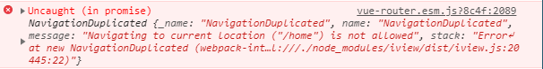

# [vue router连续点击多次路由报错解决方法](https://github.com/danygitgit/document-library)

> create by **db** on **2020-9-30 17:13:30**  
> Recently revised in **2020-9-30 17:45:49**
>
> **闲时要有吃紧的心思，忙时要有悠闲的趣味**

<a id="catalog">目录</a>

- [前言](#preface)
- [正文](#main-body)

- [总结](#summary)

- [参考文档](#reference-documents)

# <a  id="preface">前言</a>

> [返回目录](#catalog)

&emsp;vue-router 升级到 3.1.x 后，重复点击导航时，控制台出现报错 ，虽然不影响功能使用，但也不能视而不见

# <a  id="main-body">正文</a>

> [返回目录](#catalog)

## 报错信息


## 报错原因

&emsp;vue router ≥ v3.1 后 ，回调形式改成 promise api 了，返回的是 promise，如果没有捕获到错误，控制台始终会出现如上图的警告。

## 解决方法

### 一、降低版本

`npm i vue-router@3.0 -S`

### 二、在 router 文件夹下增加下列代码

```js
const routerPush = Router.prototype.push
Router.prototype.push = function push(location) {
  return routerPush.call(this, location).catch((error) => error)
}
```

### 三、捕获异常

```js
// 捕获router.push异常
this.$router.push(route).catch((err) => {
  console.log('输出报错', err)
})
```

### 四、补齐 router 第三个参数

```js
// 补齐router.push()的第三个参数
this.$router.push(
  route,
  () => {},
  (e) => {
    console.log('输出报错', e)
  }
)
```

# <a  id="summary">总结</a>

> [返回目录](#catalog)

&emsp;双节将至，祝大家中秋&&国庆愉快！

### <a  id="reference-documents">参考文档</a>

- [Element/vue router连续点击多次路由报错解决方法 | CSDN-ldz_miantiao](https://blog.csdn.net/qq_40282732/article/details/99693491)

- [解决Vue中重复点击相同路由控制台报错问题 | CSDN-@Demi](https://blog.csdn.net/qq_38128179/article/details/105247399?utm_medium=distribute.pc_relevant.none-task-blog-BlogCommendFromMachineLearnPai2-2.channel_param&depth_1-utm_source=distribute.pc_relevant.none-task-blog-BlogCommendFromMachineLearnPai2-2.channel_param)


**后记：Hello 小伙伴们，如果觉得本文还不错，记得点个赞或者给个 star，你们的赞和 star 是我编写更多更丰富文章的动力！[GitHub 地址](https://github.com/danygitgit/document-library)**

# 文档协议

> <a rel="license" href="http://creativecommons.org/licenses/by-nc-sa/4.0/"></a><br /><a xmlns:dct="http://purl.org/dc/terms/" property="dct:title">**db** 的文档库</a> 由 <a xmlns:cc="http://creativecommons.org/ns#" href="db" property="cc:attributionName" rel="cc:attributionURL">db</a> 采用 <a rel="license" href="http://creativecommons.org/licenses/by-nc-sa/4.0/">知识共享 署名-非商业性使用-相同方式共享 4.0 国际 许可协议</a>进行许可。<br />基于<a xmlns:dct="http://purl.org/dc/terms/" href="https://github.com/danygitgit" rel="dct:source">https://github.com/danygitgit</a>上的作品创作。<br />本许可协议授权之外的使用权限可以从 <a xmlns:cc="http://creativecommons.org/ns#" href="https://creativecommons.org/licenses/by-nc-sa/2.5/cn/" rel="cc:morePermissions">https://creativecommons.org/licenses/by-nc-sa/2.5/cn/</a> 处获得。
