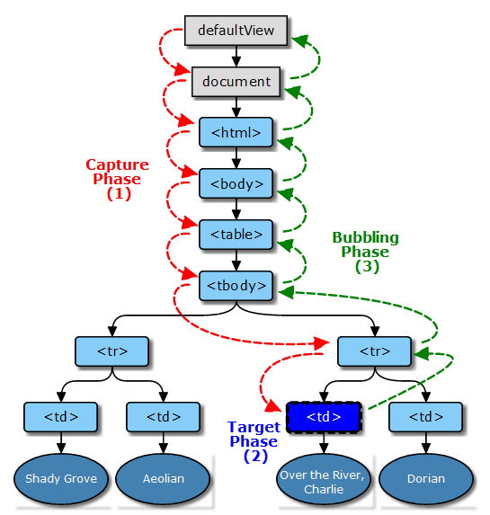

@[关于事件捕获与事件冒泡先后执行顺序](https://github.com/danygitgit/document-library)

> create by **db** on **2021-2-21 14:33:31**  
> Recently revised in **2021-2-21 16:00:35**
>
> **闲时要有吃紧的心思，忙时要有悠闲的趣味**

<a id="catalog">目录</a>

- [前言](#preface)

- [正文](#main-body)

- [总结](#summary)

# <a  id="preface">前言</a>

> [返回目录](#catalog)

> I hear and I fogorget.

> I see and I remember.

> I do and I understand.


&emsp;作为一名前端开发，DOM是我们最熟悉的伙伴之一——每天F11都能看到它。 

&emsp;但是，你真的懂它吗？能描述一下事件捕获与事件冒泡先后执行顺序吗？

&emsp;如果一时想不起来，我们就去看一下吧。


# <a  id="main-body">正文</a>

> [返回目录](#catalog)

## DOM 事件流的三个阶段

&emsp;事件发生时会在元素节点之间按照特定的顺序传播，这个传播过程即**DOM 事件流**

&emsp;当一个 DOM 事件被触发时，它不仅仅只是单纯地在本身对象上触发一次，而是会经历三个不同的阶段：

1. 捕获阶段(Capture Phase)：

- 当我们在 DOM 树的某个节点发生了一些操作（例如单击、鼠标移动上去），就会有一个事件发射过去。这个事件从 Window 发出，不断经过下级节点直到触发的目标节点。在到达目标节点之前的过程，就是捕获阶段（Capture Phase）。（所有经过的节点，都会触发这个事件。捕获阶段的任务就是建立这个事件传递路线，以便后面冒泡阶段顺着这条路线返回 Window。）在目标元素对象本身上注册的捕获事件处理程序不会被调用。

2. 目标阶段(Target Phase)：

- 当事件不断的传递直到目标节点的时候，最终在目标节点上触发这个事件，就是目标阶段。

3. 冒泡阶段(Bubbling Phase)：

- 再从目标事件位置往文档的根节点方向回溯，从内向外冒泡事件对象（我们平时用的事件绑定就是利用的事件冒泡的原理）

如图所示：



&emsp;事件捕获与事件冒泡先后执行顺序就显而易见了。

## DOM 元素绑定 js 事件方式：

### onclick

&emsp;在 html 标签里面或通过赋值的方式创建`onclick`事件 ，**重写`onclick`会覆盖之前的属性，只支持冒泡阶段**，不存在兼容性问题

**绑定事件：**`element.onclick = function(){}`

**解绑事件：**`element.onclick = null`

### addEventListener

&emsp;IE8 以下不支持，属于 DOM2 级方法，可以添加多个方法不被覆盖

**参数说明：**

- `event`，必须。字符串，指定事件名。 不要使用 "on" 前缀。 例如，使用 "click" ,而不是使用 "onclick"。

- `function` 必须。指定要事件触发时执行的函数，注意只写函数名，不要带括号。

- `useCapture` 可选。布尔值，指定事件是否在捕获或冒泡阶段执行。

**绑定事件：**

```js
element.addEventListener(
  'click',
  function (e) {
    e.preventDefault() //阻止默认事件
  },
  false
)
```

**解绑事件：**

`element.removeEventListener('click',function(){},false)`

### attachEvent

&emsp;IE 特有，兼容 IE8 及以下版本，可添加多个事件处理程序，**只支持冒泡阶段**

**参数说明：**

- `event`，必须。字符串，指定事件名。注意加上事件前边的“on”，比如“onclick”和“onmouseover”，这是与 `addEventListener` 的区别。
- `function` 要绑定的事件监听函数，注意只写函数名，不要带括号。

**绑定事件：**

```js
element.attachEvent('onclick', function (e) {
  e.returnValue = false //阻止默认事件
})
```

**解绑事件：**
`element.detachEvent("onclick",function(){})`

## 上代码，做实验

&emsp;打开[在线编辑器](https://jsbin.com/cedorat/edit?html,css,js,console,output) ---> https://jsbin.com/cedorat/edit?html,css,js,console,output

代码如下：

```html
</html>
<!DOCTYPE html>
<html lang="en">

<head>
  <meta charset="UTF-8">
  <meta name="viewport" content="width=device-width, initial-scale=1.0">
  <style>
    #outer {
      text-align: center;
      width: 400px;
      height: 400px;
      background-color: yellow;
      margin: 0 auto;
    }

    #middle {
      width: 250px;
      height: 250px;
      background-color: red;
      margin: 0 auto;
    }

    #inner {
      width: 100px;
      height: 100px;
      background-color: green;
      margin: 0 auto;
    }
  </style>
</head>

<body>
  <div id='outer'>
    <span>outer</span>
    <div id='middle'>
      <span>middle</span>
      <div id='inner'>
        <span>inner</span>
      </div>
    </div>
  </div>
  <script>
    // 先全部绑定捕获事件再全部绑定冒泡事件
    on("outer", "click", o_click_c, true);
    on("middle", "click", m_click_c, true);
    on("inner", "click", i_click_c, true);

    on("outer", "click", o_click_b, false);
    on("middle", "click", m_click_b, false);
    on("inner", "click", i_click_b, false);


    // // 先全部绑定冒泡事件再全部绑定捕获事件
    // on("outer", "click", o_click_b, false);
    // on("middle", "click", m_click_b, false);
    // on("inner", "click", i_click_b, false);

    // on("outer", "click", o_click_c, true);
    // on("middle", "click", m_click_c, true);
    // on("inner", "click", i_click_c, true);


    // 挨个绑定捕获及冒泡事件
    // on("outer", "click", o_click_c, true);
    // on("outer", "click", o_click_b, false);

    // on("middle", "click", m_click_c, true);
    // on("middle", "click", m_click_b, false);

    // on("inner", "click", i_click_c, true);
    // on("inner", "click", i_click_b, false);


    // 挨个绑定冒泡及捕获事件
    // on("outer", "click", o_click_b, false);
    // on("outer", "click", o_click_c, true);

    // on("middle", "click", m_click_b, false);
    // on("middle", "click", m_click_c, true);

    // on("inner", "click", i_click_b, false);
    // on("inner", "click", i_click_c, true);


    // 选择相应元素
    function $(element) {
      return document.getElementById(element);
    }
    // 绑定方法
    function on(element, event_name, handler, use_capture) {
      if (addEventListener) { //所有主流浏览器，除了 IE 8 及更早 IE版本
        $(element).addEventListener(event_name, handler, use_capture);
      } else { // IE 8 及更早 IE 版本
        $(element).attachEvent('on' + event_name, handler);
      }
    }

    function o_click_c() {
      console.log("outer_捕获");
    }

    function m_click_c() {
      console.log("middle_捕获")
    }

    function i_click_c() {
      console.log("inner_捕获")
    }

    function o_click_b() {
      console.log("outer_冒泡")
    }

    function m_click_b() {
      console.log("middle_冒泡")
    }

    function i_click_b() {
      console.log("inner_冒泡")
    }
  </script>
</body>

</body>

</html>
```

&emsp;在上述代码中，我们定义了四种执行顺序：

1. 先全部绑定捕获事件再全部绑定冒泡事件

2. 先全部绑定冒泡事件再全部绑定捕获事件

3. 挨个绑定捕获及冒泡事件

4. 挨个绑定冒泡及捕获事件

### 一、先全部绑定捕获事件再全部绑定冒泡事件

我们先运行第一种：

1.  点击 outer，打印结果：

```
"outer_捕获"
"outer_冒泡"
```

2.  点击 middle，打印结果：

```
"outer_捕获"
"middle_捕获"
"middle_冒泡"
"outer_冒泡"
```

3.  点击 inner，打印结果：

```
"outer_捕获"
"middle_捕获"
"inner_捕获"
"inner_冒泡"
"middle_冒泡"
"outer_冒泡"
```

<!-- 由此可见：确实是先由外向内事件捕获，一直到事发元素，再由内向外冒泡到根节点上 -->

**结论:**

- 先由外向内事件捕获，一直到事发元素，再由内向外冒泡到根节点上

### 二、先全部绑定冒泡事件再全部绑定捕获事件

我们先运行第二种：

1.  点击 outer，打印结果：

```
"outer_冒泡"
"outer_捕获"
```

2.  点击 middle，打印结果：

```
"outer_捕获"
"middle_冒泡"
"middle_捕获"
"outer_冒泡"
```

3.  点击 inner，打印结果：

```
"outer_捕获"
"middle_捕获"
"inner_冒泡"
"inner_捕获"
"middle_冒泡"
"outer_冒泡"
```

**结论:**

- 在捕获阶段先由外向内事件捕获，在冒泡阶段由内向外冒泡到根节点上

- 目标元素先执行冒泡事件，再执行捕获事件

### 三、挨个绑定捕获及冒泡事件

我们先运行第三种：

1.  点击 outer，打印结果：

```
"outer_捕获"
"outer_冒泡"
```

2.  点击 middle，打印结果：

```
"outer_捕获"
"middle_捕获"
"middle_冒泡"
"outer_冒泡"
```

3.  点击 inner，打印结果：

```
"outer_捕获"
"middle_捕获"
"inner_捕获"
"inner_冒泡"
"middle_冒泡"
"outer_冒泡"
```

**结论:**

- 同第一种一样，先由外向内事件捕获，一直到事发元素，再由内向外冒泡到根节点上

### 四、挨个绑定冒泡及捕获事件

我们先运行第四种：

1.  点击 outer，打印结果：

```
"outer_冒泡"
"outer_捕获"
```

2.  点击 middle，打印结果：

```
"outer_捕获"
"middle_冒泡"
"middle_捕获"
"outer_冒泡"
```

3.  点击 inner，打印结果：

```
"outer_捕获"
"middle_捕获"
"inner_冒泡"
"inner_捕获"
"middle_冒泡"
"outer_冒泡"
```

**结论:**

同第二种一样

- 在捕获阶段先由外向内事件捕获，在冒泡阶段由内向外冒泡到根节点上

- 目标元素先执行冒泡事件，再执行捕获事件

# <a  id="summary">总结</a>

> [返回目录](#catalog)

## 事件流执行顺序

&emsp;通过以上代码，我们可以看出，关于事件捕获与事件冒泡先后执行顺序：

1. **在捕获阶段，先由外向内执行捕获事件**；

2. 当事件触发**在目标阶段**时，会根据事件注册的先后顺序执行。也就是说如果该处既注册了冒泡事件，也注册了捕获事件，则**按照注册顺序执行**；

3. **在冒泡阶段，由内向外冒泡到根节点上**。

## 其他：

1. js 代码只能执行捕获或者冒泡其中一个阶段（要么是捕获要么是冒泡）

2. onclick 和 attachevent（ie）只能得到冒泡阶段

3. 实际开发中，我们很少使用事件捕获，我们更关注事件冒泡

4. 有些事件是没有冒泡的，比如 onblur、onfocus、onmouseenter、onmouseleave

5. 事件的冒泡有时会带来麻烦，不过是可以被阻止的，方法是：stopPropagation()

- stopPropagation() 方法：终止事件在传播过程的捕获、目标处理或冒泡阶段进一步传播。调用该方法后，该节点上处理该事件的处理程序将被调用，事件不再被分派到其他节点。

&emsp;路漫漫其修远兮，与诸君共勉。

## 参考文档：

- [JS阻止冒泡和取消默认事件(默认行为) | 前端开发博客 ](http://caibaojian.com/javascript-stoppropagation-preventdefault.html)
- [JavaScript捕获和冒泡探讨 | 前端开发博客 ](http://caibaojian.com/javascript-capture-bubble.html)
- [DOM事件阶段以及事件捕获与事件冒泡先后执行顺序 | 博客园 - AlvinWei ](https://www.cnblogs.com/alvinwei1024/p/4739344.html)


**后记：Hello 小伙伴们，如果觉得本文还不错，记得点个赞或者给个 star，你们的赞和 star 是我编写更多更丰富文章的动力！[GitHub 地址](https://github.com/danygitgit/document-library)**

# 文档协议

> <a rel="license" href="http://creativecommons.org/licenses/by-nc-sa/4.0/"></a><br /><a xmlns:dct="http://purl.org/dc/terms/" property="dct:title">**db** 的文档库</a> 由 <a xmlns:cc="http://creativecommons.org/ns#" href="db" property="cc:attributionName" rel="cc:attributionURL">db</a> 采用 <a rel="license" href="http://creativecommons.org/licenses/by-nc-sa/4.0/">知识共享 署名-非商业性使用-相同方式共享 4.0 国际 许可协议</a>进行许可。<br />基于<a xmlns:dct="http://purl.org/dc/terms/" href="https://github.com/danygitgit" rel="dct:source">https://github.com/danygitgit</a>上的作品创作。<br />本许可协议授权之外的使用权限可以从 <a xmlns:cc="http://creativecommons.org/ns#" href="https://creativecommons.org/licenses/by-nc-sa/2.5/cn/" rel="cc:morePermissions">https://creativecommons.org/licenses/by-nc-sa/2.5/cn/</a> 处获得。
