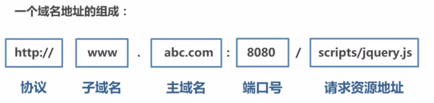
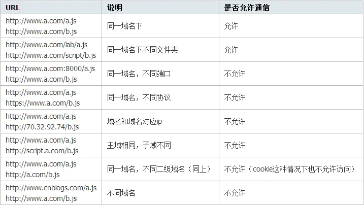

<!-- [面试系列（一）- 浅拷贝与深拷贝 | 掘金技术征文](https://github.com/danygitgit/document-library) -->

名、主域名、端口号中任意一个不相同时，都算作不同域。不同域之间相互请求资源，就算作“跨域”。常见跨域场景如下图所示：
https://juejin.im/post/5c23993de51d457b8c1f4ee1

题，是由于JavaScript出于安全方面的考虑，不允许跨域调用其他页面的对象。换句话说，只有JavaScript存在跨域问题。

https://juejin.im/post/5816158e2e958a00549e80f6

 同源策略是一种约定，由Netscape公司1995年引入浏览器，它是浏览器最核心也最基本的安全功能，如果缺少了同源策略，浏览器很容易受到XSS、CSFR等攻击。所谓同源是指"协议+域名+端口"三者相同，即便两个不同的域名指向同一个ip地址，也非同源
https://juejin.im/post/5d1ecb96f265da1b6d404433

http://www.ruanyifeng.com/blog/2016/04/cors.html


https://segmentfault.com/a/1190000011145364
===
> create by **db** on **2020-4-10 13:27:25**   
> Recently revised in **2020-4-10 13:27:29**
> 
**闲时要有吃紧的心思，忙时要有悠闲的趣味**

<a name="chapter-menu" id="chapter-menu">目录</a>

- <a name="catalog-chapter-1" id="catalog-chapter-1"></a>[前言](#chapter-1)

- <a name="catalog-chapter-2" id="catalog-chapter-2"></a>[正文](#chapter-2)

  - <a name="catalog-chapter-2-1" id="catalog-chapter-2-1"></a>[一、什么是跨域？](#chapter-2-1)
  - <a name="catalog-chapter-2-2" id="catalog-chapter-2-2"></a>[二、浅拷贝和深拷贝初探](#chapter-2-2)
  - <a name="catalog-chapter-2-3" id="catalog-chapter-2-3"></a>[三、浅拷贝的实现](#chapter-2-3)
    - [Object.assign()](#chapter-2-3-2) 
    - [Array.prototype.concat()](#chapter-2-3-3) 
    - [Array.prototype.slice()](#chapter-2-3-4) 
    - [...  展开运算符](#chapter-2-3-5)
    - [手写浅拷贝](#chapter-2-3-1)
  - <a name="catalog-chapter-2-4" id="catalog-chapter-2-4"></a>[四、 深拷贝的实现](#chapter-2-4) 
    - [JSON.parse(JSON.stringify())](#chapter-2-4-2) 
    - [函数库 Lodash](#chapter-2-4-3) 
    - [框架 jQuery](#chapter-2-4-4) 
    - [手写深拷贝](#chapter-2-4-1) 

- <a name="catalog-chapter3" id="catalog-chapter3"></a>[总结](#chapter3) 

# <a name="chapter-1" id="chapter-1">前言</a>

> [返回目录](#chapter-menu)

&emsp;跨域这两个字就像一块狗皮膏药一样黏在每一个前端开发者身上，无论你在工作上或者面试中无可避免会遇到这个问题。为了应付面试，我每次都随便背几个方案，也不知道为什么要这样干，反正面完就可以扔了，我想工作上也不会用到那么多乱七八糟的方案。到了真正工作，开发环境有`webpack-dev-server`搞定，上线了服务端的大佬们也会配好，配了什么我不管，反正不会跨域就是了。日子也就这么混过去了，终于有一天，我觉得不能再继续这样混下去了，我一定要彻底搞懂这个东西！于是就有了这篇文章。
<!-- 
&emsp;下面我们就开始准备我们的面试必考题之一 —— **跨域**。 -->

# <a name="chapter-2" id="chapter-2">正文</a>

## <a name="chapter-2-1" id="chapter-2-1">一、什么是跨域？</a>

**跨域**：指的是浏览器处于安全方面的考虑，只允许本域名下的接口交互，不同源的客户端脚本，在没有明确授权的情况下，不能读写对方的资源——也就是跨域限制访问。它是由浏览器的`同源策略`造成的，是浏览器对javascript施加的安全限制。

<!-- 同源策略是一种约定，它是浏览器最核心也最基本的安全功能，如果缺少了同源策略，浏览器很容易受到XSS、CSRF等攻击。所谓同源是指"协议+域名+端口"三者相同，即便两个不同的域名指向同一个ip地址，也非同源。 -->

### 什么是同源策略

&emsp;**同源策略/SOP（Same origin policy）**：是由NetScape提出的一个著名的安全策略。它是浏览器最核心也最基本的安全功能，现在所有支持 JavaScript 的浏览器都会使用这个策略。如果缺少了同源策略，浏览器很容易受到 XSS、 CSFR 等攻击。

&emsp;**源**（`origin`）就是`协议`、`域名`和 `端口号`。



所谓的**同源**，指的是`协议`，`域名`，`端口号`均相同。只要有一个不相同，即便两个不同的域名指向同一个ip地址，也是**非同源**。

**举个栗子**：

> &emsp;有一个小小的东西叫cookie大家应该知道，一般用来处理登录等场景，目的是让服务端知道谁发出的这次请求。如果你请求了接口进行登录，服务端验证通过后会在响应头加入Set-Cookie字段，然后下次再发请求的时候，浏览器会自动将cookie附加在HTTP请求的头字段Cookie中，服务端就能知道这个用户已经登录过了。知道这个之后，我们来看场景：<br>
&emsp;你准备去清空你的购物车，于是打开了买买买网站`www.maimaimai.com`，然后登录成功，一看，购物车东西这么少，不行，还得买多点。<br>
&emsp;你在看有什么东西买的过程中，你的好基友发给你一个链接`www.nidongde.com`，一脸yin笑地跟你说：“你懂的”，你毫不犹豫打开了。<br>
&emsp;你饶有兴致地浏览着`www.nidongde.com`，谁知这个网站暗地里做了些不可描述的事情！由于没有同源策略的限制，它向`www.maimaimai.com`发起了请求！聪明的你一定想到上面的话“服务端验证通过后会在响应头加入Set-Cookie字段，然后下次再发请求的时候，浏览器会自动将cookie附加在HTTP请求的头字段Cookie中”，这样一来，这个不法网站就相当于登录了你的账号，可以为所欲为了！如果这不是一个买买买账号，而是你的银行账号，那……

——这就是传说中的**CSRF攻击**。

&emsp;由此可见，同源策略是必须的。如果非同源，那么在请求数据时，浏览器会在控制台中报一个异常，提示拒绝访问。

```js
No 'Access-Control-Allow-Origin' header is present on the requested resource
```

同源策略限制了以下行为：

- 【1】无法读取非同源网页的 Cookie、LocalStorage 和 IndexedDB

- 【2】无法接触非同源网页的 DOM 和 JS 对象

- 【3】无法向非同源地址发送 AJAX 请求

但是有三个标签是允许跨域加载资源：

- ``
- `<link href=XXX>`
- `<script src=XXX>`

### 常见的跨域场景

当协议、子域名、主域名、端口号中任意一个不相同时，都算作不同域。常见跨域场景如下图所示：



## 跨域的解决办法

### jsonp跨域

jsonp跨域其实也是JavaScript设计模式中的一种代理模式。在html页面中通过相应的标签从不同域名下加载静态资源文件是被浏览器允许的，所以我们可以通过这个“犯罪漏洞”来进行跨域。一般，我们可以动态的创建script标签，再去请求一个带参网址来实现跨域通信

```ecmascript 6
//原生的实现方式
let script = document.createElement('script');

script.src = 'http://www.nealyang.cn/login?username=Nealyang&callback=callback';

document.body.appendChild(script);

function callback(res) {
  console.log(res);
}
```
当然，jquery也支持jsonp的实现方式
```javascript
$.ajax({
    url:'http://www.nealyang.cn/login',
    type:'GET',
    dataType:'jsonp',//请求方式为jsonp
    jsonpCallback:'callback',
    data:{
        "username":"Nealyang"
    }
})

```
虽然这种方式非常好用，但是一个最大的缺陷是，只能够实现get请求

### document.domain + iframe 跨域
这种跨域的方式最主要的是要求主域名相同。什么是主域名相同呢？
www.nealyang.cn aaa.nealyang.cn ba.ad.nealyang.cn 这三个主域名都是nealyang.cn,而主域名不同的就不能用此方法。

假设目前a.nealyang.cn 和 b.nealyang.cn 分别对应指向不同ip的服务器。

a.nealyang.cn 下有一个test.html文件

```html
<!DOCTYPE html>
<html lang="en">
<head>
    <meta charset="UTF-8">
    <title>html</title>
    <script type="text/javascript" src = "jquery-1.12.1.js"></script>
</head>
<body>
    <div>A页面</div>
    <iframe 
    style = "display : none" 
    name = "iframe1" 
    id = "iframe" 
    src="http://b.nealyang.cn/1.html" frameborder="0"></iframe>
    <script type="text/javascript">
        $(function(){
            try{
                document.domain = "nealyang.cn"
            }catch(e){}
            $("#iframe").load(function(){
                var jq = document.getElementById('iframe').contentWindow.$
                jq.get("http://nealyang.cn/test.json",function(data){
                    console.log(data);
                });
            })
        })
    </script>
</body>
</html>
```

利用 iframe 加载 其他域下的文件（nealyang.cn/1.html）, 同时 document.domain 设置成 nealyang.cn ，当 iframe 加载完毕后就可以获取 nealyang.cn 域下的全局对象，
此时尝试着去请求 nealyang.cn 域名下的 test.json （此时可以请求接口），就会发现数据请求失败了~~ 惊不惊喜，意不意外！！！！！！！

数据请求失败，目的没有达到，自然是还少一步：

```html
<!DOCTYPE html>
<html lang="en">
<head>
    <meta charset="UTF-8">
    <title>html</title>
    <script type="text/javascript" src = "jquery-1.12.1.js"></script>
    <script type="text/javascript">
        $(function(){
            try{
                document.domain = "nealyang.com"
            }catch(e){}
        })
    </script>
</head>
<body>
    <div id = "div1">B页面</div>
</body>
</html>
```

此时在进行刷新浏览器，就会发现数据这次真的是成功了~~~~~ 

### window.name + iframe 跨域

window.name属性可设置或者返回存放窗口名称的一个字符串。他的神器之处在于name值在不同页面或者不同域下加载后依旧存在，没有修改就不会发生变化，并且可以存储非常长的name(2MB)

假设index页面请求远端服务器上的数据，我们在该页面下创建iframe标签，该iframe的src指向服务器文件的地址（iframe标签src可以跨域），服务器文件里设置好window.name的值，然后再在index.html里面读取改iframe中的window.name的值。完美~

```html
<body>
  <script type="text/javascript"> 
    iframe = document.createElement('iframe'),
    iframe.src = 'http://localhost:8080/data.php';
    document.body.appendChild(iframe);
    iframe.onload = function() {
      console.log(iframe.contentWindow.name)
    };
  </script>
</body>
```
当然，这样还是不够的。

因为规定如果index.html页面和和该页面里的iframe框架的src如果不同源，则也无法操作框架里的任何东西，所以就取不到iframe框架的name值了，告诉你我们不是一家的，你也休想得到我这里的数据。
既然要同源，那就换个src去指，前面说了无论怎样加载window.name值都不会变化，于是我们在index.html相同目录下，新建了个proxy.html的空页面，修改代码如下：

```html
<body>
  <script type="text/javascript"> 
    iframe = document.createElement('iframe'),
    iframe.src = 'http://localhost:8080/data.php';
    document.body.appendChild(iframe);
    iframe.onload = function() {
      iframe.src = 'http://localhost:81/cross-domain/proxy.html';
      console.log(iframe.contentWindow.name)
    };
  </script>
</body>
```
理想似乎很美好，在iframe载入过程中，迅速重置iframe.src的指向，使之与index.html同源，那么index页面就能去获取它的name值了！但是现实是残酷的，iframe在现实中的表现是一直不停地刷新，
也很好理解，每次触发onload时间后，重置src，相当于重新载入页面，又触发onload事件，于是就不停地刷新了（但是需要的数据还是能输出的）。修改后代码如下：
```html
<body>
  <script type="text/javascript"> 
    iframe = document.createElement('iframe');
    iframe.style.display = 'none';
    var state = 0;
    
    iframe.onload = function() {
      if(state === 1) {
          var data = JSON.parse(iframe.contentWindow.name);
          console.log(data);
          iframe.contentWindow.document.write('');
          iframe.contentWindow.close();
        document.body.removeChild(iframe);
      } else if(state === 0) {
          state = 1;
          iframe.contentWindow.location = 'http://localhost:81/cross-domain/proxy.html';
      }
    };

    iframe.src = 'http://localhost:8080/data.php';
    document.body.appendChild(iframe);
  </script>
</body>
```

所以如上，我们就拿到了服务器返回的数据，但是有几个条件是必不可少的：
- iframe标签的跨域能力
- window.names属性值在文档刷新后依然存在的能力

### location.hash + iframe 跨域
此跨域方法和上面介绍的比较类似，一样是动态插入一个iframe然后设置其src为服务端地址，而服务端同样输出一端js代码，也同时通过与子窗口之间的通信来完成数据的传输。

关于锚点相信大家都已经知道了，其实就是设置锚点，让文档指定的相应的位置。锚点的设置用a标签，然后href指向要跳转到的id，当然，前提是你得有个滚动条，不然也不好滚动嘛是吧。

而location.hash其实就是url的锚点。比如http://www.nealyang.cn#Nealyang的网址打开后，在控制台输入location.hash就会返回#Nealyang的字段。

基础知识补充完毕，下面我们来说下如何实现跨域

如果index页面要获取远端服务器的数据，动态的插入一个iframe，将iframe的src执行服务器的地址，这时候的top window 和包裹这个iframe的子窗口是不能通信的，因为同源策略，所以改变子窗口的路径就可以了，将数据当做改变后的路径的hash值加载路径上，然后就可以通信了。将数据加在index页面地址的hash上，
index页面监听hash的变化，h5的hashchange方法

```html
<body>
  <script type="text/javascript">
    function getData(url, fn) {
      var iframe = document.createElement('iframe');
      iframe.style.display = 'none';
      iframe.src = url;

      iframe.onload = function() {
        fn(iframe.contentWindow.location.hash.substring(1));
        window.location.hash = '';
        document.body.removeChild(iframe);
      };

      document.body.appendChild(iframe);
    }

    // get data from server
    var url = 'http://localhost:8080/data.php';
    getData(url, function(data) {
      var jsondata = JSON.parse(data);
      console.log(jsondata.name + ' ' + jsondata.age);
    });
  </script>
</body>
```

>补充说明：其实location.hash和window.name都是差不多的，都是利用全局对象属性的方法，然后这两种方法和jsonp也是一样的，就是只能够实现get请求

### postMessage跨域
这是由H5提出来的一个炫酷的API，IE8+，chrome,ff都已经支持实现了这个功能。这个功能也是非常的简单，其中包括接受信息的Message时间，和发送信息的postMessage方法。

发送信息的postMessage方法是向外界窗口发送信息
```javascript
otherWindow.postMessage(message,targetOrigin);
```
otherWindow指的是目标窗口，也就是要给哪一个window发送消息，是window.frames属性的成员或者是window.open方法创建的窗口。
Message是要发送的消息，类型为String，Object(IE8、9不支持Obj)，targetOrigin是限定消息接受范围，不限制就用星号 *

接受信息的message事件

```javascript
var onmessage = function(event) {
  var data = event.data;
  var origin = event.origin;
}

if(typeof window.addEventListener != 'undefined'){
    window.addEventListener('message',onmessage,false);
}else if(typeof window.attachEvent != 'undefined'){
    window.attachEvent('onmessage', onmessage);
}
```

举个栗子

a.html(http://www.nealyang.cn/a.html)

```html
<iframe id="iframe" src="http://www.neal.cn/b.html" style="display:none;"></iframe>
<script>       
    var iframe = document.getElementById('iframe');
    iframe.onload = function() {
        var data = {
            name: 'aym'
        };
        // 向neal传送跨域数据
        iframe.contentWindow.postMessage(JSON.stringify(data), 'http://www.neal.cn');
    };

    // 接受domain2返回数据
    window.addEventListener('message', function(e) {
        alert('data from neal ---> ' + e.data);
    }, false);
</script>
```

b.html(http://www.neal.cn/b.html)

```html
<script>
    // 接收domain1的数据
    window.addEventListener('message', function(e) {
        alert('data from nealyang ---> ' + e.data);

        var data = JSON.parse(e.data);
        if (data) {
            data.number = 16;

            // 处理后再发回nealyang
            window.parent.postMessage(JSON.stringify(data), 'http://www.nealyang.cn');
        }
    }, false);
</script>
```

### 跨域资源共享 CORS
因为是目前主流的跨域解决方案。所以这里多介绍点。
#### 简介
CORS是一个W3C标准，全称是"跨域资源共享"（Cross-origin resource sharing）。
它允许浏览器向跨源服务器，发出XMLHttpRequest请求，从而克服了AJAX只能同源使用的限制。

CORS需要浏览器和服务器同时支持。目前，所有浏览器都支持该功能，IE浏览器不能低于IE10。IE8+：IE8/9需要使用XDomainRequest对象来支持CORS。

整个CORS通信过程，都是浏览器自动完成，不需要用户参与。对于开发者来说，CORS通信与同源的AJAX通信没有差别，代码完全一样。浏览器一旦发现AJAX请求跨源，就会自动添加一些附加的头信息，有时还会多出一次附加的请求，但用户不会有感觉。
因此，实现CORS通信的关键是服务器。只要服务器实现了CORS接口，就可以跨源通信。

#### 两种请求
说起来很搞笑，分为两种请求，一种是简单请求，另一种是非简单请求。只要满足下面条件就是简单请求

- 请求方式为HEAD、POST 或者 GET
- http头信息不超出一下字段：Accept、Accept-Language 、 Content-Language、 Last-Event-ID、 Content-Type(限于三个值：application/x-www-form-urlencoded、multipart/form-data、text/plain)

为什么要分为简单请求和非简单请求，因为浏览器对这两种请求方式的处理方式是不同的。

#### 简单请求

##### 基本流程

对于简单请求，浏览器直接发出CORS请求。具体来说，就是在头信息之中，增加一个Origin字段。
下面是一个例子，浏览器发现这次跨源AJAX请求是简单请求，就自动在头信息之中，添加一个Origin字段。
```
GET /cors HTTP/1.1
Origin: http://api.bob.com
Host: api.alice.com
Accept-Language: en-US
Connection: keep-alive
User-Agent: Mozilla/5.0
...
```
Origin字段用来说明，本次请求来自哪个源（协议 + 域名 + 端口）。服务器根据这个值，决定是否同意这次请求。

如果Origin指定的源，不在许可范围内，服务器会返回一个正常的HTTP回应。
浏览器发现，这个回应的头信息没有包含Access-Control-Allow-Origin字段（详见下文），就知道出错了，从而抛出一个错误，被XMLHttpRequest的onerror回调函数捕获。

注意，这种错误无法通过状态码识别，因为HTTP回应的状态码有可能是200。

如果Origin指定的域名在许可范围内，服务器返回的响应，会多出几个头信息字段。
```
   Access-Control-Allow-Origin: http://api.bob.com
   Access-Control-Allow-Credentials: true
   Access-Control-Expose-Headers: FooBar
   Content-Type: text/html; charset=utf-8
   ```
   
上面的头信息之中，有三个与CORS请求相关的字段，都以Access-Control-开头

- Access-Control-Allow-Origin :该字段是必须的。它的值要么是请求时Origin字段的值，要么是一个*，表示接受任意域名的请求
- Access-Control-Allow-Credentials: 该字段可选。它的值是一个布尔值，表示是否允许发送Cookie。默认情况下，Cookie不包括在CORS请求之中。设为true，即表示服务器明确许可，Cookie可以包含在请求中，一起发给服务器。这个值也只能设为true，如果服务器不要浏览器发送Cookie，删除该字段即可。
- Access-Control-Expose-Headers:该字段可选。CORS请求时，XMLHttpRequest对象的getResponseHeader()方法只能拿到6个基本字段：Cache-Control、Content-Language、Content-Type、Expires、Last-Modified、Pragma。如果想拿到其他字段，就必须在Access-Control-Expose-Headers里面指定。

##### withCredentials 属性
上面说到，CORS请求默认不发送Cookie和HTTP认证信息。如果要把Cookie发到服务器，一方面要服务器同意，指定Access-Control-Allow-Credentials字段。

另一方面，开发者必须在AJAX请求中打开withCredentials属性。
```javascript
var xhr = new XMLHttpRequest(); // IE8/9需用window.XDomainRequest兼容

// 前端设置是否带cookie
xhr.withCredentials = true;

xhr.open('post', 'http://www.domain2.com:8080/login', true);
xhr.setRequestHeader('Content-Type', 'application/x-www-form-urlencoded');
xhr.send('user=admin');

xhr.onreadystatechange = function() {
    if (xhr.readyState == 4 && xhr.status == 200) {
        alert(xhr.responseText);
    }
};

// jquery
$.ajax({
    ...
   xhrFields: {
       withCredentials: true    // 前端设置是否带cookie
   },
   crossDomain: true,   // 会让请求头中包含跨域的额外信息，但不会含cookie
    ...
});
```

否则，即使服务器同意发送Cookie，浏览器也不会发送。或者，服务器要求设置Cookie，浏览器也不会处理。
但是，如果省略withCredentials设置，有的浏览器还是会一起发送Cookie。这时，可以显式关闭withCredentials。

需要注意的是，如果要发送Cookie，Access-Control-Allow-Origin就不能设为星号，必须指定明确的、与请求网页一致的域名。同时，Cookie依然遵循同源政策，只有用服务器域名设置的Cookie才会上传，其他域名的Cookie并不会上传，且（跨源）原网页代码中的document.cookie也无法读取服务器域名下的Cookie。

#### 非简单请求
非简单请求是那种对服务器有特殊要求的请求，比如请求方法是PUT或DELETE，或者Content-Type字段的类型是application/json。

非简单请求的CORS请求，会在正式通信之前，增加一次HTTP查询请求，称为"预检"请求（preflight）。

浏览器先询问服务器，当前网页所在的域名是否在服务器的许可名单之中，以及可以使用哪些HTTP动词和头信息字段。只有得到肯定答复，浏览器才会发出正式的XMLHttpRequest请求，否则就报错。
```javascript
var url = 'http://api.alice.com/cors';
var xhr = new XMLHttpRequest();
xhr.open('PUT', url, true);
xhr.setRequestHeader('X-Custom-Header', 'value');
xhr.send();
```

浏览器发现，这是一个非简单请求，就自动发出一个"预检"请求，要求服务器确认可以这样请求。下面是这个"预检"请求的HTTP头信息。

```
    OPTIONS /cors HTTP/1.1
   Origin: http://api.bob.com
   Access-Control-Request-Method: PUT
   Access-Control-Request-Headers: X-Custom-Header
   Host: api.alice.com
   Accept-Language: en-US
   Connection: keep-alive
   User-Agent: Mozilla/5.0...
```
"预检"请求用的请求方法是OPTIONS，表示这个请求是用来询问的。头信息里面，关键字段是Origin，表示请求来自哪个源。

除了Origin字段，"预检"请求的头信息包括两个特殊字段。
- Access-Control-Request-Method：该字段是必须的，用来列出浏览器的CORS请求会用到哪些HTTP方法，上例是PUT。
- Access-Control-Request-Headers：该字段是一个逗号分隔的字符串，指定浏览器CORS请求会额外发送的头信息字段，上例是X-Custom-Header

##### 预检请求的回应
服务器收到"预检"请求以后，检查了Origin、Access-Control-Request-Method和Access-Control-Request-Headers字段以后，确认允许跨源请求，就可以做出回应

```
HTTP/1.1 200 OK
Date: Mon, 01 Dec 2008 01:15:39 GMT
Server: Apache/2.0.61 (Unix)
Access-Control-Allow-Origin: http://api.bob.com
Access-Control-Allow-Methods: GET, POST, PUT
Access-Control-Allow-Headers: X-Custom-Header
Content-Type: text/html; charset=utf-8
Content-Encoding: gzip
Content-Length: 0
Keep-Alive: timeout=2, max=100
Connection: Keep-Alive
Content-Type: text/plain
```

上面的HTTP回应中，关键的是Access-Control-Allow-Origin字段，表示http://api.bob.com可以请求数据。该字段也可以设为星号，表示同意任意跨源请求。

如果浏览器否定了"预检"请求，会返回一个正常的HTTP回应，但是没有任何CORS相关的头信息字段。这时，浏览器就会认定，服务器不同意预检请求，因此触发一个错误，被XMLHttpRequest对象的onerror回调函数捕获。控制台会打印出如下的报错信息。

服务器回应的其他CORS相关字段如下：
```
Access-Control-Allow-Methods: GET, POST, PUT
Access-Control-Allow-Headers: X-Custom-Header
Access-Control-Allow-Credentials: true
Access-Control-Max-Age: 1728000
```
- Access-Control-Allow-Methods：该字段必需，它的值是逗号分隔的一个字符串，表明服务器支持的所有跨域请求的方法。注意，返回的是所有支持的方法，而不单是浏览器请求的那个方法。这是为了避免多次"预检"请求。
- Access-Control-Allow-Headers：如果浏览器请求包括Access-Control-Request-Headers字段，则Access-Control-Allow-Headers字段是必需的。它也是一个逗号分隔的字符串，表明服务器支持的所有头信息字段，不限于浏览器在"预检"中请求的字段。
- Access-Control-Allow-Credentials： 该字段与简单请求时的含义相同。
- Access-Control-Max-Age： 该字段可选，用来指定本次预检请求的有效期，单位为秒。上面结果中，有效期是20天（1728000秒），即允许缓存该条回应1728000秒（即20天），在此期间，不用发出另一条预检请求。

##### 浏览器正常请求回应

一旦服务器通过了"预检"请求，以后每次浏览器正常的CORS请求，就都跟简单请求一样，会有一个Origin头信息字段。服务器的回应，也都会有一个Access-Control-Allow-Origin头信息字段。

```
PUT /cors HTTP/1.1
Origin: http://api.bob.com
Host: api.alice.com
X-Custom-Header: value
Accept-Language: en-US
Connection: keep-alive
User-Agent: Mozilla/5.0...
```

浏览器的正常CORS请求。上面头信息的Origin字段是浏览器自动添加的。下面是服务器正常的回应。

```
Access-Control-Allow-Origin: http://api.bob.com
Content-Type: text/html; charset=utf-8
```
Access-Control-Allow-Origin字段是每次回应都必定包含的

#### 结束语

CORS与JSONP的使用目的相同，但是比JSONP更强大。JSONP只支持GET请求，CORS支持所有类型的HTTP请求。JSONP的优势在于支持老式浏览器，以及可以向不支持CORS的网站请求数据。

### WebSocket协议跨域

WebSocket protocol是HTML5一种新的协议。它实现了浏览器与服务器全双工通信，同时允许跨域通讯，是server push技术的一种很好的实现。

原生WebSocket API使用起来不太方便，我们使用Socket.io，它很好地封装了webSocket接口，提供了更简单、灵活的接口，也对不支持webSocket的浏览器提供了向下兼容。

前端代码：

```html
<div>user input：<input type="text"></div>
<script src="./socket.io.js"></script>
<script>
var socket = io('http://www.domain2.com:8080');

// 连接成功处理
socket.on('connect', function() {
    // 监听服务端消息
    socket.on('message', function(msg) {
        console.log('data from server: ---> ' + msg); 
    });

    // 监听服务端关闭
    socket.on('disconnect', function() { 
        console.log('Server socket has closed.'); 
    });
});

document.getElementsByTagName('input')[0].onblur = function() {
    socket.send(this.value);
};
</script>
```
node Server
```node
var http = require('http');
var socket = require('socket.io');

// 启http服务
var server = http.createServer(function(req, res) {
    res.writeHead(200, {
        'Content-type': 'text/html'
    });
    res.end();
});

server.listen('8080');
console.log('Server is running at port 8080...');

// 监听socket连接
socket.listen(server).on('connection', function(client) {
    // 接收信息
    client.on('message', function(msg) {
        client.send('hello：' + msg);
        console.log('data from client: ---> ' + msg);
    });

    // 断开处理
    client.on('disconnect', function() {
        console.log('Client socket has closed.'); 
    });
});
```

### node代理跨域

node中间件实现跨域代理，是通过启一个代理服务器，实现数据的转发，也可以通过设置cookieDomainRewrite参数修改响应头中cookie中域名，实现当前域的cookie写入，方便接口登录认证。


利用node + express + http-proxy-middleware搭建一个proxy服务器

前端代码
```javascript
var xhr = new XMLHttpRequest();

// 前端开关：浏览器是否读写cookie
xhr.withCredentials = true;

// 访问http-proxy-middleware代理服务器
xhr.open('get', 'http://www.domain1.com:3000/login?user=admin', true);
xhr.send();
```
后端代码
```javascript
var express = require('express');
var proxy = require('http-proxy-middleware');
var app = express();

app.use('/', proxy({
    // 代理跨域目标接口
    target: 'http://www.domain2.com:8080',
    changeOrigin: true,

    // 修改响应头信息，实现跨域并允许带cookie
    onProxyRes: function(proxyRes, req, res) {
        res.header('Access-Control-Allow-Origin', 'http://www.domain1.com');
        res.header('Access-Control-Allow-Credentials', 'true');
    },

    // 修改响应信息中的cookie域名
    cookieDomainRewrite: 'www.domain1.com'  // 可以为false，表示不修改
}));

app.listen(3000);
console.log('Proxy server is listen at port 3000...');
```

### nginx代理跨域
NGINX其实个人没有怎么玩过，所以暂且也就不能误人子弟了，原谅笔者才疏尚浅~ 有机会学习研究再回来补充~~

## 交流

欢迎加入react技术栈、前端技术杂谈QQ群


>前端技术杂谈:604953717 <br/>
react技术栈:398240621


## 参考文档

[http://www.ruanyifeng.com/blog/2016/04/cors.html](http://www.ruanyifeng.com/blog/2016/04/cors.html)
[https://segmentfault.com/a/1190000011145364](https://segmentfault.com/a/1190000011145364)


# <a name="chapter3" id="chapter3">总结</a>

> [返回目录](#chapter-menu)

&emsp;浅拷贝与深拷贝，无论在日常工作还是面试准备中都是避免不了的知识点，虽然不必将其中的所有方法和原理全部记住，但是知其然也要知其所以然。要是面试官忽然让你手写深拷贝也不至于太尴尬不是……

&emsp;另外，尺有所短寸有所长，无关乎好坏优劣，其实每种方法都有自己的优缺点，和适用场景，人尽其才，物尽其用，方是真理。

<!-- 下面对各种方法进行对比，希望给大家提供一些帮助

clone	cloneJSON	cloneLoop	cloneForce
难度	☆☆	☆	☆☆☆	☆☆☆☆
兼容性	ie6	ie8	ie6	ie6
循环引用	一层	不支持	一层	支持
栈溢出	会	会	不会	不会
保持引用	否	否	否	是
适合场景	一般数据拷贝	一般数据拷贝	层级很多	保持引用关系 -->

* **参考文献**：

1. [Lodash clone 系列](https://segmentfault.com/a/1190000011145364#item-1)


 
**后记：Hello 小伙伴们，如果觉得本文还不错，记得点个赞或者给个 star，你们的赞和 star 是我编写更多更丰富文章的动力！[GitHub 地址](https://github.com/danygitgit/document-library)**

# 文档协议 
> <a rel="license" href="http://creativecommons.org/licenses/by-nc-sa/4.0/"></a><br /><a xmlns:dct="http://purl.org/dc/terms/" property="dct:title">**db** 的文档库</a> 由 <a xmlns:cc="http://creativecommons.org/ns#" href="db" property="cc:attributionName" rel="cc:attributionURL">db</a> 采用 <a rel="license" href="http://creativecommons.org/licenses/by-nc-sa/4.0/">知识共享 署名-非商业性使用-相同方式共享 4.0 国际 许可协议</a>进行许可。<br />基于<a xmlns:dct="http://purl.org/dc/terms/" href="https://github.com/danygitgit" rel="dct:source">https://github.com/danygitgit</a>上的作品创作。<br />本许可协议授权之外的使用权限可以从 <a xmlns:cc="http://creativecommons.org/ns#" href="https://creativecommons.org/licenses/by-nc-sa/2.5/cn/" rel="cc:morePermissions">https://creativecommons.org/licenses/by-nc-sa/2.5/cn/</a> 处获得。

