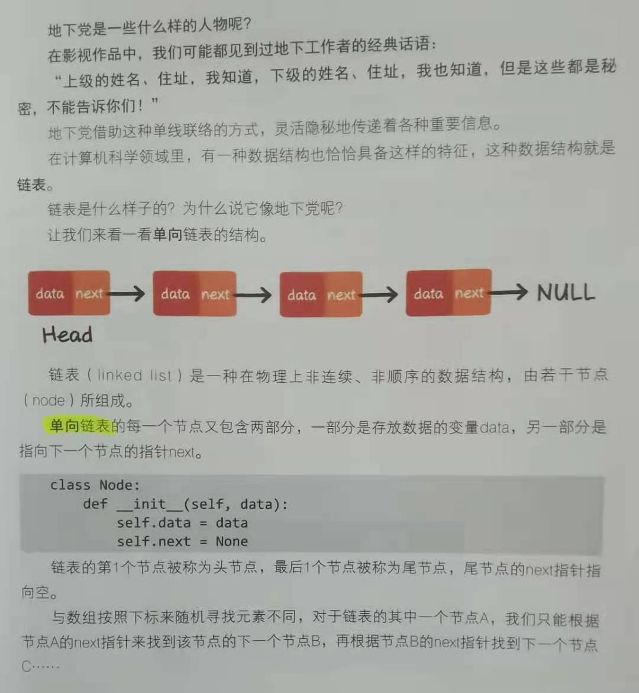

# [83. 删除排序链表中的重复元素｜刷题打卡](https://github.com/danygitgit/document-library)

> create by **db** on **2021-3-2 22:48:10**  
> Recently revised in **2021-3-2 23:38:36**

 **闲时要有吃紧的心思，忙时要有悠闲的趣味**

> 原题链接[83. 删除排序链表中的重复元素](https://leetcode-cn.com/problems/remove-duplicates-from-sorted-list/)
<a id="catalog">目录</a>

- [题目描述](#preface)
- [思路分析](#main-body)
- [AC 代码](#main-body2)
- [总结](#summary)

# <a  id="preface">题目描述</a>

> [返回目录](#catalog)

&emsp;给定一个排序链表，删除所有重复的元素，使得每个元素只出现一次。

示例 1:

```
输入: 1->1->2
输出: 1->2
示例 2:

输入: 1->1->2->3->3
输出: 1->2->3
```

# <a  id="main-body">思路分析</a>

&emsp;这是一道简单题，不过对我们这些算法小白来说是个认识**链表**这一数据结构的不错选择。

&emsp;那什么是链表呢？我觉得小灰算法讲的不错。




## 思路一：

&emsp;这就让我想到了位运算——异或（^）。

**tips:** 按位“异或”运算符说明

> `^` 运算符查看两个表达式的二进制表示法的值，并执行按位异或。该操作的结果如下所示：

```
0101 (expression1)
1100 (expression2)
----
1001 (结果)
```

&emsp;当且仅当只有一个表达式的某位上为 1 时，结果的该位才为 1。否则结果的该位为 0。即两个相等的数相加为0。

## 思路二：

&emsp;虽然不能使用辅助数组，但是我们可以一个数组正反两头查啊。

&emsp;出现两次的元素肯定不在同一位置，出现一次的别管哪头查都在同一位置。找出他来就好了。

# <a  id="main-body2">AC 代码</a>

## 题解一：异或运算

```js
/**
 * @param {number[]} nums
 * @return {number}
 */
var singleNumber = function(nums) {
    let res = 0
    nums.forEach(el=> {
      res ^= el
    })
    return res
};
```
## 题解二：正反查找

```js
/**
 * @param {number[]} nums
 * @return {number}
 */
var singleNumber = function(nums) {
    let res = 0
    nums.forEach(el=> {
      if(nums.indexOf(el) === nums.lastIndexOf(el)){
        res =  el
      }
    })
    return res
};
```
# <a  id="summary">总结</a>

> [返回目录](#catalog)
> 
&emsp;很简单的一道题，柿子先挑软的捏……

&emsp;三月你好，春暖花开。加油！

**后记：Hello 小伙伴们，如果觉得本文还不错，记得点个赞或者给个 star，你们的赞和 star 是我编写更多更丰富文章的动力！[GitHub 地址](https://github.com/danygitgit/document-library)**

# 文档协议

> <a rel="license" href="http://creativecommons.org/licenses/by-nc-sa/4.0/"></a><br /><a xmlns:dct="http://purl.org/dc/terms/" property="dct:title">**db** 的文档库</a> 由 <a xmlns:cc="http://creativecommons.org/ns#" href="db" property="cc:attributionName" rel="cc:attributionURL">db</a> 采用 <a rel="license" href="http://creativecommons.org/licenses/by-nc-sa/4.0/">知识共享 署名-非商业性使用-相同方式共享 4.0 国际 许可协议</a>进行许可。<br />基于<a xmlns:dct="http://purl.org/dc/terms/" href="https://github.com/danygitgit" rel="dct:source">https://github.com/danygitgit</a>上的作品创作。<br />本许可协议授权之外的使用权限可以从 <a xmlns:cc="http://creativecommons.org/ns#" href="https://creativecommons.org/licenses/by-nc-sa/2.5/cn/" rel="cc:morePermissions">https://creativecommons.org/licenses/by-nc-sa/2.5/cn/</a> 处获得。
