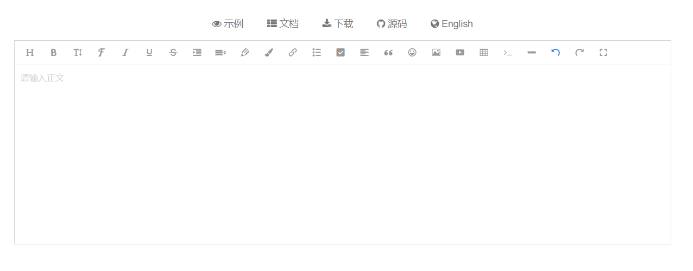
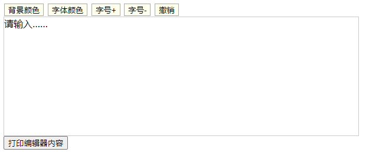

# [简单实现富文本编辑器｜项目复盘｜](https://github.com/danygitgit/document-library)

> create by **db** on **2021-3-17 15:46:50**  
> Recently revised in **2021-3-18 15:56:01**
>
> **闲时要有吃紧的心思，忙时要有悠闲的趣味**

<a id="catalog">目录</a>

- [前言](#preface)
- [正文](#main-body)

  - [富文本编辑器是啥](#chapter-1)
  - [富文本编辑器的实现原理](#chapter-2)
  - [实现简易富文本编辑器](#chapter-3)

- [总结](#summary)

# <a  id="preface">前言</a>

> [返回目录](#catalog)

&emsp;作为一只程序猿，每天都淹没在业务的海洋里，不是在写 bug，就是在改 bug。好容易项目上线了，还有新项目要评审，旧项目要迭代……瀑布流、敏捷开发、devOps……项目周期越来越快，头发掉的也越来越快……

&emsp;Vue 3.0 发布了；Vite 2.0 发布了；Webpack 5 发布了……技术迭代飞快，学不动了都……

&emsp;根本就没时间复盘自己的项目好不好！

&emsp;——吐槽时间结束，其实本来是想写一个关于关于富文本编辑器二次封装的项目的。无奈时间过去的太久，好多细节都已经忘却了，干脆简单实现一个富文本编辑器好了。

# <a  id="main-body">正文</a>

## <a  id="chapter-1">富文本编辑器是啥</a>

> [返回目录](#catalog)

&emsp;说到富文本编辑器，可能有人没什么概念，其实我们从村里通网之后一直在用它。

&emsp;从早期论坛发贴、贴吧留言，到邮件编辑、博客编辑上面，一般都会有一个发布信息的界面，在里面输入文字后，可以设文本格式、字体的大小、粗细、颜色等样式，这个就是富文本编辑器的常见应用，如下图（取自[wangEditor](https://www.wangeditor.com/)，很漂亮的一款开源编辑器）：



&emsp;总的来说，**富文本编辑器（Rich Text Editor，RTE）**是一种可内嵌于浏览器，所见即所得的文本编辑器。它提供类似于 Office Word 的编辑功能。

## <a  id="chapter-2">富文本编辑器的实现原理</a>

> [返回目录](#catalog)

&emsp;富文本编辑器的原理并不复杂。其本质就是在一个页面元素中嵌入 HTML 代码，并且这个元素可以像文档输入框一样进行文本的编辑，同时还可以设置文本样式，如字体样式、大小、颜色等。

&emsp;然后我们将这一整段 HTML 代码或将其抽离成 json 数据，保存到后台，需要的时候再从后台拉取，在富文本编辑器中渲染成保存之前的样式。

&emsp;那么，我们应该怎样让自己的 HTML 可以编辑呢？

&emsp;我们知道 HTML 的 `<input></input>`(输入框)及`<textarea></textarea>`(文本框)标签是可以用来编辑文本的，那我们应该用什么呢？这就提到了这几个属性

- `contenteditable`
- `HTMLElement.contentEditable`
- `designMode`
- `document.execCommand`

### contenteditable 元素内容可编辑

详情了参考：[contenteditable | MDN](https://developer.mozilla.org/zh-CN/docs/Web/HTML/Global_attributes/contenteditable)

&emsp;`contenteditable` 是一个枚举属性，表示元素是否可被用户编辑。属性兼容性很好，兼容所有主流浏览器。

`contenteditable`属性有两个值：

- true： 指定元素是可编辑的
- false： 指定元素是不可编辑的

#### 用法

&emsp;用法很简单，只需要给你需要的标签填上即可。如下：

```html
<p contenteditable="true">这是一个段落。是可编辑的。尝试修改文本。</p>
```

#### 可继承

&emsp;如果是嵌套关系的呢？

```html
<div contenteditable="true">
  我是一个div1，我的contenteditable为true
  <div>我是div2,没有设置contenteditable属性</div>
</div>
```

&emsp;你会发现，即使是嵌套关系，里面的标签也没有 contenteditable 属性，也是可以编辑的，这又是为啥呢？ 其实这个属性有继承关系，只要父级有，那么子级也会继承下来，所以说，子级也是可以编辑的啦。

&emsp;如果子级不想编辑，给子级添加上`contenteditable="false"` 即可

#### tips

&emsp;最后说一下，下面这种特殊情况，按理来说，span 的 姓名 和 年龄都是不可以编辑的对吧。

```html
<div contenteditable="true">
  <span contenteditable="false">姓名：</span>小明<br />
  <span contenteditable="false">年龄：</span>20岁
</div>
```

&emsp;然后只要从 上面一行开始编辑，就会发现，即使是 contenteditable=“false” 的两个 span 里面的文字，都被删除了。这又是为啥呢?

&emsp;这是因为，被标记了 false 的标签，那么他的内部文字是不能被编辑的，但是 外部的编辑，是可以把你整个标签给删除掉的。 所以得避开这种布局。

### HTMLElement.contentEditable 表明元素是否是可编辑的

详情可参考：[HTMLElement.contentEditable | MDN](https://developer.mozilla.org/zh-CN/docs/Web/API/Document/designMode)

&emsp;`contentEditable` 是一个枚举属性，属性用于表明元素是否是可编辑的。

`contentEditable`属性有三个值：

- "true" 表明该元素可编辑。
- "false" 表明该元素不可编辑。
- "inherit" 表明该元素继承了其父元素的可编辑状态。

#### 用法

&emsp;用法也很简单，只需要给你需要的标签填上即可。如下：

```js
document.getElementById('editor').contentEditable = true
```

### Document.designMode 整个文档可编辑

详情可参考：[Document.designMode | MDN](https://developer.mozilla.org/zh-CN/docs/Web/API/Document/designMode)

&emsp;`Document.designMode`是一个全局属性，具有以下特点：

- 用来指定整个页面是否可编辑，当页面可编辑时候，页面上任何支持 contentEditable 属性的元素都变成可编辑状态。
- 只能在 Js 被编辑修改
- 该属性有两个值 ---- `on` (该文档是可编辑的) | `off` (默认值。 该文档不可编辑)

#### designMode 用法

&emsp;designMode 用法也很简单。

1. 让整个页面可编辑：`F12`打开你的控制台,键入一下命令，然后你就发现整个页面可编辑了。

```js
document.designMode = 'on'
```

2. 使一个 `<iframe> `的文档可编辑：

```js
iframeNode.contentDocument.designMode = 'on'
```

#### tips

&emsp;根据规范，该属性默认为 "off" 。Firefox 遵循此标准。早期版本的 Chrome 和 IE 默认为 "inherit" 。从 Chrome 43 开始，默认值为 "off" ，并且不再支持 "inherit"。在 IE6 到 IE10 中，该值为大写。

&emsp;将文档设置为设计模式，要将整个文档设置为设计模式，可以对文档对象本身设置 designMode 属性。当文档处于设计模式时，将不运行脚本。这样，似乎在文档内设置一个按钮来打开或关闭设计模式是个好主意，但这样做没有作用。。

&emsp;当用户打开它后，它将保持在设计模式状态。当他们下次单击此按钮时，它将被选定而不是被单击，他们再次单击它，将能够编辑它的值。这就是为什么如果要使用设计模式最好对框架或 IFrame 中的文档设置 designMode 属性的原因。

### document.execCommand 操纵可编辑内容区域的元素

详情可参考：[document.execCommand | MDN](https://developer.mozilla.org/zh-CN/docs/Web/API/Document/execCommand)

&emsp;其实元素设置 contentedable 后就已经实现了一个最基本的富文本编辑器，只是这个编辑器和文本输入框一样，实在简陋。如果它能很便捷的设置内容的样式，那就完美了。

&emsp;这就用到了与富文本样式交互的方法 -- `document.execCommand()`

该方法有三个参数：

1. aCommandName

- 一个 DOMString ，命令的名称。可用命令列表请参阅 命令 。

2. aShowDefaultUI

- 一个 Boolean， 表示是否需要提示用户提供给该命令一个值，一般为 false。Mozilla 没有实现，所以有些浏览器设置第二个参数为 true 会报错，为了便于移植，通常我们设置为 false。

3. aValueArgument

- 表示执行当前命令的参数值，默认为 null。

#### 用法

比如要给选中文本字体加粗，命令表达式当如下所示：

```js
document.execCommand(bold, false, null)
```

## <a  id="chapter-3">简易实现富文本编辑器</a>

> [返回目录](#catalog)

&emsp;既然原理准备好了，我们就撸一个自己的富文本编辑器吧。

### 1. 搭建编辑器页面

&emsp;我们需要建一个 html 文件。就叫`myEditor.html`吧。

&emsp;一个简易的富文本编辑器应该有一系列的样式操作按钮，一个编辑框。这里我就简单实现五个操作按钮，分别是 `背景颜色`、`字体颜色`、`字号+`、`字号-`、`撤销`；然后简单更改下样式即可。代码如下：

```html
<!DOCTYPE html>
<html lang="en">
  <head>
    <meta charset="UTF-8" />
    <meta http-equiv="X-UA-Compatible" content="IE=edge" />
    <meta name="viewport" content="width=device-width, initial-scale=1.0" />
    <title>豆包的富文本编辑器</title>
  </head>
  <style type="text/css">
    #editor {
      width: 600px;
      height: 200px;
      border: 1px solid #ccc;
    }

    button {
      margin: 1px;
      border: 1px solid #aaa;
      background: #ffe;
      cursor: pointer;
      overflow: hidden;
    }

    button:hover {
      background: #ccc;
      border: 1px solid #00f;
    }
  </style>

  <body>
    <!-- 样式操作按钮 -->
    <button id="btn1">背景颜色</button>
    <button id="btn2">字体颜色</button>
    <button id="btn3">字号+</button>
    <button id="btn4">字号-</button>
    <button id="btn5">撤销</button>
    <!-- 编辑框 -->
    <div id="editor">请输入……</div>
    <input id="printContent" type="button" value="打印编辑器内容" />
  </body>
</html>
```

### 2. 实现富文本编辑功能

让编辑器生效只需

- 开启元素的编辑功能 `editor.contentEditable = true`;

- 给所有样式按钮绑定启动 `document.execCommand` 的事件。

1. 先实现开启元素编辑的 `openOrCloseEditor` 函数：

```js
/**
 *
 * 功能： 开启元素编辑功能
 * 输入： el：编辑器ID; operate：Boolean值，表示启动还是关闭
 */
function openOrCloseEditor(el, operate) {
  var editor = document.getElementById(el)
  editor.contentEditable = operate
}
```

2. 再实按钮事件绑定函数 `bindBtnCommand`：

```js
//按钮绑定命令
  function bindBtnCommand() {
    let btnConfigList = [{
      lab: 'backcolor',
      value: '#f00'
    }, {
      lab: 'foreColor',
      value: '#0f0'
    }, {
      lab: 'fontSize',
      value: '+1'
    }, {
      lab: 'fontSize',
      value: '-1'
    }, {
      lab: 'undo',
      value: '1'
    }]
    for (let i = 0; i < btnConfigList.length; i++) {
      document.getElementById("btn" + (i + 1)).onclick = function () {
        document.execCommand(btnConfigList[i].lab, false, btnConfigList[i].value);
      }
    }
  }
}
```

3. 最后给每个按钮绑定`clickBtn`,然后调用 `initEditor` 使编辑器生效

```htm
<!-- 按钮事件绑定及传参 -->
<button id="btn1" onclick="clickBtn('backcolor','#f00')">背景颜色</button>
<button id="btn2" onclick="clickBtn('foreColor','#0f0')">字体颜色</button>
<button id="btn3" onclick="clickBtn('fontSize',7)">字号+</button>
<button id="btn4" onclick="clickBtn('fontSize',1)">字号-</button>
<button id="btn5" onclick="clickBtn('undo',1)">撤销</button>
```

4. 接下来实现“打印编辑内容”按钮功能：

```js
//获取编辑器内嵌内容
function getContent(el) {
  var editor = document.getElementById(el)
  return editor.innerHTML
}

//打印按钮绑定触发事件
document.getElementById('printContent').onclick = function (e) {
  var content = getContent('editor')
  document.write(content)
}
```

5. 最后调用初始化函数`initEditor`使编辑器生效

```js
//编辑器初始化
function initEditor() {
  openOrCloseEditor('editor', 'true') //开启元素编辑
}
```

&emsp;就这样，我们的编辑器就完成了,如下:



## <a  id="summary">总结</a>

> [返回目录](#catalog)

&emsp;本片并不算一个真正的项目复盘；因为项目过去时间过的太久了，具体细节记不清了。

&emsp; **项目手中过，经验心中留。** 只要自己能有所收获，顺便还能帮到别人，水点文章有什么关系呢？

&emsp;路漫漫其修远兮，与诸君共勉。
## 参考文档

- [实现编辑器](https://www.cnblogs.com/cmt/p/14553189.html)
- [HTML中的designMode 属性 | 简书 - 阿丶炳](https://www.cnblogs.com/cmt/p/14553189.html)
- [几款主流好用的富文本编辑器（所见即所得常用编辑器）介绍 | CSDN - 黄志千](https://blog.csdn.net/davidhzq/article/details/100842866)
- [几款主流好用的markdown编辑器介绍 | CSDN - 黄志千](https://blog.csdn.net/davidhzq/article/details/100815332)


本文正在参与「掘金 2021 春招闯关活动」, 点击查看 [活动详情](https://juejin.cn/post/6939329638506168334/)

附完整代码：

```html
<!DOCTYPE html>
<html lang="en">

<head>
  <meta charset="UTF-8">
  <meta http-equiv="X-UA-Compatible" content="IE=edge">
  <meta name="viewport" content="width=device-width, initial-scale=1.0">
  <title>豆包的富文本编辑器</title>
</head>
<style type="text/css">
  #editor {
    width: 600px;
    height: 200px;
    border: 1px solid #ccc;
  }

  button {
    margin: 1px;
    border: 1px solid #aaa;
    background: #ffe;
    cursor: pointer;
    overflow: hidden;
  }

  button:hover {
    background: #ccc;
    border: 1px solid #00f;
  }
</style>

<body>
  <!-- 样式操作按钮 -->
  <button id="btn1">背景颜色</button>
  <button id="btn2"> 字体颜色</button>
  <button id="btn3">字号+</button>
  <button id="btn4">字号-</button>
  <button id="btn5">撤销</button>
  <!-- 编辑框 -->
  <div id="editor">
    请输入……
  </div>
  <input id="printContent" type="button" value="打印编辑器内容">
</body>
<script>
  initEditor();


  //编辑器初始化函数
  function initEditor() {
    openOrCloseEditor('editor', 'true') //开启元素编辑
    bindBtnCommand(); //给样式按钮绑定命令
  }

  /*
   * 功能： 开启元素编辑功能
   * 输入： el：编辑器ID; operate：Boolean值，表示启动还是关闭
   */
  function openOrCloseEditor(el, operate) {
    var editor = document.getElementById(el);
    editor.contentEditable = operate;
  }

  //按钮绑定命令
  function bindBtnCommand() {
    let btnConfigList = [{
      lab: 'backcolor',
      value: '#f00'
    }, {
      lab: 'foreColor',
      value: '#0f0'
    }, {
      lab: 'fontSize',
      value: '+1'
    }, {
      lab: 'fontSize',
      value: '-1'
    }, {
      lab: 'undo',
      value: '1'
    }]
    for (let i = 0; i < btnConfigList.length; i++) {
      document.getElementById("btn" + (i + 1)).onclick = function () {
        document.execCommand(btnConfigList[i].lab, false, btnConfigList[i].value);
      }
    }
  }

  //获取编辑器内嵌内容
  function getContent(el) {
    var editor = document.getElementById(el);
    return editor.innerHTML;
  }

  //打印按钮绑定触发事件
  document.getElementById("printContent").onclick = function (e) {
    var content = getContent("editor");
    document.write(content);
  };
</script>

</html>
```

**后记：Hello 小伙伴们，如果觉得本文还不错，记得点个赞或者给个 star，你们的赞和 star 是我编写更多更丰富文章的动力！[GitHub 地址](https://github.com/danygitgit/document-library)**

# 文档协议

> <a rel="license" href="http://creativecommons.org/licenses/by-nc-sa/4.0/"></a><br /><a xmlns:dct="http://purl.org/dc/terms/" property="dct:title">**db** 的文档库</a> 由 <a xmlns:cc="http://creativecommons.org/ns#" href="db" property="cc:attributionName" rel="cc:attributionURL">db</a> 采用 <a rel="license" href="http://creativecommons.org/licenses/by-nc-sa/4.0/">知识共享 署名-非商业性使用-相同方式共享 4.0 国际 许可协议</a>进行许可。<br />基于<a xmlns:dct="http://purl.org/dc/terms/" href="https://github.com/danygitgit" rel="dct:source">https://github.com/danygitgit</a>上的作品创作。<br />本许可协议授权之外的使用权限可以从 <a xmlns:cc="http://creativecommons.org/ns#" href="https://creativecommons.org/licenses/by-nc-sa/2.5/cn/" rel="cc:morePermissions">https://creativecommons.org/licenses/by-nc-sa/2.5/cn/</a> 处获得。

```

```
