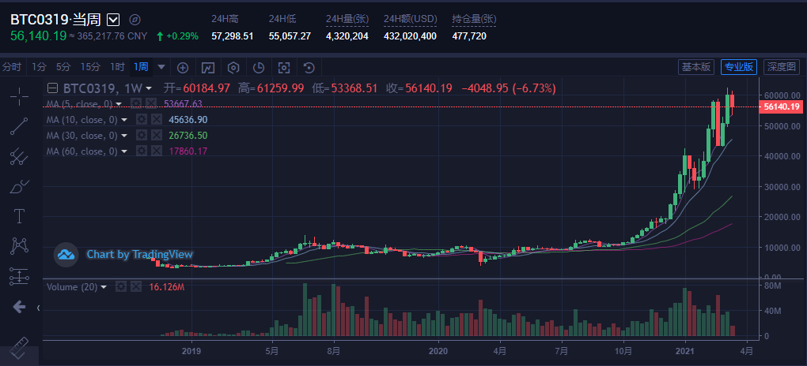

# [股票跌了不要怕，自己做个交易所｜项目复盘](https://github.com/danygitgit/document-library)

> create by **db** on **2021-3-15 15:46:50**  
> Recently revised in **2021-3-17 16:14:38**
>
> **闲时要有吃紧的心思，忙时要有悠闲的趣味**

<a id="catalog">目录</a>

- [前言](#preface)
- [正文](#main-body)

  - [一、项目简介](#chapter-1)
  - [二、项目背景](#chapter-2)
  - [三、实践过程](#chapter-3)
  - [四、总结思考](#chapter-5)

- [总结](#summary)

# <a  id="preface">前言</a>

> [返回目录](#catalog)

<!-- &emsp;作为一只程序猿，每天都淹没在业务的海洋里，不是在写 bug，就是在改 bug。好容易项目上线了，还有新项目要评审，旧项目要迭代……瀑布流、敏捷开发、devOps……项目周期越来越快，头发掉的也越来越快……

&emsp;Vue 3.0发布了；Vite 2.0发布了；Webpack 5发布了……技术迭代飞快，学不动了都……

&emsp;根本就没时间复盘自己的项目好不好！ -->

&emsp;2021，你的基金股票还好吗？

&emsp;股票跌跌不休，行业龙头集体跳水，A 股一片青青草原。说好的牛年牛市呢？

&emsp;但是不要怕，股市无情，人间有爱。现在我们就手撸一个交易所，让你的 k 线涨上天！

# <a  id="main-body">正文</a>

## <a  id="chapter-1">一、项目简介</a>

> [返回目录](#catalog)

&emsp;本次复盘的的是一个交易所的项目，其中涵盖了前台产品认购与后台产品管理两套系统。前台主要包括用户注册认证、产品申请、发行、认购以及交易等一系列的模块。

&emsp;整套系统就是用来给公司用户发行一些线上产品，个人用户可以在线实时交易，并且可看到实时的交易信息。

就是这种，来看看大家的比特币咋样了，


## <a  id="chapter-2">二、项目背景</a>

> [返回目录](#catalog)

&emsp;说到交易所，不得不提的就是 K 线图。

&emsp;因为之前没有接触过 K 线相关的东西，产品给出的需求也不怎么详细。因此第一任务就是做个市场调研——看看竞品网站是怎么做的。

&emsp;参考了一些网站的 K 线实现，比如火币、币严、以太坊之类的大站，基本上分为两类组件：

- ECharts
- TradingView

&emsp;先比较一下这两个组件之间的差别；

#### ECharts 的 K 线图

**优点**

- 开源免费，使用简单，而且项目也使用了 ECharts，不需要引入新的组件。

**缺点**

- 因为比较简单，所以功能来说也比较单一。用来画高开低收还好，如果要实现一些比较专业的指标（MCAD 之类）实现起来比较麻烦。

#### TradingView

**优点**

- 专业的股票交易所类的图表库，提供免费和付费选项，我们的需求使用免费版就好了。

**缺点**

- 其图表库源码需要申请才能使用，申请需要时间，不适合太急的项目使用；
- 因为是专业版组件，相关文档不是太友好，相关社区也不太多。

&emsp;参考了几个类似网站，经过一系列对比，最终决定用 tradingview 实现我们的 K 线图。

&emsp;关于 Tradingview,可以简单介绍一下。

&emsp;Tradingview 是一个价格图表和分析软件，提供免费和付费选项，由一群交易员和软件开发商在 2011 年 9 月推出。投资者可以通过 Tradingview 查看各种不同金融市场和资产类别的价格图表，包括股票、货币对、债券、期货以及加密货币。除此之外，投资者还可以通过该平台查看多个交易品种，比如股指期货、欧美货币对、黄金、原油、比特币等等。

&emsp;简而言之，这是一个图表插件，刨除外观 UI 的设置，它的功能就是：获得数据——数据可视化——响应用户操作——获得数据——数据可视化——……

&emsp;有兴趣可以看下 [官网在线 demo](https://www.tradingview.com/chart/)

## <a  id="chapter-3">三、实践过程</a>

> [返回目录](#catalog)

&emsp;既然选定了组件库，那就开始干吧。

### 1. 申请核心图表库

&emsp;Tradingview 图表库是开源免费的，GitHub 上有官网 demo 可以下载——[demo 下载地址](https://github.com/tradingview/charting-library-examples)。

&emsp;该图表库支持多种语言及框架（如 Vue/React/Angular 等），其实下载了 demo 并不能直接运行，其中缺少关键的核心库(charting-library)，这个需要到官网申请获得——[申请地址](https://cn.tradingview.com/HTML5-stock-forex-bitcoin-charting-library/)，申请步骤比较麻烦，需要下载它的一份协议，签名盖章之后扫描上传上去，然后填写一堆表单（邮箱公司地址等等），如果填写没问题的话，会在一两天之内回复你的邮箱，是 github 的链接(已授权过的，不然会报 404)。

申请页面如下：


&emsp;获取 github 授权之后，就可以将核心库(charting-library)下载到本地了。可以用`http-server`打开 charting-library 中的`index.html`（npm install http-server/ http-server -p 8080）,我使用的是 VScode 的`Live Server`插件运行的，运行之后，可以看到 demo 效果如下。


### 2. 寻找参考文档

&emsp;在此罗列一下自己的一些参考文档及一些实现的 demo

**文档**

- [TradingView 中文开发文档](https://zlq4863947.gitbook.io/tradingview/) ==> https://zlq4863947.gitbook.io/tradingview/

这是个很不错的文档，作者很用心，文档也很详尽，只是小白可能看着有点绕。

**开源项目**

&emsp;因为我们用的是 Vue 框架，所以推荐的大都是基于 Vue 的一些开源项目，都是可以去 github 直接下载的。

1. [vue-tradingview | xushanpei ](https://github.com/xushanpei/Vue-tradingview) ==> https://github.com/xushanpei/Vue-tradingview

很基础的一个项目，Vue + tradingview 实现交易所交易 K 线，里面 K 线是随机创建的假数据，有在线演示--[demo](https://xushanpei.github.io/Vue-tradingview/#/)

**同类网站**

- [火币](https://futures.huobi.fm/zh-cn/contract/exchange/#symbol=BTC&&contract_type=this_week) ==> https://futures.huobi.fm/zh-cn/contract/exchange/#symbol=BTC&&contract_type=this_week

- [币安](https://www.binancezh.pro/cn/trade/BNB_BUSD) ==> https://www.binancezh.pro/cn/trade/BNB_BUSD

### 3. 撸出自己的交易所

&emsp;现在我们已经大致了解了 TradingView，也已经运行起了相关的 demo。剩下要做的就是一步步撸出自己的交易所了。

&emsp;具体一步一步如何实现，可以参考我之前的一篇文章[TradingView 使用心得](https://juejin.cn/post/6911126769420468238)

&emsp;其实 TradingView 图表的工作原理就是我们喂数据（包括`最高价`，`最低价`，`开盘价`，`收盘价`，`交易量`，`交易时间`），图表做可视化的展示。而我们如何把数据喂给图表，插件本身已经定义了对外接口，需要我们提供一个拥有这些接口的对象 **datafeed**，我们定制化的一些东西基本上都是基于**datafeed**对象来更改的。

&emsp;在此分享一下自己碰到的一些问题及解决方案：实践过程中遇到的问题：

#### 关于数据获取

&emsp;在用户量比较多、产品交易量比较大的情况下，如果使用 ajax 获取数据，实时数据轮询会造成服务器压力很大，所以我们选择使用 websocket 推送来获取数据。

&emsp;关于 websocket，官方没有给出 demo，但是很幸运的是，已经有博主实现了 websocket 的 demo，有需要的同学可以看一下[关于 tradingView 与 websocket 结合的可用案例](https://blog.csdn.net/weixin_41421227/article/details/81456205)

#### vue 中使用 TradingView 页面闪白解决方案

&emsp;&emsp;闪白是 iframe 所引起的，解决方案：

- 找到`\static\tradeView\charting_library\static\tv-chart.xxxx.html` 这个文件
- 打开文件后直接在前面加上下面代码即可：

```CSS
<style>
#loading-indicator,body.chart-page {
background: 0 0
}
</style>
```

#### 自定义按钮及功能

&emsp;&emsp;tradingView 支持用户在头部自定义按钮，代码如下。

```js
tvWidget.onChartReady(() => {
  tvWidget.headerReady().then(() => {
    const button = tvWidget.createButton()

    button.setAttribute('title', 'Click to show a notification popup')
    button.classList.add('apply-common-tooltip')

    button.addEventListener('click', () =>
      tvWidget.showNoticeDialog({
        title: 'Notification',
        body: 'TradingView Charting Library API works correctly',
        callback: () => {
          // eslint-disable-next-line no-console
          console.log('Noticed!')
        },
      })
    )

    button.innerHTML = 'Check API'
  })
})
```

#### 更改默认显示指标

&emsp;&emsp;TradingView 支持自定义指标，同样支持默认指标显示。代码如下。

```js
tvWidget.onChartReady(() => {
  // 增加RSI
  tvWidget.chart().createStudy('Connors RSI', false, false)
  // 增加MACD
  tvWidget.chart().createStudy('MACD', false, false)

  // 增加移动平均线
  tvWidget.chart().createStudy('moving average')
})
```

&emsp;&emsp;添加自定义指标可参考 [TradingView 自定义指标 | x_smile - 博客园](https://www.cnblogs.com/xsmile/p/10640536.html)

## <a  id="chapter-5">四、总结思考</a>

> [返回目录](#catalog)

&emsp;经历了一些列肝代码的过程，最后比较圆满的完成了产品的需求，项目也成功的上了线。

&emsp;其实这 K 线只是项目中的比较重要的一小部分，自己做的也是中规中矩。真称得上自豪的东西就是在周围没有人能请教，自己也没有接触过相关知识的情况下，独立完成所需知识查找及学习，并且可以将其融入自己的知识体系，圆满完成工作任务。

&emsp;路漫漫其修远兮，与诸君共勉。

本文正在参与「掘金 2021 春招闯关活动」, 点击查看 [活动详情](https://juejin.cn/post/6939329638506168334/)

**后记：Hello 小伙伴们，如果觉得本文还不错，记得点个赞或者给个 star，你们的赞和 star 是我编写更多更丰富文章的动力！[GitHub 地址](https://github.com/danygitgit/document-library)**

# 文档协议

> <a rel="license" href="http://creativecommons.org/licenses/by-nc-sa/4.0/"></a><br /><a xmlns:dct="http://purl.org/dc/terms/" property="dct:title">**db** 的文档库</a> 由 <a xmlns:cc="http://creativecommons.org/ns#" href="db" property="cc:attributionName" rel="cc:attributionURL">db</a> 采用 <a rel="license" href="http://creativecommons.org/licenses/by-nc-sa/4.0/">知识共享 署名-非商业性使用-相同方式共享 4.0 国际 许可协议</a>进行许可。<br />基于<a xmlns:dct="http://purl.org/dc/terms/" href="https://github.com/danygitgit" rel="dct:source">https://github.com/danygitgit</a>上的作品创作。<br />本许可协议授权之外的使用权限可以从 <a xmlns:cc="http://creativecommons.org/ns#" href="https://creativecommons.org/licenses/by-nc-sa/2.5/cn/" rel="cc:morePermissions">https://creativecommons.org/licenses/by-nc-sa/2.5/cn/</a> 处获得。
