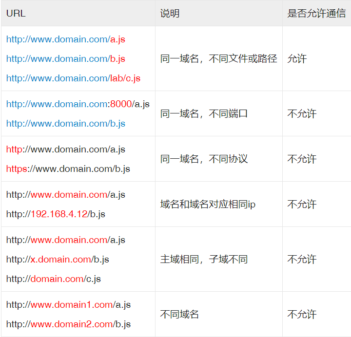
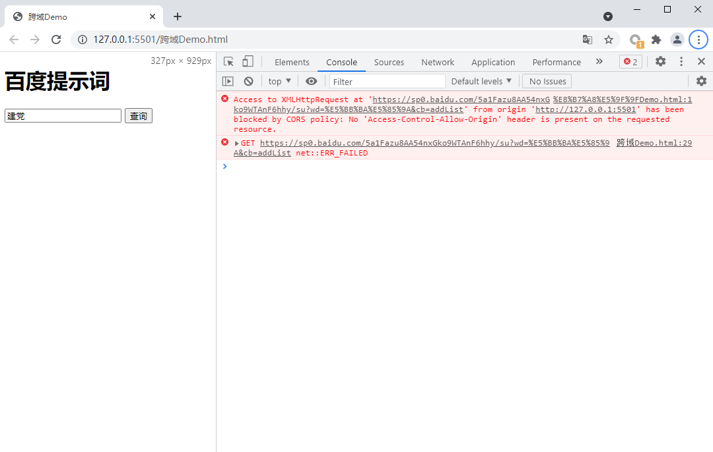

@[前端常见跨域解决方案](https://github.com/danygitgit/document-library/blob/master/other-library)  

> create by **db** on **2019-12-31 14:31:32**   
> Recently revised in **2021-7-5 18:05:59**  

&emsp;**Hello 小伙伴们，如果觉得本文还不错，麻烦点个赞或者给个 star，你们的赞和 star 是我前进的动力！[GitHub 地址](https://github.com/danygitgit/document-library)**  


# 前言  

> I hear and I fogorget. 

> I see and I remember.  

> I do and I understand.  

&emsp;参考文献：

- [前端常见跨域解决方案（全） | 思否 - 安静de沉淀](https://segmentfault.com/a/1190000011145364#item-1)

- [可能是最好的跨域解决方案了... ... | 掘金 - 一二家的攻城狮](https://juejin.im/post/5dc9228cf265da4d2125de8d)

- [简单的跨域案例 | CSDN - sleepwalker_199](https://blog.csdn.net/sleepwalker_1992/article/details/80977661)


# 正文

## 什么是跨域？

&emsp;`跨域`是指一个域下的文档或脚本试图去请求另一个域下的资源，这里跨域是广义的。

### 广义的跨域：

1. 资源跳转： `<a>`链接、重定向、表单提交

2.  资源嵌入： `<link>、<script>、、<frame>`等dom标签，还有样式中`background:url()、@font-face()`等文件外链

3. 脚本请求： js发起的`ajax`请求、dom和js对象的跨域操作等

&emsp;其实我们通常所说的跨域是狭义的，是由浏览器同源策略限制的一类请求场景。

&emsp;例如：a页面想获取b页面资源，如果a、b页面的`协议`、`域名`、`端口`、`子域名`不同，所进行的访问行动都是跨域的，而浏览器为了安全问题一般都限制了跨域访问，也就是不允许跨域请求资源。

**注意**: 跨域限制访问，其实是浏览器的限制。理解这一点很重要！！！

### 什么是同源策略？

&emsp;`同源策略/SOP`（Same origin policy）是一种约定，由Netscape公司1995年引入浏览器，它是浏览器最核心也最基本的安全功能，如果缺少了同源策略，浏览器很容易受到XSS、CSFR等攻击。所谓同源是指"`协议+域名+端口`"三者相同，即便两个不同的域名指向同一个ip地址，也非同源。

**举个栗子:**

```javaScript
const url = 'https://www.google.com:3000'
```
&emsp;比如上面的这个 URL，协议是：`https`，域名是 `www.google.com`，端口是 `3000`。

不同源了会怎么样？会有很多限制，比如：

1. Cookie，LocalStorage，IndexDB 等存储性内容无法读取
2. DOM 节点无法访问
3. Ajax 请求发出去了，但是响应被浏览器拦截了

如果没有同于策略，你可能会遇到：

1. Cookie劫持，被恶意网站窃取数据
2. 更容易受到 XSS，CSRF 攻击
3. 无法隔离潜在恶意文件
4. ……

正是因为浏览器同源策略的存在，你的 Ajax 请求有可能在发出去后就被拦截了，它还会给你报个错：

```javaScript
✘ Access to XMLHttpRequest at 'xxx' from origin 'xxx' has been block by CORS,
  policy: No 'Access-Control-Allow-Origin' header is present on the requested resource.
```

### 常见跨域场景



## 跨域的实际例子

&emsp;百闻不如一见，啰嗦那么多，不如亲自尝试一下。

&emsp;下面我们就**百度提示词接口**来实现一个智能搜索，看看会遇到什么问题。

接口地址：

- `https://sp0.baidu.com/5a1Fazu8AA54nxGko9WTAnF6hhy/su?wd=关键词&cb=回调函数`

接口参数：

- **wd** ：关键词
- **cb** ：回调函数名称

返回数据格式：

- jsonp格式

&emsp;很简单的一个借口，我们只需要关注`关键词`及`回调函数`即可。
&emsp;类似百度首页，我们在页面中简单做一个输入框和一个按钮，当用户输入内容并且点击按钮的时候，触发相关请求，然后在请求成功之后将返回的数据展示在页面中就好了。具体代码如下：

```html
<!DOCTYPE html>
<html lang="en">

<head>
  <meta charset="UTF-8">
  <title>跨域Demo</title>
</head>

<body>
  <h1>百度提示词</h1>
  <input type="text" id="keyword" placeholder="请输入关键字" />
  <input type="button" id="btn" onclick="clickBtn()" value="查询" />
  <div class="box"></div>

  <script>
    /**
    * 按钮点击事件
    */
    function clickBtn() {
      // 获取手输入框内容
      let keyWord = document.getElementById("keyword").value;
      //输入为空直接返回
      if (!keyWord) return
      // 声明请求路径
      let url = "https://sp0.baidu.com/5a1Fazu8AA54nxGko9WTAnF6hhy/su?wd=" + keyWord + "&cb=addList"
      // 实现http请求
      let httpRequest = new XMLHttpRequest();//第一步：建立所需的对象
      httpRequest.open('GET', url, true);//第二步：打开连接 
      httpRequest.send();//第三步：发送请求  
    };

    /**
    * 获取数据后的回调函数
    * 将获取的数据列表展示在id为box的元素内
    */
    function addList(data) {
      let list = "<ul>";
      for (let i = 0; i < data.s.length; i++) {
        let temp = data.s[i];
        list += "<li>" + temp + "</li>";
      }
      list += "</ul>";
      let box = document.querySelector(".box");
      box.innerHTML = list;
    };
  </script>
</body>

</html>
```
&emsp;ok，页面准备完毕，然后我们开始测试一下：


&emsp;果不其然，接口跨域，请求失败

&emsp;那我们应该怎么解决呢？

## 跨域解决方案

**解决方案一览**

1. 通过jsonp跨域
2. document.domain + iframe跨域
3. location.hash + iframe
4. window.name + iframe跨域
5. postMessage跨域
6. 跨域资源共享（CORS）
7. nginx代理跨域
8. nodejs中间件代理跨域
9. WebSocket协议跨域

### 一、 通过jsonp跨域

&emsp;通常为了减轻web服务器的负载，我们把js、css，img等静态资源分离到另一台独立域名的服务器上，在html页面中再通过相应的标签从不同域名下加载静态资源，而被浏览器允许，基于此原理，我们可以通过动态创建script，再请求一个带参网址实现跨域通信。

#### 原生实现：

```html
 <script>
    var script = document.createElement('script');
    script.type = 'text/javascript';

    // 传参一个回调函数名给后端，方便后端返回时执行这个在前端定义的回调函数
    script.src = 'http://www.domain2.com:8080/login?user=admin&callback=handleCallback';
    document.head.appendChild(script);

    // 回调执行函数
    function handleCallback(res) {
        alert(JSON.stringify(res));
    }
 </script>
 ```
&emsp;服务端返回如下（返回时即执行全局函数）：

```javaScript
handleCallback({"status": true, "user": "admin"})
```
#### jquery ajax：

```javaScript
$.ajax({
    url: 'http://www.domain2.com:8080/login',
    type: 'get',
    dataType: 'jsonp',  // 请求方式为jsonp
    jsonpCallback: "handleCallback",    // 自定义回调函数名
    data: {}
});
```
#### vue.js：

```javaScript
this.$http.jsonp('http://www.domain2.com:8080/login', {
    params: {},
    jsonp: 'handleCallback'
}).then((res) => {
    console.log(res); 
})

```
#### 后端node.js代码示例：

```javaScript
var querystring = require('querystring');
var http = require('http');
var server = http.createServer();

server.on('request', function(req, res) {
    var params = qs.parse(req.url.split('?')[1]);
    var fn = params.callback;

    // jsonp返回设置
    res.writeHead(200, { 'Content-Type': 'text/javascript' });
    res.write(fn + '(' + JSON.stringify(params) + ')');

    res.end();
});

server.listen('8080');
console.log('Server is running at port 8080...');


```

#### 利用jsonp在我们的页面实现如下：

```js
  /**
  * 按钮点击事件
  */
  function clickBtn() {
    // 获取手输入框内容
    let keyWord = document.getElementById("keyword").value;
    //输入为空直接返回
    if (!keyWord) return
    // 声明请求路径
    let url = "https://sp0.baidu.com/5a1Fazu8AA54nxGko9WTAnF6hhy/su?wd=" + keyWord + "&cb=addList"
    
    // 实现jsonp跨域请求
    let script = document.createElement("script");
    script.src = url
    let head = document.querySelector("head");
    head.appendChild(script);
  };
```

jsonp缺点：只能实现get一种请求。
### 二、 document.domain + iframe跨域

&emsp;此方案仅限主域相同，子域不同的跨域应用场景。

&emsp;**实现原理**：两个页面都通过js强制设置document.domain为基础主域，就实现了同域。

1.）父窗口：(http://www.domain.com/a.html)
```html
<iframe id="iframe" src="http://child.domain.com/b.html"></iframe>
<script>
    document.domain = 'domain.com';
    var user = 'admin';
</script>
```
2.）子窗口：(http://child.domain.com/b.html)

```html
<script>
    document.domain = 'domain.com';
    // 获取父窗口中变量
    alert('get js data from parent ---> ' + window.parent.user);
</script>
```
### 三、 location.hash + iframe跨域

&emsp;**实现原理**： a欲与b跨域相互通信，通过中间页c来实现。 三个页面，不同域之间利用iframe的location.hash传值，相同域之间直接js访问来通信。

&emsp;**具体实现**：A域：a.html -> B域：b.html -> A域：c.html，a与b不同域只能通过hash值单向通信，b与c也不同域也只能单向通信，但c与a同域，所以c可通过parent.parent访问a页面所有对象。

1. a.html：(http://www.domain1.com/a.html)

```html
<iframe id="iframe" src="http://www.domain2.com/b.html" style="display:none;"></iframe>
<script>
    var iframe = document.getElementById('iframe');

    // 向b.html传hash值
    setTimeout(function() {
        iframe.src = iframe.src + '#user=admin';
    }, 1000);
    
    // 开放给同域c.html的回调方法
    function onCallback(res) {
        alert('data from c.html ---> ' + res);
    }
</script>
```
2. b.html：(http://www.domain2.com/b.html)

```html
<iframe id="iframe" src="http://www.domain1.com/c.html" style="display:none;"></iframe>
<script>
    var iframe = document.getElementById('iframe');

    // 监听a.html传来的hash值，再传给c.html
    window.onhashchange = function () {
        iframe.src = iframe.src + location.hash;
    };
</script>
```
3. c.html：(http://www.domain1.com/c.html)

```html
<script>
    // 监听b.html传来的hash值
    window.onhashchange = function () {
        // 再通过操作同域a.html的js回调，将结果传回
        window.parent.parent.onCallback('hello: ' + location.hash.replace('#user=', ''));
    };
</script>
```
### 四、 window.name + iframe跨域

&emsp;window.name属性的独特之处：name值在不同的页面（甚至不同域名）加载后依旧存在，并且可以支持非常长的 name 值（2MB）。

1. a.html：(http://www.domain1.com/a.html)
```javaScript
var proxy = function(url, callback) {
    var state = 0;
    var iframe = document.createElement('iframe');

    // 加载跨域页面
    iframe.src = url;

    // onload事件会触发2次，第1次加载跨域页，并留存数据于window.name
    iframe.onload = function() {
        if (state === 1) {
            // 第2次onload(同域proxy页)成功后，读取同域window.name中数据
            callback(iframe.contentWindow.name);
            destoryFrame();

        } else if (state === 0) {
            // 第1次onload(跨域页)成功后，切换到同域代理页面
            iframe.contentWindow.location = 'http://www.domain1.com/proxy.html';
            state = 1;
        }
    };

    document.body.appendChild(iframe);

    // 获取数据以后销毁这个iframe，释放内存；这也保证了安全（不被其他域frame js访问）
    function destoryFrame() {
        iframe.contentWindow.document.write('');
        iframe.contentWindow.close();
        document.body.removeChild(iframe);
    }
};

// 请求跨域b页面数据
proxy('http://www.domain2.com/b.html', function(data){
    alert(data);
});
```
2. proxy.html：(http://www.domain1.com/proxy....
中间代理页，与a.html同域，内容为空即可。

3. b.html：(http://www.domain2.com/b.html)
```html
<script>
    window.name = 'This is domain2 data!';
</script>
```
#### 总结：
&emsp;通过iframe的src属性由外域转向本地域，跨域数据即由iframe的window.name从外域传递到本地域。这个就巧妙地绕过了浏览器的跨域访问限制，但同时它又是安全操作。

### 五、 postMessage跨域

&emsp;postMessage是HTML5 XMLHttpRequest Level 2中的API，且是为数不多可以跨域操作的window属性之一，它可用于解决以下方面的问题：

* a. 页面和其打开的新窗口的数据传递
* b. 多窗口之间消息传递
* c. 页面与嵌套的iframe消息传递
* d. 上面三个场景的跨域数据传递

**用法**：postMessage(data,origin)方法接受两个参数
data： html5规范支持任意基本类型或可复制的对象，但部分浏览器只支持字符串，所以传参时最好用JSON.stringify()序列化。
origin： 协议+主机+端口号，也可以设置为"*"，表示可以传递给任意窗口，如果要指定和当前窗口同源的话设置为"/"。

1. a.html：(http://www.domain1.com/a.html)
```html
<iframe id="iframe" src="http://www.domain2.com/b.html" style="display:none;"></iframe>
<script>       
    var iframe = document.getElementById('iframe');
    iframe.onload = function() {
        var data = {
            name: 'aym'
        };
        // 向domain2传送跨域数据
        iframe.contentWindow.postMessage(JSON.stringify(data), 'http://www.domain2.com');
    };

    // 接受domain2返回数据
    window.addEventListener('message', function(e) {
        alert('data from domain2 ---> ' + e.data);
    }, false);
</script>
```
2. b.html：(http://www.domain2.com/b.html)
```html
<script>
    // 接收domain1的数据
    window.addEventListener('message', function(e) {
        alert('data from domain1 ---> ' + e.data);

        var data = JSON.parse(e.data);
        if (data) {
            data.number = 16;

            // 处理后再发回domain1
            window.parent.postMessage(JSON.stringify(data), 'http://www.domain1.com');
        }
    }, false);
</script>
```
### 六、 跨域资源共享（CORS）

&emsp;**普通跨域请求**：只服务端设置`Access-Control-Allow-Origin`即可，前端无须设；若要带cookie请求：前后端都需要设置。

&emsp;需注意的是：由于同源策略的限制，所读取的cookie为**跨域请求接口所在域的cookie**，而非当前页。如果想实现当前页cookie的写入，可参考下文：`七、nginx反向代理中设置proxy_cookie_domain` 和 八、`NodeJs中间件代理中cookieDomainRewrite`参数的设置。

&emsp;目前，所有浏览器都支持该功能(IE8+：IE8/9需要使用XDomainRequest对象来支持CORS）)，CORS也已经成为主流的跨域解决方案。

#### 前端设置：

1. 原生ajax
```javaScript
// 前端设置是否带cookie
xhr.withCredentials = true;
```
示例代码：

```javaScript
var xhr = new XMLHttpRequest(); // IE8/9需用window.XDomainRequest兼容

// 前端设置是否带cookie
xhr.withCredentials = true;

xhr.open('post', 'http://www.domain2.com:8080/login', true);
xhr.setRequestHeader('Content-Type', 'application/x-www-form-urlencoded');
xhr.send('user=admin');

xhr.onreadystatechange = function() {
    if (xhr.readyState == 4 && xhr.status == 200) {
        alert(xhr.responseText);
    }
};
```
2. jQuery ajax

```javaScript
$.ajax({
    ...
   xhrFields: {
       withCredentials: true    // 前端设置是否带cookie
   },
   crossDomain: true,   // 会让请求头中包含跨域的额外信息，但不会含cookie
    ...
});
```
3. vue框架

- axios设置：
```javaScript
axios.defaults.withCredentials = true
```
- vue-resource设置：

```javaScript
Vue.http.options.credentials = true
```
#### 服务端设置：

&emsp;若后端设置成功，前端浏览器控制台则不会出现跨域报错信息，反之，说明没设成功。

1. Java后台：

```java
/*
 * 导入包：import javax.servlet.http.HttpServletResponse;
 * 接口参数中定义：HttpServletResponse response
 */

// 允许跨域访问的域名：若有端口需写全（协议+域名+端口），若没有端口末尾不用加'/'
response.setHeader("Access-Control-Allow-Origin", "http://www.domain1.com"); 

// 允许前端带认证cookie：启用此项后，上面的域名不能为'*'，必须指定具体的域名，否则浏览器会提示
response.setHeader("Access-Control-Allow-Credentials", "true"); 

// 提示OPTIONS预检时，后端需要设置的两个常用自定义头
response.setHeader("Access-Control-Allow-Headers", "Content-Type,X-Requested-With");
```
2. Nodejs后台示例：

```javaScript
var http = require('http');
var server = http.createServer();
var qs = require('querystring');

server.on('request', function(req, res) {
    var postData = '';

    // 数据块接收中
    req.addListener('data', function(chunk) {
        postData += chunk;
    });

    // 数据接收完毕
    req.addListener('end', function() {
        postData = qs.parse(postData);

        // 跨域后台设置
        res.writeHead(200, {
            'Access-Control-Allow-Credentials': 'true',     // 后端允许发送Cookie
            'Access-Control-Allow-Origin': 'http://www.domain1.com',    // 允许访问的域（协议+域名+端口）
            /* 
             * 此处设置的cookie还是domain2的而非domain1，因为后端也不能跨域写cookie(nginx反向代理可以实现)，
             * 但只要domain2中写入一次cookie认证，后面的跨域接口都能从domain2中获取cookie，从而实现所有的接口都能跨域访问
             */
            'Set-Cookie': 'l=a123456;Path=/;Domain=www.domain2.com;HttpOnly'  // HttpOnly的作用是让js无法读取cookie
        });

        res.write(JSON.stringify(postData));
        res.end();
    });
});

server.listen('8080');
console.log('Server is running at port 8080...');
```
### 七、 nginx代理跨域

#### 1、 nginx配置解决iconfont跨域

&emsp;浏览器跨域访问js、css、img等常规静态资源被同源策略许可，但iconfont字体文件(eot|otf|ttf|woff|svg)例外，此时可在nginx的静态资源服务器中加入以下配置。

```javaScript
location / {
  add_header Access-Control-Allow-Origin *;
}
```
#### 2、 nginx反向代理接口跨域

&emsp;**跨域原理：** 同源策略是浏览器的安全策略，不是HTTP协议的一部分。服务器端调用HTTP接口只是使用HTTP协议，不会执行JS脚本，不需要同源策略，也就不存在跨越问题。

&emsp;**实现思路**：通过nginx配置一个代理服务器（域名与domain1相同，端口不同）做跳板机，反向代理访问domain2接口，并且可以顺便修改cookie中domain信息，方便当前域cookie写入，实现跨域登录。

nginx具体配置：

```
#proxy服务器
server {
    listen       81;
    server_name  www.domain1.com;

    location / {
        proxy_pass   http://www.domain2.com:8080;  #反向代理
        proxy_cookie_domain www.domain2.com www.domain1.com; #修改cookie里域名
        index  index.html index.htm;

        # 当用webpack-dev-server等中间件代理接口访问nignx时，此时无浏览器参与，故没有同源限制，下面的跨域配置可不启用
        add_header Access-Control-Allow-Origin http://www.domain1.com;  #当前端只跨域不带cookie时，可为*
        add_header Access-Control-Allow-Credentials true;
    }
}
```

1. 前端代码示例：
```javaScript
var xhr = new XMLHttpRequest();

// 前端开关：浏览器是否读写cookie
xhr.withCredentials = true;

// 访问nginx中的代理服务器
xhr.open('get', 'http://www.domain1.com:81/?user=admin', true);
xhr.send();
```
2.  Nodejs后台示例：

```javaScript
var http = require('http');
var server = http.createServer();
var qs = require('querystring');

server.on('request', function(req, res) {
    var params = qs.parse(req.url.substring(2));

    // 向前台写cookie
    res.writeHead(200, {
        'Set-Cookie': 'l=a123456;Path=/;Domain=www.domain2.com;HttpOnly'   // HttpOnly:脚本无法读取
    });

    res.write(JSON.stringify(params));
    res.end();
});

server.listen('8080');
console.log('Server is running at port 8080...');
```
### 八、 Nodejs中间件代理跨域

&emsp;node中间件实现跨域代理，原理大致与nginx相同，都是通过启一个代理服务器，实现数据的转发，也可以通过设置cookieDomainRewrite参数修改响应头中cookie中域名，实现当前域的cookie写入，方便接口登录认证。

#### 1、 非vue框架的跨域（2次跨域）

利用node + express + http-proxy-middleware搭建一个proxy服务器。

1. 前端代码示例：
```javaScript
var xhr = new XMLHttpRequest();

// 前端开关：浏览器是否读写cookie
xhr.withCredentials = true;

// 访问http-proxy-middleware代理服务器
xhr.open('get', 'http://www.domain1.com:3000/login?user=admin', true);
xhr.send();
```
2. 中间件服务器：

```javaScript
var express = require('express');
var proxy = require('http-proxy-middleware');
var app = express();

app.use('/', proxy({
    // 代理跨域目标接口
    target: 'http://www.domain2.com:8080',
    changeOrigin: true,

    // 修改响应头信息，实现跨域并允许带cookie
    onProxyRes: function(proxyRes, req, res) {
        res.header('Access-Control-Allow-Origin', 'http://www.domain1.com');
        res.header('Access-Control-Allow-Credentials', 'true');
    },

    // 修改响应信息中的cookie域名
    cookieDomainRewrite: 'www.domain1.com'  // 可以为false，表示不修改
}));

app.listen(3000);
console.log('Proxy server is listen at port 3000...');
```
3. Nodejs后台同（六：nginx）

#### 2、 vue框架的跨域（1次跨域）

&emsp;利用node + webpack + webpack-dev-server代理接口跨域。在开发环境下，由于vue渲染服务和接口代理服务都是webpack-dev-server同一个，所以页面与代理接口之间不再跨域，无须设置headers跨域信息了。

webpack.config.js部分配置：
```javaScript
module.exports = {
    entry: {},
    module: {},
    ...
    devServer: {
        historyApiFallback: true,
        proxy: [{
            context: '/login',
            target: 'http://www.domain2.com:8080',  // 代理跨域目标接口
            changeOrigin: true,
            secure: false,  // 当代理某些https服务报错时用
            cookieDomainRewrite: 'www.domain1.com'  // 可以为false，表示不修改
        }],
        noInfo: true
    }
}
```
### 九、 WebSocket协议跨域

&emsp;`WebSocket protocol`是HTML5一种新的协议。它实现了浏览器与服务器全双工通信，同时允许跨域通讯，是server push技术的一种很好的实现。
&emsp;原生WebSocket API使用起来不太方便，我们使用Socket.io，它很好地封装了webSocket接口，提供了更简单、灵活的接口，也对不支持webSocket的浏览器提供了向下兼容。

1. 前端代码：
```html
<div>user input：<input type="text"></div>
<script src="https://cdn.bootcss.com/socket.io/2.2.0/socket.io.js"></script>
<script>
var socket = io('http://www.domain2.com:8080');

// 连接成功处理
socket.on('connect', function() {
    // 监听服务端消息
    socket.on('message', function(msg) {
        console.log('data from server: ---> ' + msg); 
    });

    // 监听服务端关闭
    socket.on('disconnect', function() { 
        console.log('Server socket has closed.'); 
    });
});

document.getElementsByTagName('input')[0].onblur = function() {
    socket.send(this.value);
};
</script>
```
2. Nodejs socket后台：

```javaScript
var http = require('http');
var socket = require('socket.io');

// 启http服务
var server = http.createServer(function(req, res) {
    res.writeHead(200, {
        'Content-type': 'text/html'
    });
    res.end();
});

server.listen('8080');
console.log('Server is running at port 8080...');

// 监听socket连接
socket.listen(server).on('connection', function(client) {
    // 接收信息
    client.on('message', function(msg) {
        client.send('hello：' + msg);
        console.log('data from client: ---> ' + msg);
    });

    // 断开处理
    client.on('disconnect', function() {
        console.log('Client socket has closed.'); 
    });
});
```
## 总结 
&emsp;当然，除了上述的方案外，比较 Hack 的还有：window.name, location.hash，但是这些跨域的方式现在我们已经不推荐了，为什么 ？因为相比之下有更加安全和强大的 PostMessage 作为替代。跨域的方案其实有很多，总结下来：

* CORS 支持所有的 HTTP 请求，是跨域最主流的方案
* JSONP 只支持 GET 请求，但是可以兼容老式浏览器
* Node 中间件和 Nginx 反向代理都是利用了服务器对服务器没有同源策略限制
* Websocket 也是一种跨域的解决方案
* PostMessage 可以实现跨文档通信，更多地用于窗口通信
* document.domain, window.name, location.hash 逐渐淡出历史舞台，作为替代 PostMessage 是一种不错的方案

&emsp;作为一只前端菜鸟，本篇文章旨在记录自己的学习心得，如有不足，还请多多指教。

&emsp;路漫漫其修远兮，与诸君共勉。  

**后记：Hello 小伙伴们，如果觉得本文还不错，记得点个赞或者给个 star，你们的赞和 star 是我编写更多更丰富文章的动力！[GitHub 地址](https://github.com/danygitgit/document-library/blob/master/other-library/%E8%AE%A1%E7%AE%97%E6%9C%BA%E5%9F%BA%E7%A1%80/%E5%89%8D%E7%AB%AF%E5%B8%B8%E8%A7%81%E8%B7%A8%E5%9F%9F%E8%A7%A3%E5%86%B3%E6%96%B9%E6%A1%88.md)**  

> <a rel="license" href="http://creativecommons.org/licenses/by-nc-sa/4.0/"></a><br /><a xmlns:dct="http://purl.org/dc/terms/" property="dct:title">**db** 的文档库</a> 由 <a xmlns:cc="http://creativecommons.org/ns#" href="db" property="cc:attributionName" rel="cc:attributionURL">db</a> 采用 <a rel="license" href="http://creativecommons.org/licenses/by-nc-sa/4.0/">知识共享 署名-非商业性使用-相同方式共享 4.0 国际 许可协议</a>进行许可。<br />基于<a xmlns:dct="http://purl.org/dc/terms/" href="https://github.com/danygitgit" rel="dct:source">https://github.com/danygitgit</a>上的作品创作。<br />本许可协议授权之外的使用权限可以从 <a xmlns:cc="http://creativecommons.org/ns#" href="https://creativecommons.org/licenses/by-nc-sa/2.5/cn/" rel="cc:morePermissions">https://creativecommons.org/licenses/by-nc-sa/2.5/cn/</a> 处获得。  