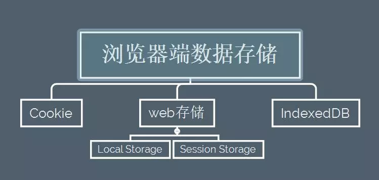

@[浏览器本地存储漫谈](https://github.com/danygitgit/document-library/blob/master/other-library/%E6%AD%A3%E5%88%99/%E6%AD%A3%E5%88%99%E8%A1%A8%E8%BE%BE%E5%BC%8F%E9%9B%86%E9%94%A6%20.md)  

`> create by **db** on **2019-6-21 11:30:54**   
> Recently revised in **2019-7-6 22:50:24**  

&emsp;**Hello 小伙伴们，如果觉得本文还不错，麻烦点个赞或者给个 star，你们的赞和 star 是我前进的动力！[GitHub 地址](https://github.com/danygitgit/document-library/blob/master/other-library/%E6%AD%A3%E5%88%99/%E6%AD%A3%E5%88%99%E8%A1%A8%E8%BE%BE%E5%BC%8F%E9%9B%86%E9%94%A6%20.md)**  


# 前言  

> I hear and I fogorget. 

> I see and I remember.  

> I do and I understand.  

&emsp;作为一个前端码农，每天都在跟浏览器打交道，大家有对浏览器的数据存储方案有多少了解呢？

&emsp;参考文献：

- [深入了解浏览器存储 | 博客园-醉盏](https://www.cnblogs.com/belove8013/p/8134067.html)
  
- [前端常用缓存技术 | 博客园-醉盏](https://www.cnblogs.com/belove8013/p/8134067.html)

- [漫话前端缓存 | 谢子琼](http://www.sohu.com/a/288324635_575744)

- [说说几种常用的前端缓存 | CSDN-blank](https://blog.csdn.net/weixin_38639882/article/details/79791786)

# 正文

## 前端缓存一览

&emsp;前端缓存主要分为浏览器缓存和http缓存。大致分类如下图所示：


## 浏览器的本地存储

&emsp;在浏览器端存储数据对我们是很有用，这相当于赋予浏览器记忆的功能，可以纪录用户的所有状态信息，增强用户体验。比如当纪录用户的登陆状态时，可以让用户能够更快的进行访问，而不是每次登陆时都需要去进行繁琐的操作。

&emsp;我们就浅聊一下浏览器的本地存储机制。

&emsp;打开谷歌浏览器，按`F12`打开开发者工具，选择`Application`，我们就能看到自己浏览器的缓存了。如下图所示：


&emsp;该图很清晰的可以看到浏览器的缓存分类。总的来说,在平时的开发过程中，现在市面上最常见的数据存储方案是以下三种：
- `Cookie`
- web存储 (`localStorage`和`seesionStorage`)
- `IndexedDB`
- 
如下图所示：



&emsp;那么这几种缓存有什么区别呢？

### Cookie

**Cookie使用教程-->[菜鸟教程](https://www.runoob.com/js/js-cookies.html)**

#### 什么是Cookie

&emsp; `JavaScript`是运行在客户端的脚本，因此一般是不能够设置`Session`的，因为`Session`是运行在服务器端的。而`cookie`是运行在客户端的，所以可以用JS来设置`cookie`。

&emsp; `cookie`是浏览器提供的一种机制，它将`document`对象的`cookie`属性提供给`JavaScript`。可以由`JavaScript`对其进行控制，而并不是`JavaScript`本身的性质。cookie是存于用户硬盘的一个文件，这个文件通常对应于一个域名，当浏览器再次访问这个域名时，便使这个`cookie`可用。因此，`cookie`可以跨越一个域名下的多个网页，但不能跨越多个域名使用。 

#### Cookie的优点
`cookie`机制将信息存储于用户硬盘，因此可以作为全局变量，这是它最大的一个优点。它可以用于以下几种场合。 

1. 保存用户登录状态。
2. 跟踪用户行为。
3. 定制页面。
4. 创建购物车，例如淘宝网就使用`cookie`记录了用户曾经浏览过的商品，方便随时进行比较。

#### Cookie的缺点

`cookie`能完成的部分应用，还有更多的功能需要全局变量。`cookie`的缺点主要集中于安全性和隐私保护。主要包括以下几种： 

1. `cookie`可能被禁用。当用户非常注重个人隐私保护时，他很可能禁用浏览器的`cookie`功能； 
2. `cookie`是与浏览器相关的。这意味着即使访问的是同一个页面，不同浏览器之间所保存的`cookie`也是不能互相访问的； 
3. `cookie`可能被删除。因为每个`cookie`都是硬盘上的一个文件，因此很有可能被用户删除； 
4. `cookie`安全性不够高。所有的`cookie`都是以纯文本的形式记录于文件中，因此如果要保存用户名密码等信息时，最好事先经过加密处理。

#### 总结

&emsp;cookie是比较老的前端缓存技术了。

&emsp;想要使用它前端必须要有服务（静态网页是不行的），而且存储大小限制在`4kb`。那么为什么必须要有服务才能使用`cookie`呢？因为只要有请求涉及，`cookie`就要在服务器和浏览器之间来回传送。而且由于浏览器的跨域限制，客户端和服务端必须要保证同源的原则才能使用，但是由于cookie是存放在前端的，所以安全问题一直是个大问题。

&emsp;因此一般重要的信息不建议放在cookie中存放。

### localStorage

#### 什么是localstorage？

&emsp;在HTML5中，新加入了一个`localStorage`特性，这个特性主要是用来作为本地存储来使用的，解决了cookie存储空间不足的问题(cookie中每条cookie的存储空间为`4k`)，`localStorage`中一般浏览器支持的是`5M`大小，这个在不同的浏览器中`localStorage`会有所不同。

#### localStorage的优势与局限

**优势**

1.  `localStorage`拓展了cookie的4K限制

2. `localStorage`会可以将第一次请求的数据直接存储到本地，这个相当于一个5M大小的针对于前端页面的数据库，相比于cookie可以节约带宽，但是这个却是只有在高版本的浏览器中才支持的

**局限**

1. 浏览器的大小不统一，并且在IE8以上的IE版本才支持`localStorage`这个属性

2. 目前所有的浏览器中都会把`localStorage`的值类型限定为`string`类型，这个在对我们日常比较常见的`JSON`对象类型需要一些转换

3.  `localStorage`在浏览器的隐私模式下面是不可读取的

4.  `localStorage`本质上是对字符串的读取，如果存储内容多的话会消耗内存空间，会导致页面变卡

5. `localStorage`不能被爬虫抓取到

&emsp;`localStorage`与`SessionStorage`的唯一一点区别就是`localStorage`属于永久性存储，而`SessionStorage`属于当会话结束的时候，`SessionStorage`中的键值对会被清空


#### localStorage的使用方法

&emsp;localStorage特点就是“持久” ——一旦通过保存，不通过手动清除的话，就会一直保存在前端。它的保存格式是键值对的方式也就是“key-value”的方式保存的，以下是它的一些使用方法：

```JavaScript
localStorage.length    //获得storage中的个数
localStorage.key(n)    //获得storage中第n个元素对的键值（第一个元素是0）
localStorage.getItem(key)    //获取键值key对应的值
localStorage.key    //获取键值key对应的值
localStorage.setItem(key, value)    //添加数据，键值为key，值为value
localStorage.removeItem(key)    //移除键值为key的数据
localStorage.clear()    //清除所有数据
```

#### localstorage的其他注意事项

&emsp;一般我们会将JSON存入localStorage中，但是在localStorage会自动将localStorage转换成为字符串形式。

&emsp;这个时候我们可以使用`JSON.stringify()`这个方法，来将JSON对象转换成为JSON字符串

示例：
```JavaScript
if(!window.localStorage){
   alert("浏览器支持localstorage");
}else{
   var storage=window.localStorage;
   var data={
      name:'xiecanyong',
      sex:'man',
      hobby:'program'
   };
   //将JSON字对象转换成为JSON字符串输入
   var d = JSON.stringify(data);
   storage.setItem("data",d);
   console.log(storage.data);
}
```
读取之后要将JSON字符串转换成为JSON对象，使用JSON.parse()方法

```JavaScript
var storage=window.localStorage;
   var data={
         name:'xiecanyong',
         sex:'man',
         hobby:'program'
   };
   var d=JSON.stringify(data);
   storage.setItem("data",d);
   //将JSON字符串转换成为JSON对象输出
   var json=storage.getItem("data");
   var jsonObj=JSON.parse(json);
   console.log(typeof jsonObj);
```

### SessionStorage

#### 什么是SessionStorage？

&emsp;`SessionStorage`用于本地存储一个会话（Session）中的数据，它的作用域是窗口级别的，也就是说不同窗口间的sessionStorage数据不能共享的。这些数据只有在同一个会话中的页面才能访问并且当会话结束后数据也随之销毁。因此`SessionStorage`不是一种持久化的本地存储，仅仅是会话级别的存储。

#### SessionStorage的特点

&emsp;这个和`localStorage`有什么区别呢？作为一种会话级别的本地存储，一旦关闭浏览器`SessionStorage`就会消失，而`localStorage`是很“持久”的，即使你关闭一万次浏览器也没事，所以差距还是很大的。因为现在都是前后端分离的开发模式，前端工程师都很青睐这两种前端缓存方式。

#### SessionStorage的基本用法：

```JavaScript
sessionStorage.length    //获得storage中的个数
sessionStorage.key(n)    //获得storage中第n个元素对的键值（第一个元素是0）
sessionStorage.getItem(key)    //获取键值key对应的值
sessionStorage.key    //获取键值key对应的值
sessionStorage.setItem(key, value)    //添加数据，键值为key，值为value
sessionStorage.removeItem(key)    //移除键值为key的数据
sessionStorage.clear()    //清除所有数据
```

## 总结  

&emsp;作为一只前端菜鸟，本篇文章旨在记录自己的学习心得，如有不足，还请多多指教。其中大部分是拷贝的，如有错误，慢慢用，慢慢改。谢谢大家。  

&emsp;路漫漫其修远兮，与诸君共勉。  

**后记：Hello 小伙伴们，如果觉得本文还不错，记得点个赞或者给个 star，你们的赞和 star 是我编写更多更丰富文章的动力！[GitHub 地址](https://github.com/danygitgit/document-library/blob/master/other-library/%E6%AD%A3%E5%88%99/%E6%AD%A3%E5%88%99%E8%A1%A8%E8%BE%BE%E5%BC%8F%E9%9B%86%E9%94%A6%20.md)**  

> <a rel="license" href="http://creativecommons.org/licenses/by-nc-sa/4.0/"></a><br /><a xmlns:dct="http://purl.org/dc/terms/" property="dct:title">**db** 的文档库</a> 由 <a xmlns:cc="http://creativecommons.org/ns#" href="db" property="cc:attributionName" rel="cc:attributionURL">db</a> 采用 <a rel="license" href="http://creativecommons.org/licenses/by-nc-sa/4.0/">知识共享 署名-非商业性使用-相同方式共享 4.0 国际 许可协议</a>进行许可。<br />基于<a xmlns:dct="http://purl.org/dc/terms/" href="https://github.com/danygitgit" rel="dct:source">https://github.com/danygitgit</a>上的作品创作。<br />本许可协议授权之外的使用权限可以从 <a xmlns:cc="http://creativecommons.org/ns#" href="https://creativecommons.org/licenses/by-nc-sa/2.5/cn/" rel="cc:morePermissions">https://creativecommons.org/licenses/by-nc-sa/2.5/cn/</a> 处获得。  