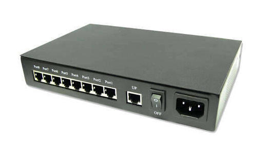
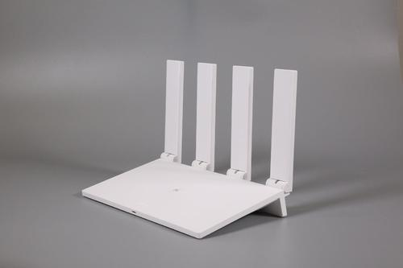
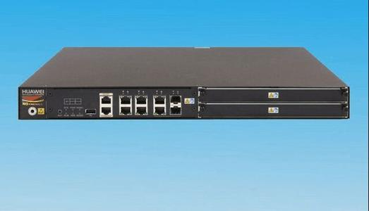
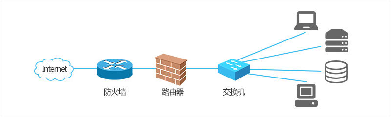
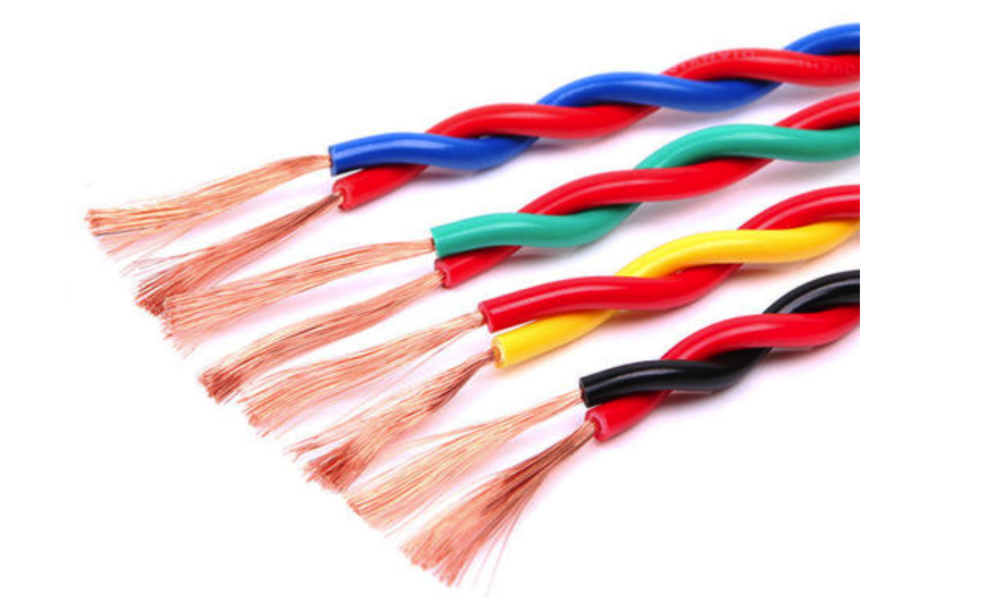
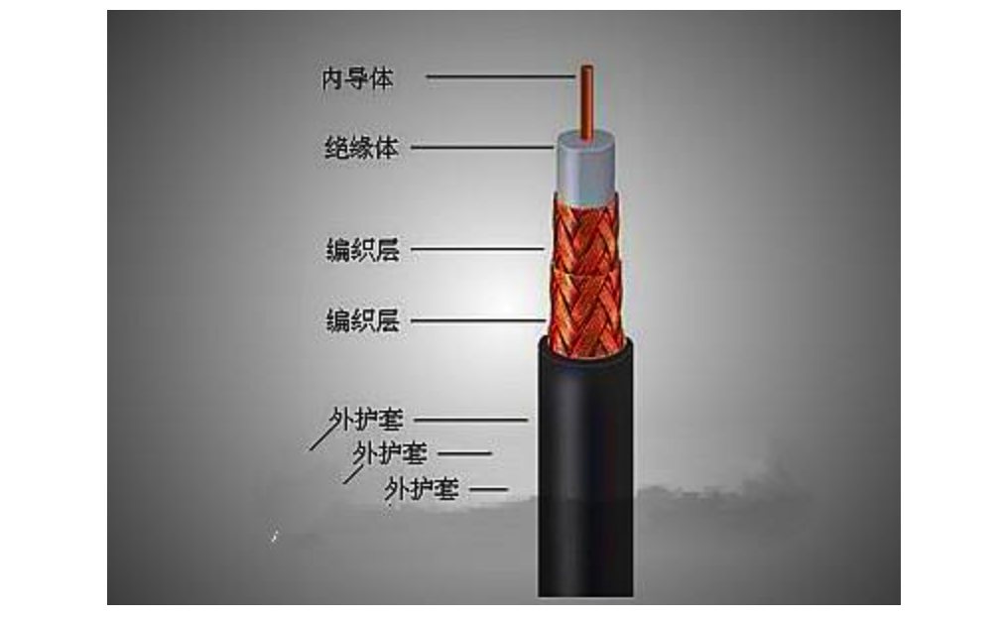
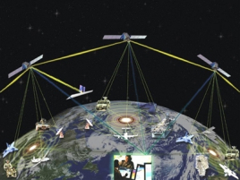

@[故事会之交换机与路由器——读《图解网络硬件》](https://github.com/danygitgit/document-library)

> create by **db** on **2020-10-30 11:35:16**  
> Recently revised in **2020-10-31 17:33:24**
>
> **闲时要有吃紧的心思，忙时要有悠闲的趣味**

<a id="catalog">目录</a>

- [前言](#preface)

- [参考文档](#reference-documents)

- [交换机、路由器那些事儿](#main-body)

- [读《图解网络硬件》](#summary)

# <a  id="preface">前言</a>

> [返回目录](#catalog)

&emsp;最近在看《图解网络硬件》，里面有些关于网络协议的概念不是特别了解，正巧知乎看到的一篇很不错的回答，形象地阐释了关于交换机、路由器、防火墙等网络硬件的特点及发展史，特地分享给大家。

## <a  id="reference-documents">参考文档</a>

- [如何跟小白解释路由器和交换机的区别 | 知乎-薛定谔不在家](https://www.zhihu.com/question/22007235/answer/402261894)

- [如何跟小白解释路由器和交换机的区别 | 知乎-FS 网络](https://www.zhihu.com/question/22007235/answer/574328954)

- [计算机网络基础知识总结 | 掘金-程序员 cxuan](https://www.zhihu.com/question/22007235/answer/574328954)

# <a  id="main-body">网关路由那些事儿</a>

## 一场游戏引发的硬件革命

**注**，故事部分来及知乎回答，[原文链接](https://www.zhihu.com/question/22007235/answer/402261894)，侵删。

&emsp;&emsp;我相信我们都玩过一款特别火的游戏：帝国时代。小时候想要玩帝国时代，需要到软件城购买盗版光盘安装（大概 3 块钱一张左右的样子，当时已经觉得很便宜了，谁想到现在有了网络之后是免费）。下载完成后只能进行单机模式。

&emsp;&emsp;小 A 是一个帝国时代大神，他打通了游戏的所有关卡，可以一个人单挑 8 个疯狂的电脑。渐渐他觉得无聊了，想要找小伙伴一起 PK。

&emsp;&emsp;但是如何实现两台设备的互联呢？小 A 很聪明，他发明了一个类似于 USB 口一样的可以传输数据的端口，他将其命名为**网口**。小 A 通过一根网线将自己的电脑与小 B 的网口相连，实现了两台电脑间的互连。

&emsp;&emsp;两个小伙伴很开心，联机玩了起来，这时被路过的小 C 看见了，小 C 也要加入进来。但是我们知道，每台电脑只有一个网口，无法实现三台电脑的相互连接，那要要怎么办呢？

&emsp;&emsp;这时候小 B 出了一个主意：咱们再找一台计算机，给他多设计几个网口，我们每个人都连到这台计算机的网口上，不也实现咱们哥几个之间的互连了吗。

### 集线器（Hub）

&emsp;&emsp;说干就干，于是他们设计出了一款微型计算机，他本身具备多个网口，专门实现多台计算机的互联作用，这个微型计算机就是**集线器**。顾名思义，`集线器`起到了一个将网线集结起来的作用，实现最初级的网络互通。集线器是通过网线直接传送数据的，我们说他工作在**物理层**。

&emsp;&emsp;有了集线器后，越来越多的小伙伴加入到游戏中，小 D、小 E 等人都慕名而来。然而集线器有一个问题，由于和每台设备相连，他不能分辨出具体信息是发送给谁的，只能广泛的广播出去。例如小 A 本来想问小 C：你吃了吗？结果小 B，小 D 和小 E 等所有连接在集线器上的用户都收到了这一信息，且由于处于同一网络，小 A 说话时其他人不能发言，否则信息间会产生碰撞，引发错误，我们叫做各设备处于同一**冲突域**内。

### 交换机(NetWork Switch)

&emsp;&emsp;这样的设备用户体验极差，于是小伙伴们一起讨论改进措施。这时聪明的小 D 发话了：我们给这台设备加入一个指令，让他可以根据网口名称自动寻址传输数据。比如我把小 A 的网口命名为 `macA`，将小 C 的命名为 `macC`，这时如果小 A 想要将数据传给小 C，则设备会根据网口名称 `macA` 和 `macC` 自动将资料从 A 的电脑传送到 C 的电脑中，而不让小 B、小 D 和小 E 收到。也就是说，这台设备解决了冲突的问题，实现了任意两台电脑间的互联，大大地提升了网络间的传输速度，我们把它叫做**交换机**。由于交换机是根据网口地址传送信息，比网线直接传送多了一个步骤，我们也说交换机工作在**数据链路层**。

&emsp;&emsp; 这回小伙伴们高兴了，他们愉快地玩耍起来。渐渐地，他们在当地有了名气，吸引了越来越多的小伙伴加入到他们的队伍中。直到有一天，一个外村的小伙突然找上门来，希望能和他们一起互联，实现跨村间的网络对战。 小 A 说可以呀，于是他们找了一根超长的网线将两个村落的交换机连在了一起。结果发现一件奇怪的事：两个村落间竟然不能相互通信。怎么着，原来那边的电脑和他们用的不是一套操作系统，这导致信息间的传送形式的不匹配。在这期间，还有其他村落的人也来找过小 A，可是小 A 发现，每个村子之间用的操作系统都不一样。

### 路由器(Router)

&emsp;&emsp;这可咋办呐？难道以后只能各自村子玩各自的了吗？为了解决这一问题，各村的小伙伴们坐在一起组织了一场会议，最终得出了一套解决方案：采用同样的信息传送形式（像不像秦始皇统一度量衡）。那如何实现呢？小伙伴们规定，不同的村子间先在各自的操作系统上加上一套相同的协议。不同村落通信时，信息经协议加工成统一形式，再经由一个特殊的设备传送出去。这个设备就叫做**路由器**。路由器通过 IP 地址寻址，我们说它工作在计算机的**网络层**。

&emsp;&emsp;这样，经由如此的一系列改装，小 A 终于带领村民们实现了整个乡镇的通信。随着越来越多的城里人也加入小 A 的协议，小 A 带领村民逐步实现了全市、全国乃至全世界的通信。这一套协议便是 **TCP/IP 协议簇**，互联网也便这样形成了。

&emsp;&emsp;后来,隔壁村二狗子跟小 A 打游戏输了,但是他不服气.于是;他联系了一批狐朋狗友，和他们串通好，每天固定一个时间大家一起给小 A 他们村发消息，内容什么都有，例如"打雷啦，下雨收衣服啊！"、"人是人他妈生的，妖是妖他妈生的"、"你妈贵姓"等等。搞得小 A 他们打游戏卡的要死，最后网络崩掉，。这就是"**拒绝服务攻击**"（`DoS攻击`）。

### 防火墙（Firewall）

&emsp;&emsp;那怎么办呢？聪明的小 E 发明了一个新设备。这个设备可以监控进出他们村网络的通信量，并可以规定哪些数据可以进出，哪些数据不可以进出，从而抵制对村内构成威胁的数据。他们设置二狗子村的数据禁止访问，这样二狗子和他朋友就不能攻击到小 A 他们村的网络了。大家觉得二狗子他们就像火灾一样，而这个东西能把他们防住，于是给这个设备取名叫**防火墙（硬件）**。后来小 E 觉得每台电脑都有防火墙就好了，不过家家户户都买个防火墙太贵了，于是他就自学编程，编了一个杀毒软件安装在电脑上，用来过滤不需要的信息，这个就是**软件防火墙**。

&emsp;&emsp;有了防火墙，小 A 他们村（**局域网**）就不用担心外村（**互联网**）随意访问他们的数据了，也不用担心他们村的小朋友看\*\*小电影了。

&emsp;&emsp;即便如今全网络已遍布了全世界，在小 A 和村里的小伙伴对战帝国时代的时候，也仍然用着交换机。只有和外面更大的世界交流的时候才用到路由器与防火墙。 总结：**交换机适合局域网内互联，路由器实现全网段互联，防火墙用来过滤交互时不需要的数据**。

他们之间的链接是这样的：路由器-防火墙-交换机，然后交换机再连接其他网络设备。

### 猫（Modem）

&emsp;&emsp; 这里再单独解释一下**猫（Modem）**：猫的学名叫**调制解调器**，它的作用是将发送端（电脑想要发送的信息）通过`调制`将数字信号转换为模拟信号，而在接收端（网线中的电信号或者光纤中的光信号）通过`解调`再将模拟信号转换为数字信号，从而使信息在网线中传输。

&emsp;&emsp; 由于计算机只认识`1000011`这种二进制数据，它的一切信号都要由电流脉冲传送出去，因而猫是必须的。目前的家用路由器一般都是路由猫，即路由器兼顾了猫和简单交换机的功能，因而在选购时，选一款性价比超高的路由猫就可以了。

### 传输介质

&emsp;&emsp; 网络的传输是需要介质的。一个比特数据包从一个端系统开始传输，经过一系列的链路和路由器，从而到达另外一个端系统。这个比特会被转发了很多次，那么这个比特经过传输的过程所跨越的媒介就被称为`物理媒介(phhysical medium)`，物理媒介有很多种，比如`双绞铜线`、`同轴电缆`、`多模光纤榄`、`陆地无线电频谱`和`卫星无线电频谱`。其实大致分为两种：引导性媒介和非引导性媒介。

#### 双绞铜线

&emsp;&emsp; 最便宜且最常用的引导性传输媒介就是双绞铜线，多年以来，它一直应用于电话网。从电话机到本地电话交换机的连线超过 99% 都是使用的双绞铜线，例如下面就是双绞铜线的实物图

双绞铜线由两根绝缘的铜线组成，每根大约 1cm 粗，以规则的螺旋形状排列，通常许多双绞线捆扎在一起形成电缆，并在双绞馅的外面套上保护层。一对电缆构成了一个通信链路。无屏蔽双绞线一般常用在局域网（LAN）中。

#### 同轴电缆

&emsp;&emsp; 与双绞线类似，同轴电缆也是由两个铜导体组成，下面是实物图

&emsp;&emsp; 借助于这种结构以及特殊的绝缘体和保护层，同轴电缆能够达到较高的传输速率，同轴电缆普遍应用在在电缆电视系统中。同轴电缆常被用户引导型共享媒介。

#### 光纤

&emsp;&emsp; 光纤是一种细而柔软的、能够引导光脉冲的媒介，每个脉冲表示一个比特。一根光纤能够支持极高的比特率，高达数十甚至数百 Gbps。它们不受电磁干扰。光纤是一种引导型物理媒介，下面是光纤的实物图

&emsp;&emsp; 一般长途电话网络全面使用光纤，光纤也广泛应用于因特网的主干。

#### 陆地无线电信道

&emsp;&emsp; 无线电信道承载电磁频谱中的信号。它不需要安装物理线路，并具有穿透墙壁、提供与移动用户的连接以及长距离承载信号的能力。

#### 卫星无线电信道

&emsp;&emsp; 一颗卫星电信道连接地球上的两个或多个微博发射器/接收器，它们称为地面站。通信中经常使用两类卫星：同步卫星和近地卫星。

# <a  id="summary">读《图解网络硬件》</a>

> [返回目录](#catalog)

<!-- ## 网络硬件汇总 -->

<!-- | 网络协议分层 | 对应 OSI 分层        | 相关协议                                                           | 职责                                                                                      |
| ------------ | -------------------- | ------------------------------------------------------------------ | ----------------------------------------------------------------------------------------- |
| 应用层       | 医用层/表示层/会话层 | TELNET,SSH,HTTTP,SMTP,POP,SSL/TLS,FTP,MIME,HTML,SNMP,MIB,SIP,RTP…… | 定义数据格式，并按照对应的格式解读数据。                                                  |
| 传输层       | 传输层               | TCP,UDP,UDP-Lite,SCTP,DCCP                                         | 定义端口，确认主机上应用程序的身份，并将数据包交给对应的应用程序；                        |
| 网络层       | 网络层               | ARP,IPv4,IPv6,ICMP,IPsec                                           | 定义 IP 地址，确认主机所在的网络位置，并通过 IP 进行 MAC 寻址，对外网数据包进行路由转发； |
| 链路层       | 数据链路层/物理层    | 以太网、无线 LAN、PPP^(双绞线，无线，光纤…… )                      | 对 0 和 1 进行分组，定义数据帧，确认主机的物理地址，传输数据；                            | -->

## 读《图解网络硬件》

&emsp;今天终于囫囵吞枣的将《图解网络硬件》看完了，说一下自己的感受吧。

&emsp;这是一本比较专业的书（对小白来说）。本书详述了构建网络的硬件知识，涵盖了交换机、路由器、防火墙、无线网等。其讲解细致，定位在科普读物与技术专业书籍之间，适合介于小白和大神之间的`大白`来读。

&emsp;不过书上列举的设备都是思科的，没有国产硬件知识介绍。上面有很多图（这是废话，《图解……》系列都很多图），但是没接触过网络硬件的也看不太懂。对于非从事通信工程的来讲，属于看了不懂，懂了也没啥用系列。

&emsp;总的来说，若果对于网络硬件没啥兴趣的话，不建议读；如果想了解相关知识，建议速读。

&emsp;路漫漫其修远兮，与诸君共勉。

## <a  id="reference-documents">参考文档</a>

- [网关 DNS DHCP 路由 | CSDN-yugui_huang0305](https://blog.csdn.net/yugui_huang0305/article/details/7495557)

- [深入浅出 TCP/IP 协议栈 | 博客园-一像素](https://www.cnblogs.com/onepixel/p/7092302.html)

**后记：Hello 小伙伴们，如果觉得本文还不错，记得点个赞或者给个 star，你们的赞和 star 是我编写更多更丰富文章的动力！[GitHub 地址](https://github.com/danygitgit/document-library)**

# 文档协议

>  <a xmlns:dct="http://purl.org/dc/terms/" property="dct:title">**db** 的文档库</a> 由 <a xmlns:cc="http://creativecommons.org/ns#" href="db" property="cc:attributionName" rel="cc:attributionURL">db</a> 采用 <a rel="license" href="http://creativecommons.org/licenses/by-nc-sa/4.0/">知识共享 署名-非商业性使用-相同方式共享 4.0 国际 许可协议</a>进行许可。 基于<a xmlns:dct="http://purl.org/dc/terms/" href="https://github.com/danygitgit" rel="dct:source">https://github.com/danygitgit</a>上的作品创作。 本许可协议授权之外的使用权限可以从 <a xmlns:cc="http://creativecommons.org/ns#" href="https://creativecommons.org/licenses/by-nc-sa/2.5/cn/" rel="cc:morePermissions">https://creativecommons.org/licenses/by-nc-sa/2.5/cn/</a> 处获得。
