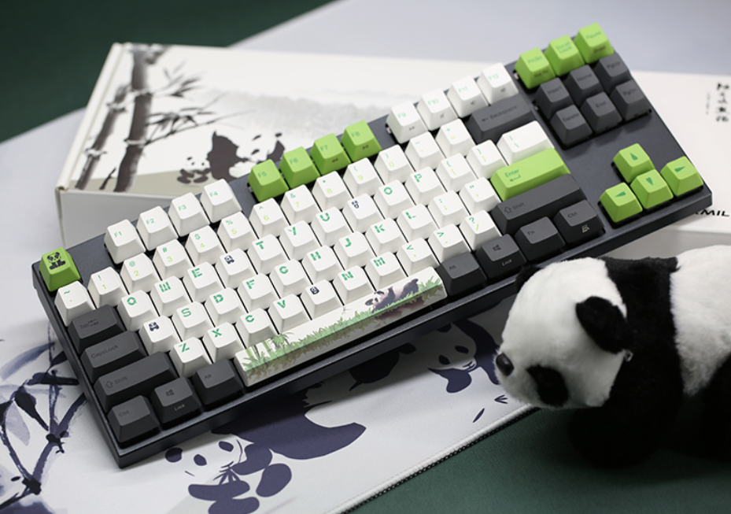
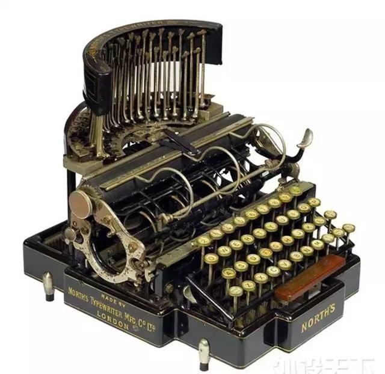
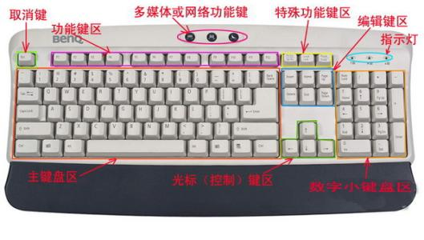

@[键盘快捷键笔记](https://github.com/danygitgit/document-library/blob/master/other-library/%E9%94%AE%E7%9B%98%E5%BF%AB%E6%8D%B7%E9%94%AE%E7%AC%94%E8%AE%B0.md)

> create by **db** on **2018-12-30 15:42:36**   
> Recently revised in **2018-12-31 03:42:31**

&emsp;**Hello 小伙伴们，如果觉得本文还不错，麻烦点个赞或者给个 star，你们的赞和 star 是我前进的动力！[GitHub 地址](https://github.com/danygitgit/document-library/blob/master/other-library/%E9%94%AE%E7%9B%98%E5%BF%AB%E6%8D%B7%E9%94%AE%E7%AC%94%E8%AE%B0.md)**

&emsp;最近在网易云课堂看了小黑老师讲的关于键盘快捷键的课程，写下这篇学习笔记，以记录自己的学习心得。现分享给大家，以供参考。

&emsp;如果大家有兴趣，可以戳这里观看原视频：[提高办公效率必学的键盘操作技巧](https://study.163.com/course/courseLearn.htm?courseId=1003046004#/learn/video?lessonId=1003509078&courseId=1003046004)

&emsp;作为一只菜鸟，这是我掘金分享的第二篇文章。如有不足，还请多多指教，谢谢大家。

# 前言

## 关于键盘

&emsp;什么是键盘？————我就不啰嗦了。马上9012了，也许你没见过猪跑，但估计不会没敲过键盘。

&emsp;当然，如果你非要问个究竟，那我只能说：

### **这——就是键盘！**

————有木有流口水呢~~反正我在流……

## 键盘前生今世

### 没图说个 * * 

&emsp;当然，此文并非介绍键盘史的，如有需要请左转百度，走好您嘞。。。

# 正文

&emsp;如果你是一个程序员，键盘是是我们必备的生存工具（之一）；如果你是个吃鸡大神，键盘是你最犀利的武器；如果你是个宠妻狂魔，那么键盘更是搓衣板的最好替代品......所以，你该如何挑选一块优秀的键盘呢~~

&emsp;呸，又跑题了。选购键盘请右转淘宝，不送。

## 正题之前

&emsp;你每天敲多久的键盘？

&emsp;8个小时？

&emsp;10个小时？

&emsp;12个小时？

&emsp;16个小时~~

&emsp;作为我们最重要的生产力工具，作为手中最锋利的战刀，作为每天相伴的合作伙伴，键盘陪你的时间比女朋友都长（前提是你有女朋友）。不过，对于你的键盘，是否足够熟悉，是否足够了解，是否......

## 更高！更快！更强！

&emsp;在很多情况下，键盘操作比鼠标操作更便捷，更灵活，也更能装 X。。。与其羡慕大神的神技，不如自己成为大神，接受大家的膜拜。

&emsp;废话不多说了，开始我们的键盘侠之旅。

## 键盘分区

如上图所示，一个标准键盘（104键）主要分为五个区:

* 主键盘区
    - 主键区是进行信息录入的最主要键位区，主键区又分为数字符号键、26个字母键和功能键。

* 功能键区
    - 功能键区位千键盘的最上方，共有16个键，包括<kbd>Esc</kbd>、<kbd>Sleep</kbd>、F1～F12键、<kbd>WakeUp</kbd>和<kbd>Power</kbd>。

* 控制键区
    - 编辑控制键区共有13个键，其主要作用是:在编辑文档时控制光标的移动。

* 数字键区
    - 数字键区位于键盘右侧的17个键属于数字键区。数字键区主要是为了方便输入数字而设置的，同时也有编辑和控制光标位置的功能。

* 状态指示区
    - 状态指示区具有<kbd>CapsLock</kbd>（字母大键盘小写锁定）、<kbd>NumLock</kbd>（数字小键盘锁定）、<kbd>ScrollLock</kbd>（滚动锁定键）三个指示灯。

下面我们逐一介绍这些键区中常用的快捷键。

## 功能键区

快捷键     | 功能
------ |  -----
<kbd>ESC</kbd> | 退出程序/全屏
<kbd>F2</kbd> | 文件重命名
<kbd>F4</kbd> | 重复上一步操作
<kbd>F5</kbd> | 刷新
<kbd>F11</kbd> | 全屏/退出全屏
<kbd>F12</kbd> | 进入网页开发者工具

## 主键区

### 标点符号

快捷键组合     | 功能
-------- | -----
<kbd>Shift</kbd> + <kbd>6</kbd> | （中文）省略号 ……
<kbd>Shift</kbd> + <kbd>-</kbd> | （中文）破折号 ——

### 上档转换键 <kbd>Shift</kbd>

快捷键     | 功能
-------- | -----
<kbd>Shift</kbd> + 单击 | 连续选择
<kbd>Shift</kbd> + <kbd>A</kbd> | 全选
<kbd>Shift</kbd> + <kbd>S</kbd> | 保存
<kbd>Shift</kbd> + <kbd>Z</kbd> | 撤销
<kbd>Shift</kbd> + <kbd>Y</kbd> | 反撤销
<kbd>Shift</kbd> + <kbd>C</kbd> | 复制
<kbd>Shift</kbd> + <kbd>X</kbd> | 剪切
<kbd>Shift</kbd> + <kbd>V</kbd> | 粘贴

### 控制键 <kbd>Ctrl</kbd>

快捷键     | 功能
-------- | -----
<kbd>Ctrl</kbd> + 单击 | 间隔选择 
<kbd>Ctrl</kbd> + <kbd>E</kbd> | 居中
<kbd>Ctrl</kbd> + <kbd>R</kbd> | 右对齐
<kbd>Ctrl</kbd> + <kbd>]</kbd> | 放大
<kbd>Ctrl</kbd> + <kbd>[</kbd> | 缩小
<kbd>Ctrl</kbd> + <kbd>P</kbd> | 打印
<kbd>Ctrl</kbd> + <kbd>Shift</kbd> | 切换输入法
<kbd>Ctrl</kbd> + <kbd>。</kbd> | 切换中英文标点
<kbd>Ctrl</kbd> + <kbd>Shift</kbd> + <kbd>N</kbd> | 新建文件夹

### 换挡键 <kbd>Alt</kbd>

快捷键     | 功能
-------- | ----- 
<kbd>Alt</kbd> + <kbd>Tab</kbd> | 切换程序
<kbd>Alt</kbd> + <kbd>F4</kbd> | 快速关闭程序
<kbd>Alt</kbd> + 单击拖动 | 矩形选择（word内）

### 窗口键 <kbd>Win</kbd>

快捷键     | 功能
-------- | -----
<kbd>Win</kbd> | 打开`开始`菜单
<kbd>Win</kbd> + <kbd>D</kbd> | 快速回到桌面
<kbd>Win</kbd> + <kbd>E</kbd> | 打开`文件资源管理器`
<kbd>Win</kbd> + <kbd>L</kbd> | 快速锁定电脑
<kbd>Win</kbd> + <kbd>U</kbd> | 打开电脑设置
<kbd>Win</kbd> + <kbd>R</kbd> | 打开`运行`
<kbd>Win</kbd> + <kbd>Tab</kbd> | 快速切换窗口
<kbd>Win</kbd> + <kbd>←</kbd> | 电脑屏幕左半边显示
<kbd>Win</kbd> + <kbd>→</kbd> | 电脑屏幕右半边显示

### 任务管理器

快捷键     | 功能
-------- | -----
<kbd>Ctrl</kbd> + <kbd>Shift</kbd> + <kbd>Esc</kbd> | 打开任务管理器
<kbd>Ctrl</kbd> + <kbd>Alt</kbd> + <kbd>Delete</kbd> | 打开任务管理器

## 编辑区域

快捷键     | 功能
-------- | -----
<kbd>PrintSctreenSysRq</kbd> | 截取满屏
<kbd>Insert</kbd> | 改写（光标吃掉后面的字）
<kbd>Home</kbd> | 光标移到行首
<kbd>End</kbd> | 光标移到行尾
<kbd>Ctrl</kbd> + <kbd>Home</kbd> | 光标移到文章头部
<kbd>Ctrl</kbd> + <kbd>End</kbd> | 光标移到文章尾部
<kbd>Ctrl</kbd> + <kbd>Alt</kbd> + <kbd>A</kbd> | 快速QQ截屏(登录QQ)
<kbd>Ctrl</kbd> + <kbd>F1</kbd> | 快速系统截图(可自定义快捷键)

## 附加小技巧

自定义系统程序快捷键；
> 开始 → 程序 → 属性 → 快捷键

PPT设置撤销次数：
> 文件 → 选项 → 高级 → 设置最多可取消次数`150`次

word设置自动保存时间：
> 文件 → 选项 → 保存 → 设置保存自动回复信息时间间隔`1`分钟

# 总结 

&emsp;键盘敲得好，对象找得早。这样不用多久，你就会升职加薪、当上总经理、出任CEO、迎娶白富美、走上人生巅峰，想想是不是还有点小激动呢？

&emsp;不扯淡了，练盲打去喽……

**后记：Hello 小伙伴们，如果觉得本文还不错，记得点个赞或者给个 star，你们的赞和 star 是我编写更多更丰富文章的动力！[GitHub 地址](https://github.com/danygitgit/document-library/blob/master/other-library/Git%E7%AC%94%E8%AE%B0/Git%E5%91%BD%E4%BB%A4%E5%85%A5%E9%97%A8.md)**

>  <a xmlns:dct="http://purl.org/dc/terms/" property="dct:title">**db** 的文档库</a> 由 <a xmlns:cc="http://creativecommons.org/ns#" href="wzh" property="cc:attributionName" rel="cc:attributionURL">db</a> 采用 <a rel="license" href="http://creativecommons.org/licenses/by-nc-sa/4.0/">知识共享 署名-非商业性使用-相同方式共享 4.0 国际 许可协议</a>进行许可。 基于<a xmlns:dct="http://purl.org/dc/terms/" href="https://github.com/danygitgit" rel="dct:source">https://github.com/danygitgit</a>上的作品创作。 本许可协议授权之外的使用权限可以从 <a xmlns:cc="http://creativecommons.org/ns#" href="https://creativecommons.org/licenses/by-nc-sa/2.5/cn/" rel="cc:morePermissions">https://creativecommons.org/licenses/by-nc-sa/2.5/cn/</a> 处获得。
