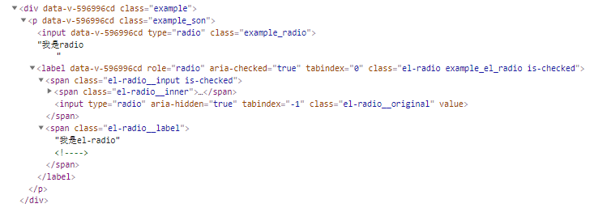

# [关于scoped与深度选择器的使用说明](https://github.com/danygitgit/document-library)

> create by **db** on **2020-5-12 01:23:06**  
> Recently revised in **2020-5-12 02:42:55**
>
> **闲时要有吃紧的心思，忙时要有悠闲的趣味**

<a name="chapter-menu" id="chapter-menu">目录</a>

- <a name="catalog-chapter-1" id="catalog-chapter-1"></a>[前言](#chapter-1)

- <a name="catalog-chapter-2" id="catalog-chapter-2"></a>[正文](#chapter-2)

- <a name="catalog-chapter3" id="catalog-chapter3"></a>[总结](#chapter3)

# <a name="chapter-1" id="chapter-1">前言</a>

&emsp;在 Vue 项目开发中，为了使组件样式私有化，从而不影响全局样式，我们通常会在 `<style></style>` 标签上添加 **scoped** 属性，以表示它只属于当下的模块。

&emsp;然而这样有时候会导致一些其他问题。比如我们经常会用到外部组件库，如 ElementUI。当使用 ElementUI 组件库中的某一个组件的时，我们可能会更改一些样式，通常的做法是用 CSS 覆盖；不过有时会碰到权重不够的问题，这个时候为我们就需要用到深度作用选择器—— **/deep/** 或者 **>>>**。

&emsp;在使用他们的时候，你有过了解其中的原理吗？

> [返回目录](#chapter-menu)

# <a name="chapter-2" id="chapter-2">正文</a>

## scoped 属性

### 什么是 scoped

&emsp;在 vue 文件中的 style 标签上，有一个特殊的属性：`scoped`。当一个 style 标签拥有 `scoped` 属性时，它的 CSS 样式就只能作用于当前的组件，也就是说，该样式只能适用于当前组件元素。通过该属性，可以使得组件之间的样式不互相污染。如果一个项目中的所有 style 标签全部加上了 scoped，相当于实现了样式的模块化。

### scoped 的实现原理

&emsp;vue 中的 scoped 属性的效果主要通过 `PostCSS` 转译实现。

如下是转译前的 vue 代码：

```HTML
<style scoped>
.example_son {
  color: red;
}
</style>

<template>
  <div class="example">
    <p class="example_son">
      <span class="example_grandson">
      hi
      </span>
    </p>
  </div>
</template>
```

转换结果：

```HTML
<style>
.example_son[data-v-596996cd] {
  color: red;
}
</style>

<template>
  <div class="example" data-v-596996cd>
    <p class="example_son" data-v-596996cd>
      <span class="example_grandson" data-v-596996cd>
      hi
      </span>
    </p>
  </div>p
</template>
```

&emsp;从上述代码我们可以看出：

- PostCSS 给一个组件中的所有 dom 添加了一个独一无二的动态属性，给 css 选择器额外添加一个对应的属性选择器，来选择组件中的 dom,这种做法使得样式只作用于含有该属性的 dom 元素(组件内部的 dom)。

&emsp;总结：scoped 的渲染规则：

1. 给当前组件下的所有 dom 节点添加一个不重复的 data 属性(例如: data-v-596996cd)来唯一标识这个 dom 元素

2. 在每句 css 选择器的末尾(编译后生成的 css 语句)加一个当前组件的 data 属性选择器(例如[data-v-596996cd])来私有化样式

**注：**
&emsp;PostCSS 是一个用 JavaScript 工具和插件转换 CSS 代码的工具，想要深入理解可以去[PostCSS 官网](https://www.postcss.com.cn/)或者[vue-loader](https://vue-loader-v14.vuejs.org/zh-cn/features/postcss.html)

### scoped 的问题

&emsp;scoped 看起来很好用，当时在 Vue 项目中，当我们引入第三方组件库时(如使用 ElementUI)，scoped 默认只会对组件的最外层（div）加入这个 [data-v-xxxx] 属性，但第二层开始就没有效果了。

如下是转译前的 vue 代码：

```HTML
<style scoped>
.example_son {
  color: red;
}
</style>

<template>
  <div class="example">
    <p class="example_son">
      <input class="example_radio" type="radio">我是radio
      <el-radio class="example_el_radio" >我是el-radio</el-radio>
    </p>
  </div>
</template>
```

转换结果：



如图所示： 第一层`<label>`还有 `data-v-596996cd`, 但第二层的`<span>`就没有了。

&emsp;所以，如果你期待通过如下方式修改 [el-radio__label] 的样式。是没有任何效果的：

```HTML
<style scoped>
.example_son .example_el_radio  .el-radio__label {
   color: yellow;
}
</style>
```

&emsp;这是因为，所有的 scoped 中的 css 最终编译出来都会变成这样：

```CSS
.example_son .example_el_radio  .el-radio__label[data-v-596996cd] {
  color: yellow!important;
}
```

&emsp;而这行样式只会去渲染含有`data-v-596996cd`属性且 class 名为`el-radio__label`的标签。

### scoped 的解决法案

1. 将 scoped 移除，或者新建一个没有 scoped 的 style（一个.vue 文件允许多个 style）

```HTML
<style>
.example_son .example_el_radio  .el-radio__label {
   color: yellow;
}
</style>
```

2. 深度作用选择器

&emsp;如果你希望 scoped 样式中的一个选择器能够作用得“更深”，例如影响子组件，你可以使用 `>>>` 操作符。

&emsp;下面我们就详细看一下深度作用选择器吧。

## 深度作用选择器

### >>>

&emsp;**>>>** 适用于`css`及`stylus`的样式穿透

1. 使用>>>和不使用的区别

如下是转译前的 vue 代码：

```HTML
<style scoped >
.example_son .el-radio__label {
  color: red;
}
>>>.example_son .el-radio__label {
  color: yellow;
}
</style>
```

转换结果：

```HTML
<style>
[data-v-596996cd] .example_son .el-radio__label { // 样式权重较大，第三方组件内起作用
  color: yellow;
}
.example_son .el-radio__label[data-v-596996cd] {  // 样式权重较小，第三方组件内不起作用
  color: red;
}
</style>
```

2. `>>>`使用位置的区别

如下是转译前的 vue 代码：

```HTML
<style scoped >
>>> .example_son .el-radio__label {
  color: yellow;
}
.example_son >>>.el-radio__label {
  color: red;
}
</style>
```

转换结果：

```HTML
<style>
.example_son[data-v-596996cd] .el-radio__label {
  color: red;
}
[data-v-596996cd] .example_son .el-radio__label {
    color: yellow;
}
</style>
```

&emsp;可以看出.在哪里加的`>>>` ,data 属性选择器就会跑到写的上一层去，权重来说是一样的，后面的样式会覆盖前面的样式。

### /deep/
&emsp;某些情况下>>>符号有可能无法正确解析,如Sass，可以替换为别名 **/deep/** 或 **::v-deep** 。

1. 在有多层嵌套的情况下，使用/deep/和不使用的区别

如下是转译前的 vue 代码：

```HTML
<style lang="scss" scoped >
.example {
  .example_son {
    color: red;
  }
}
/deep/.example {
  .example_son {
    color: yellow;
  }
}
</style>
```

转换结果：

```HTML
<style>

[data-v-596996cd].example .example_son {
  color: yellow;
}
.example .example_son[data-v-596996cd] {
  color: red;
}
</style>
```

&emsp;可以看出:在有多层嵌套的时候,不写/deep/的话选择器会将 data 属性加到最里面一层，写在最外层写/deep/的话选择器会将 data 属性会跑到写的上一层去，权重来说是一样的，后面的样式会覆盖前民的样式。

2. 在有多层嵌套的情况下，若写多个/deep/

如下是转译前的 vue 代码：

```HTML
<style lang="scss" scoped >
/deep/.example {
  /deep/.example_son {
    .el-radio__label {
      color: yellow;
    }
  }
}
</style>
```

转换结果：

```HTML
<style>
[data-v-596996cd].example /deep/.example_son .el-radio__label {
    color: yellow;
}
</style>
```

&emsp;可以看出: 多个/deep/的情况下,只有最外层的/deep/有效,内层的其他/deep/都是无效的,写了也没意义,不建议写。

# <a name="chapter3" id="chapter3">总结</a>

> [返回目录](#chapter-menu)
> 
&emsp;不经意间皆学问。希望在我们使用一些技术的同时，不止是要关心怎么用，更要多问几句为什么这样用，了解其中原理，才能让我们在技术的道路上走的越远。

&emsp;路漫漫其修远兮，与诸君共勉。

- **参考文献**：

1. [Vue Loader](https://vue-loader.vuejs.org/zh/guide/scoped-css.html#%E6%B7%B7%E7%94%A8%E6%9C%AC%E5%9C%B0%E5%92%8C%E5%85%A8%E5%B1%80%E6%A0%B7%E5%BC%8F)

2. [/deep/深度作用选择器作用及使用 | CSDN - 努力吧灰灰兔](https://blog.csdn.net/weixin_45842655/article/details/103547362)

3. [.vue 文件 加 scoped 样式不起作用 | CSDN - 努力吧灰灰兔](https://blog.csdn.net/weixin_45842655/article/details/103490900)

4. [Vue中的scoped的实现原理以及scoped穿透的用法（附代码）](https://www.php.cn/js-tutorial-407854.html)


**后记：Hello 小伙伴们，如果觉得本文还不错，记得点个赞或者给个 star，你们的赞和 star 是我编写更多更丰富文章的动力！[GitHub 地址](https://github.com/danygitgit/document-library)**

# 文档协议

> <a rel="license" href="http://creativecommons.org/licenses/by-nc-sa/4.0/"></a><br /><a xmlns:dct="http://purl.org/dc/terms/" property="dct:title">**db** 的文档库</a> 由 <a xmlns:cc="http://creativecommons.org/ns#" href="db" property="cc:attributionName" rel="cc:attributionURL">db</a> 采用 <a rel="license" href="http://creativecommons.org/licenses/by-nc-sa/4.0/">知识共享 署名-非商业性使用-相同方式共享 4.0 国际 许可协议</a>进行许可。<br />基于<a xmlns:dct="http://purl.org/dc/terms/" href="https://github.com/danygitgit" rel="dct:source">https://github.com/danygitgit</a>上的作品创作。<br />本许可协议授权之外的使用权限可以从 <a xmlns:cc="http://creativecommons.org/ns#" href="https://creativecommons.org/licenses/by-nc-sa/2.5/cn/" rel="cc:morePermissions">https://creativecommons.org/licenses/by-nc-sa/2.5/cn/</a> 处获得。
