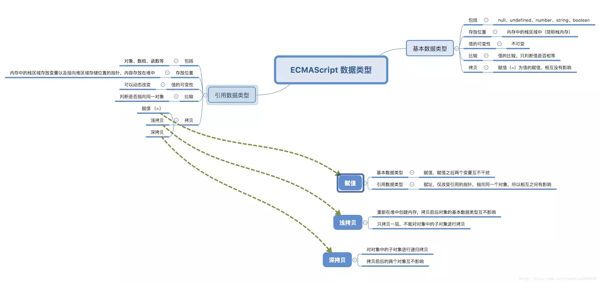

[面试系列（一）- 浅拷贝与深拷贝 | 掘金技术征文](https://github.com/danygitgit/document-library)
===
> create by **db** on **2020-3-26 19:35:50**   
> Recently revised in **2020-3-28 13:54:41**
> 
**闲时要有吃紧的心思，忙时要有悠闲的趣味**

<a name="chapter-menu" id="chapter-menu">目录</a>

- <a name="catalog-chapter-1" id="catalog-chapter-1"></a>[前言](#chapter-1)

- <a name="catalog-chapter-2" id="catalog-chapter-2"></a>[正文](#chapter-2)

  - <a name="catalog-chapter-2-1" id="catalog-chapter-2-1"></a>[一、ECMAScript 的数据类型](#chapter-2-1)
  - <a name="catalog-chapter-2-2" id="catalog-chapter-2-2"></a>[二、浅拷贝和深拷贝初探](#chapter-2-2)
  - <a name="catalog-chapter-2-3" id="catalog-chapter-2-3"></a>[三、浅拷贝的实现](#chapter-2-3)
    - [Object.assign()](#chapter-2-3-2) 
    - [Array.prototype.concat()](#chapter-2-3-3) 
    - [Array.prototype.slice()](#chapter-2-3-4) 
    - [...  展开运算符](#chapter-2-3-5)
    - [手写浅拷贝](#chapter-2-3-1)
  - <a name="catalog-chapter-2-4" id="catalog-chapter-2-4"></a>[四、 深拷贝的实现](#chapter-2-4) 
    - [JSON.parse(JSON.stringify())](#chapter-2-4-2) 
    - [函数库 Lodash](#chapter-2-4-3) 
    - [框架 jQuery](#chapter-2-4-4) 
    - [手写深拷贝](#chapter-2-4-1) 

- <a name="catalog-chapter3" id="catalog-chapter3"></a>[总结](#chapter3) 

# <a name="chapter-1" id="chapter-1">前言</a>

> [返回目录](#chapter-menu)

&emsp;白驹过隙，时光荏苒，转眼春暖花开。2020年注定让我们铭记！清明将至，新冠病毒的肆虐已接近尾声，复工复学潮即将到来。愿岁月静好，山河无恙！

&emsp;又到了一年的金三银四，想要换工作的同学自然不能错过。今年的你面试了吗，去了哪个厂？2020年春招正在进行中，不知道各位应（xin）届（si）生（ji）是否已经找到了自己心仪的公司。也不知道各位技术（lao）大（si）佬（ji）是否又弯道超车，成功跳槽。或者你想起了当年也是这样面试的自己，有过怎样的经历，是否还记得当年我们一起搜罗过的面试经验，刷过的题库？

&emsp;无论跳槽与否，居安思危，多备口罩（大雾……）——— 多个准备总是没错的。

&emsp;下面我们就开始准备我们的面试必考题之一 —— **浅拷贝与深拷贝**。

# <a name="chapter-2" id="chapter-2">正文</a>

&emsp;话不多说，祭图：



## <a name="chapter-2-1" id="chapter-2-1">一、ECMAScript 的数据类型
</a>

> [返回目录](#chapter-menu)


&emsp;`数据类型`是我们多数人学习JS得第一课，是拷贝操作最基本也是最重要的知识，让我们复习一下吧。

ECMAScript 的数据类型分为`值类型`和`引用数据类型`。

### 基本数据类型

&emsp;**基本数据类型(值类型)** 包括：字符串（`String`）、数字(`Number`)、布尔(`Boolean`)、对空（`Null`）、未定义（`Undefined`）、`Symbol`。

 > 基本类型存放在栈内存中的简单数据段，数据大小确定，内存空间大小可以分配，是直接按值存放的，所以可以直接访问。

### 引用数据类型

&emsp;**引用数据类型** 包括：对象(`Object`)、数组(`Array`)、函数(`Function`)等。

> 引用类型的值是对象，是存放在堆内存中的，变量实际上是一个存放在栈内存的指针，这个指针指向堆内存中的地址。每个空间大小不一样，要根据情况开进行特定的分配


### 传值与传址

&emsp;两种类型的先天不同决定了它们复制方式的不同。

`基本类型`的赋值是**传值**：从一个变量向另外一个新变量复制基本类型的值，会内存中新开辟一段栈内存，然后再把再将值赋值到新的栈中。

&emsp;所以说，基本类型的赋值的两个变量是两个**独立相互不影响**的变量。

```JS
let foo = 1;
let bar = foo;
console.log(foo === bar); // -> true

// 修改foo变量的值并不会影响bar变量的值
let foo = 233;
console.log(foo); // -> 233
console.log(bar); // -> 1
```
`引用类型`的赋值是**传址**：从一个变量向另一个新变量复制引用类型的值，其实复制的是指针，最终两个变量最终都指向同一个对象。

&emsp;所以说，引用类型的赋值的两个变量是两个**指向同一对象**的指针。

```JS
let foo = {
  name: 'leeper',
  age: 20
}
let bar = foo;
console.log(foo === bar); // -> true

// 改变foo变量的值会影响bar变量的值
foo.age = 19;
console.log(foo); // -> {name: 'leeper', age: 19}
console.log(bar); // -> {name: 'leeper', age: 19}
```

&emsp;总的来说，由于`基本数据类型`是直接存储的，所以如果我们对基本数据类型进行拷贝，然后修改新数据后，**不会影响到原数据**。

&emsp;而当你对`引用数据类型`进行拷贝，然后修改新数据后，它就会**影响到原数据**。

## <a name="chapter-2-2" id="chapter-2-2">二、浅拷贝和深拷贝初探</a>
> [返回目录](#chapter-menu)

&emsp;OK，了解 **基本数据类型和引用数据类型**的的区别之后，咱们进一步探索赋值、浅拷贝和深拷贝：

```js
var obj = {
  'name': 'zhangsan',
  'age': 18,
  'gender': 'man',
  'language': [1, [2, 3], [4, 5],[6, 7]],
};
/**
 * @name 赋值
 */
var obj1 = obj; // 直接赋值

/**
 * @name 浅拷贝
 */
var obj2 = shallowClone(obj); // shallowClone 待实现

/**
 * @name 深拷贝
 */
var obj3 = deepClone(obj); // deepClone 待实现

obj1.name = "张三";
obj2.age = "20岁";
obj3.gender = "男";

obj1.language[1] = ["二", "三"];
obj2.language[2] = ["四", "五"];
obj3.language[3] = ["六", "七"];

console.log(obj);

// obj = { 
//   "name": "张三", 
//   "age": 18, 
//   "gender": "man", 
//   "language": [1, ["二", "三"], ["四", "五"], [6, 7]] 
// }

console.log(obj1);

// obj1 = { 
//   "name": "张三", 
//   "age": 18, 
//   "gender": "man", 
//   "language": [1, ["二", "三"], ["四", "五"], [6, 7]] 
// }

console.log(obj2);

// obj2 = { 
//   "name": "zhangsan", 
//   "age": "20岁", 
//   "gender": "man", 
//   "language": [1, ["二", "三"], ["四", "五"], [6, 7]] 
// }

console.log(obj3);

// obj3 = { 
//   "name": "zhangsan", 
//   "age": 18, 
//   "gender": "男", 
//   "language": [1, [2, 3], [4, 5], ["六", "七"]] 
// }

```

如上，我们尝试给它们做个定义：

* **赋值**：引用地址的拷贝。修改赋值后的数据，不管是基本数据类型还是引用数据类型，都会影响到原数据。
* **浅拷贝**：一层拷贝。在浅拷贝中，修改基本数据类型不会影响原有数据的基本数据类型，修改引用数据类型会影响原有的数据类型。
* **深拷贝**：无限层级拷贝。在深拷贝中，修改基本数据类型和引用数据类型都不会影响原有的数据类型。

给它们做下对比，如下所示：

| | 和原数据是否指向同一对象 | 原数据为基本数据类型 | 原数据包含子对象 | 
| --- | --- | --- | --- |
| 赋值 | 是 | 改变【会】使原数据一同改变 | 改变【会】使原数据一同改变 |
| 浅拷贝 | 否 | 改变【不会】使原数据一同改变 | 改变【会】使原数据一同改变 |
| 深拷贝 | 否 | 改变【不会】使原数据一同改变 | 改变【不会】使原数据一同改变 |

## <a name="chapter-2-3" id="chapter-2-3">三、浅拷贝的实现</a>

**浅拷贝的目标**

&emsp;被复制对象的所有变量都含有与原来的对象相同的值，而所有的对其他对象的引用仍然指向原来的对象。即对象的浅拷贝会对`主对象`进行拷贝，但不会复制主对象里面的对象。`里面的对象`会在原来的对象和它的副本之间共享。

&emsp;我们首先介绍 3 种便捷形式，实现快速浅拷贝。

### <a name="chapter-2-3-2" id="chapter-2-3-2">Object.assign()</a>

> [返回目录](#chapter-menu)

`Object.assign()` 方法用于将所有可枚举的属性的值从一个或多个源对象复制到目标对象。它将返回目标对象。

-**语法**
> Object.assign(target, ...sources)

**参数**
> target // 目标对象

> ...sources // (多个)源对象

**返回值** 
> Object // 目标对象

&emsp;`Object.assign`方法用于对象的合并，将源对象（source）的所有可枚举属性，复制到目标对象（target）。如果目标对象中的属性具有相同的键，则属性将被源中的属性覆盖。后来的源的属性将类似地覆盖早先的属性。

&emsp;但是需要注意的是，`Object.assgin()` 进行的是浅拷贝，拷贝的是对象的属性的引用，而不是对象本身。

```js
const obj1 = {
  username: "豆包君",
  monthSalary : [100000,110000,110000],
  skill: {
    read: "《人类简史》",
    play: ["骑行", "徒步"],
  }
};

const obj2 = Object.assign({}, obj1); // 使用Object.assign拷贝对象

obj2.username = "db"; // 修改第一层基本类型
obj2.monthSalary = ["都是瞎B吹的！"]; // 修改第一层引用类型
obj2.skill.read = "computer book"; // 修改二层基本类型
obj2.skill.play = ["sleeping","eating"]; // 修改二层引用类型

console.log(obj1);
console.log(JSON.stringify(obj1));
// { 
//   username:"豆包君",
//   monthSalary:[100000,110000,110000],
//   skill:{
//     read:"computer book"
//     play:["sleeping","eating"],
//   } 
// }

console.log(obj2);
// { 
//   username:"db",
//   monthSalary:["都是瞎B吹的！"],
//   skill:{
//     read:"computer book"
//     play:["sleeping","eating"],
//   } 
// }

```

&emsp;通过对比可以看出，`Object.assign()` 对于第一层的数据来说，属于`传值`复制，并没有改变原对象的值；对于第二层及以上的数据来说，属于`传址`复制，改变原对象的值。

### <a name="chapter-2-3-3" id="chapter-2-3-3">Array.prototype.concat()</a>

> [返回目录](#chapter-menu)

&emsp;`concat()` 是数组的一个内置方法，用于合并两个或者多个数组。

&emsp;这个方法不会改变现有数组，而仅仅会返回新的被连接数组。

**语法**
> array1.concat(array2,array3,...,arrayX)

**参数**
> array2, array3, ..., arrayX	// 必需。该参数可以是具体的值，也可以是数组对象。可以是任意多个。

**返回值**
> Array	// 返回一个新的数组。该数组是通过把所有 arrayX 参数添加到 arrayObject 中生成的。如果要进行 concat() 操作的参数是数组，那么添加的是数组中的元素，而不是数组。

&emsp;在这里，我们通过 `concat()` 来浅拷贝一个数组：

```js
const arr1 = [
  1,
  {
    username: '豆包君',
  },
];

let arr2 = arr1.concat();
arr2[0] = 2;
arr2[1].username = 'db';
console.log(arr1);
// [ 1, { username: 'db' } ]
console.log(arr2);
// [ 2, { username: 'db' } ]
```

&emsp;看到这里，小伙伴们应该发现，通过 `concat()` 进行的浅拷贝，可以修改里面的基本数据类型而不影响原值，但是修改里面的引用数据类型，就会影响到原有值了。

### <a name="chapter-2-3-4" id="chapter-2-3-4">Array.prototype.slice()</a>

> [返回目录](#chapter-menu)

&emsp;`slice()` 也是数组的一个内置方法，该方法会可从已有的数组中返回选定的元素组成的数组。

&emsp;`slice()` 方法不会改变原始数组。

**语法**
> array.slice(start, end)

**参数**
> start	// 可选。规定从何处开始选取。如果是负数，那么它规定从数组尾部开始算起的位置。也就是说，-1 指最后一个元素，-2 指倒数第二个元素，以此类推。

> end	// 可选。规定从何处结束选取。该参数是数组片断结束处的数组下标。如果没有指定该参数，那么切分的数组包含从 start 到数组结束的所有元素。如果这个参数是负数，那么它规定的是从数组尾部开始算起的元素。

**返回值**
> Array // 返回一个新的数组，包含从 start 到 end （不包括该元素）的 arrayObject 中的元素。

```js
const arr1 = [
  1,
  {
    username: '豆包君',
  },
];

let arr2 = arr1.slice();
arr2[0] = 2;
arr2[1].username = 'db';
console.log(arr1);
// [ 1, { username: 'db' } ]
console.log(arr2);
// [ 2, { username: 'db' } ]
```

&emsp;可以看到的是，它和前面的 `concat()` 表现的浅拷贝一模一样，如果小伙伴希望研究更深层次的内容，可以看下 `Array.prototype.concat()` 和 `Array.prototype.slice()` 的源码具体实现。

### <a name="chapter-2-3-5" id="chapter-2-3-5">...  展开运算符</a>

> [返回目录](#chapter-menu)

&emsp;`...` 展开运算符是 ES6 中新提出来的一种运算符。在拷贝数组、对象以及拼接数组等方面都可以使用。

**语法**

- 函数调用：
> myFunction(...iterableObj);

- 字面量数组构造或字符串：

> [...iterableObj, '4', ...'hello', 6];

- 构造字面量对象时,进行克隆或者属性拷贝（ECMAScript 2018规范新增特性）：

> let objClone = { ...obj };

&emsp;我们也可以尝试下使用 `...` 进行浅拷贝。

```js
/**
 * @name ...obj拷贝数组
 */
const arr1 = [0,1,2,[0,1,2]];
const arr2 = [...arr1]; // like arr.slice()
arr2[0] = 10; 
arr2[3][0] = 100; 

console.log(arr1); // [0,1,2,[100,1,2]]
console.log(arr2); // [10,1,2,[100,1,2]]

/**
 * @name ...obj拷贝对象
 */
const obj1 = {
  name: '豆包君',
  arr1: ['1', '2', '3'],
  obj: {
    name: '豆包君',
    arr2: ['4', '5', '6'],
  },
};
const obj2 = {...obj1};
obj2.name = 'db';
obj2.arr1 = ['null'];
obj2.obj.name = 'db';
obj2.obj.arr2 = ['null'];

console.log(obj1);
// { name: '豆包君',
//   arr1: [ '1', '2', '3' ],
//   obj: { name: 'db', arr2: [ 'null' ] } }
console.log(obj2);
// { name: 'db',
//   arr1: [ 'null' ],
//   obj: { name: 'db', arr2: [ 'null' ] } }
```
### <a name="chapter-2-3-1" id="chapter-2-3-1">手写浅拷贝</a>

> [返回目录](#chapter-menu)

&emsp;现在，我们尝试 “手写” 一份浅拷贝：

```js
const shallowClone = (arr) => {
  const dst = [];
  for (let prop in arr) {
    if (arr.hasOwnProperty(prop)) {
        dst[prop] = arr[prop];
    }
  }
  return dst;
}

```

&emsp;这就是我们在 <a name="catalog-chapter-2-2" id="catalog-chapter-2-2"></a> [二、浅拷贝和深拷贝初探](#chapter-2-2) 中需要完成的`shallowClone`函数的实现了。

&emsp;至于上面代码为啥能浅拷贝数据？很简单,就是`遍历` + `赋值`

* `for...in`：遍历 `Object` 对象 `arr1`，将可枚举值列举出来。
* `hasOwnProperty()`：检查该枚举值是否属于该对象 `arr1`，如果是继承过来的就去掉，如果是自身的则进行拷贝。

这样，我们就成功实现了浅拷贝，并且了解了其中涉及的知识点~

## <a name="chapter-2-4" id="chapter-2-4">四、 深拷贝的实现</a>

### <a name="chapter-2-4-2" id="chapter-2-4-2">JSON.parse(JSON.stringify())</a>

> [返回目录](#chapter-menu)

关于深拷贝，首先要介绍的是史上最简单的深拷贝方式 ———— `JSON.parse(JSON.stringify())`。

#### JSON.stringify()

`JSON.stringify()` 方法用于将 JavaScript 值转换为 JSON 字符串。

**语法**
> JSON.stringify(value[, replacer[, space]])

**参数**
- `value` // 必需， 要转换的 JavaScript 值（通常为对象或数组）。

- `replacer` // 可选。用于转换结果的函数或数组。

  如果 replacer 为函数，则 JSON.stringify 将调用该函数，并传入每个成员的键和值。使用返回值而不是原始值。如果此函数返回 undefined，则排除成员。根对象的键是一个空字符串：""。

  如果 replacer 是一个数组，则仅转换该数组中具有键值的成员。成员的转换顺序与键在数组中的顺序一样。

- `space` // 可选，文本添加缩进、空格和换行符。
  
  如果 space 是一个数字，则返回值文本在每个级别缩进指定数目的空格，如果 space 大于 10，则文本缩进 10 个空格。space 也可以使用非数字，如：\t。

**返回值**
> String // 返回包含 JSON 文本的字符串。

#### JSON.parse()

`JSON.parse()` 方法用于将一个 JSON 字符串转换为对象。

**语法**

> JSON.parse(text[, reviver])

**参数**

- text // 必需， 一个有效的 JSON 字符串。
- reviver // 可选，一个转换结果的函数， 将为对象的每个成员调用此函数。

**返回值**：
> Object // 返回给定 JSON 字符串转换后的对象。

&emsp;通过 `JSON.parse(JSON.stringify())` 将 JavaScript 对象转序列化（转换成 JSON 字符串），再将其还原成 JavaScript 对象，一去一来我们就产生了一个新的对象，而且对象会开辟新的栈，从而实现深拷贝。

##### 该方法的局限性：  
> 1、不能存放函数或者 Undefined，否则会丢失函数或者 Undefined；  
> 2、不要存放时间对象，否则会变成字符串形式；  
> 3、不能存放 RegExp、Error 对象，否则会变成空对象；  
> 4、不能存放 NaN、Infinity、-Infinity，否则会变成 null；  
> 5、……更多请自行填坑，具体来说就是 JavaScript 和 JSON 存在差异，两者不兼容的就会出问题。

```js
const arr1 = [
  1,
  {
    username: '豆包君',
  },
];

let arr2 = JSON.parse(JSON.stringify(arr1));
arr2[0] = 2;
arr2[1].username = 'db';
console.log(arr1);
// [ 1, { username: '豆包君' } ]
console.log(arr2);
// [ 2, { username: 'db' } ]
```

### <a name="chapter-2-4-3" id="chapter-2-4-3">函数库 Lodash</a>

> [返回目录](#chapter-menu)

**备注**：选自 [浅拷贝和深拷贝（较为完整的探索）| 掘金-jsliang](https://juejin.im/post/5da7c76a6fb9a04ddc625014)

Lodash 作为一个深受大家喜爱的、优秀的 JavaScript 函数库/工具库，它里面有非常好用的封装好的功能，大家可以去试试：

* [Lodash](http://lodash.net/)

这里我们查看下它的 `cloneDeep()` 方法：

* [Lodash - _.cloneDeep(value)](https://lodash.net/docs/4.15.1.html#_clonedeepvalue)

可以看到，该方法会递归拷贝 `value`。

在这里，我们体验下它的 `cloneDeep()`：

```js
//  npm i -S lodash
var _ = require('lodash');

const obj1 = [
  1,
  'Hello!',
  { name: 'jsliang1' },
  [
    {
      name: 'LiangJunrong1',
    }
  ],
]
const obj2 = _.cloneDeep(obj1);
obj2[0] = 2;
obj2[1] = 'Hi!';
obj2[2].name = 'jsliang2';
obj2[3][0].name = 'LiangJunrong2';

console.log(obj1);
// [
//   1,
//   'Hello!',
//   { name: 'jsliang1' },
//   [
//     { name: 'LiangJunrong1' },
//   ],
// ]

console.log(obj2);
// [
//   2,
//   'Hi!',
//   { name: 'jsliang2' }, 
//   [
//     { name: 'LiangJunrong2' },
//   ],
// ]
```

这里我们使用的是 Node 安装其依赖包的形式，如果需要用 MDN 等，小伙伴可以前往它官网瞅瞅。（地址在本节开头）

### <a name="chapter-2-4-4" id="chapter-2-4-4">框架 jQuery</a>

> [返回目录](#chapter-menu)

**备注**：选自 [浅拷贝和深拷贝（较为完整的探索）| 掘金-jsliang](https://juejin.im/post/5da7c76a6fb9a04ddc625014)

当然，不可厚非你的公司还在用着 jQuery，可能还需要兼容 IE6/7/8，或者你使用 React，但是有些场景还使用了 jQuery，毕竟 jQuery 是个强大的框架。

下面我们尝试下使用 jQuery 的 `extend()` 进行深拷贝：

> index.html

```js
<!DOCTYPE html>
<html lang="en">
<head>
  <meta charset="UTF-8">
  <meta name="viewport" content="width=device-width, initial-scale=1.0">
  <meta http-equiv="X-UA-Compatible" content="ie=edge">
  <title>Document</title>
</head>
<body>
  <p>尝试 jQuery 深拷贝</p>
  <script src="https://cdn.bootcss.com/jquery/3.4.1/jquery.js"></script>
  <script>
    $(function() {
      const obj1 = [
        1,
        'Hello!',
        { name: 'jsliang1' },
        [
          {
            name: 'LiangJunrong1',
          }
        ],
      ]
      const obj2 = {};
      /**
       * @name jQuery深拷贝
       * @description $.extend(deep, target, object1, object2...)
       * @param {Boolean} deep 可选 true 或者 false，默认是 false，所以一般如果需要填写，最好是 true。
       * @param {Object} target 需要存放的位置
       * @param {Object} object 可以有 n 个原数据
       */
      $.extend(true, obj2, obj1);
      obj2[0] = 2;
      obj2[1] = 'Hi!';
      obj2[2].name = 'jsliang2';
      obj2[3][0].name = 'LiangJunrong2';

      console.log(obj1);
      // [
      //   1,
      //   'Hello!',
      //   { name: 'jsliang1' },
      //   [
      //     { name: 'LiangJunrong1'},
      //   ],
      // ];

      console.log(obj2);
      // [
      //   2,
      //   'Hi!',
      //   { name: 'jsliang2' },
      //   [
      //     { name: 'LiangJunrong2' },
      //   ],
      // ];
    });
  </script>
</body>
</html>
```

这里由于 Node 直接引用包好像没尝试成功，所以咱通过 `index.html` 的形式，引用了 jQuery 的 CDN 包，从而尝试了它的深拷贝。

> 推荐通过 `live-server` 来实时监控 HTML 文件的变化

> 如果需要查看 `jQuery.extend()` 源码可以观看文章：  
> [《深拷贝与浅拷贝的实现（一）》](http://www.alloyteam.com/2017/08/12978/)  
> [《JavaScript 浅拷贝和深拷贝》](https://www.kancloud.cn/ljw789478944/interview/397319)

> jQuery.extend 源码

```js
jQuery.extend = jQuery.fn.extend = function() {
  var options,
    name,
    src,
    copy,
    copyIsArray,
    clone,
    target = arguments[0] || {},
    i = 1,
    length = arguments.length,
    deep = false;

  // Handle a deep copy situation
  if (typeof target === "boolean") {
    deep = target;

    // Skip the boolean and the target
    target = arguments[i] || {};
    i++;
  }

  // Handle case when target is a string or something (possible in deep copy)
  if (typeof target !== "object" && !jQuery.isFunction(target)) {
    target = {};
  }

  // Extend jQuery itself if only one argument is passed
  if (i === length) {
    target = this;
    i--;
  }

  for (; i < length; i++) {
    // Only deal with non-null/undefined values
    if ((options = arguments[i]) != null) {
      // Extend the base object
      for (name in options) {
        src = target[name];
        copy = options[name];

        // Prevent never-ending loop
        if (target === copy) {
          continue;
        }

        // Recurse if we're merging plain objects or arrays
        if (
          deep &&
          copy &&
          (jQuery.isPlainObject(copy) || (copyIsArray = Array.isArray(copy)))
        ) {
          if (copyIsArray) {
            copyIsArray = false;
            clone = src && Array.isArray(src) ? src : [];
          } else {
            clone = src && jQuery.isPlainObject(src) ? src : {};
          }

          // Never move original objects, clone them
          target[name] = jQuery.extend(deep, clone, copy);

          // Don't bring in undefined values
        } else if (copy !== undefined) {
          target[name] = copy;
        }
      }
    }
  }
  // Return the modified object
  return target;
};
```
### <a name="chapter-2-4-1" id="chapter-2-4-1">手写深拷贝</a>

> [返回目录](#chapter-menu)

**备注**：选自 [浅拷贝和深拷贝（较为完整的探索）| 掘金-jsliang](https://juejin.im/post/5da7c76a6fb9a04ddc625014)

**---小节 1---**

那么，手写深拷贝的话，要怎么实现呢？其实深拷贝的问题其实可以分解成两个问题，浅拷贝+递归。

我们尝试稍微修改下前面的浅拷贝代码：

```js
const deepClone = (source) => {
  const target = {};
  for (const i in source) {
    if (source.hasOwnProperty(i)
      && typeof target[i] === 'object') {
      target[i] = deepClone(source[i]); // 注意这里
    } else {
      target[i] = source[i];
    }
  }
  return target;
};
```

当然，这份代码是存在问题的：

1. 没有对参数进行校验，如果传入进来的不是对象或者数组，我们直接返回即可。
2. 通过 `typeof` 判断是否对象的逻辑不够严谨。

---

**---小节 2---**

既然存在问题，那么我们就需要尝试克服：

```js
// 定义检测数据类型的功能函数
const checkedType = (target) => {
  return Object.prototype.toString.call(target).slice(8, -1);
}

// 实现深度克隆对象或者数组
const deepClone = (target) => {
  // 判断拷贝的数据类型
  // 初始化变量 result 成为最终数据
  let result, targetType = checkedType(target);
  if (targetType === 'Object') {
    result = {};
  } else if (targetType === 'Array') {
    result = [];
  } else {
    return target;
  }

  // 遍历目标数据
  for (let i in target) {
    // 获取遍历数据结构的每一项值
    let value = target[i];
    // 判断目标结构里的每一项值是否存在对象或者数组
    if (checkedType(value) === 'Object' || checkedType(value) === 'Array') {
      // 如果对象或者数组中还嵌套了对象或者数组，那么继续遍历
      result[i] = deepClone(value);
    } else {
      result[i] = value;
    }
  }

  // 返回最终值
  return result;
}

const obj1 = [
  1,
  'Hello!',
  { name: 'jsliang1' },
  [
    {
      name: 'LiangJunrong1',
    }
  ],
]
const obj2 = deepClone(obj1);
obj2[0] = 2;
obj2[1] = 'Hi!';
obj2[2].name = 'jsliang2';
obj2[3][0].name = 'LiangJunrong2';

console.log(obj1);
// [
//   1,
//   'Hello!',
//   { name: 'jsliang1' },
//   [
//     { name: 'LiangJunrong1' },
//   ],
// ]

console.log(obj2);
// [
//   2,
//   'Hi!',
//   { name: 'jsliang2' },
//   [
//     { name: 'LiangJunrong2' },
//   ],
// ]
```

下面讲解下这份深拷贝代码：

**首先**，我们先看检查类型的那行代码：`Object.prototype.toString.call(target).slice(8, -1)`。

在说这行代码之前，我们先对比下检测 JavaScript 数据类型的 4 种方式：

* **方式一：typeof**：无法判断 `null` 或者 `new String()` 等数据类型。
* **方式二：instanceof**：无法判断 `'jsliang'`、`123` 等数据类型。
* **方式三：constructor**：判断 `null` 和 `undefined` 会直接报错。
* **方式四：Object.prototype.toString.call()**：稳健地判断 JavaScript 数据类型方式，可以符合预期的判断基本数据类型 String、Undefined 等，也可以判断 Array、Object 这些引用数据类型。

详细研究可以看 **jsliang** 的学习文档：

* [《判断数据类型 - 汇总》](https://github.com/LiangJunrong/document-library/blob/master/JavaScript-library/JavaScript/%E8%A1%A8%E8%BE%BE%E5%BC%8F%E5%92%8C%E8%BF%90%E7%AE%97%E7%AC%A6/%E5%88%A4%E6%96%AD%E6%95%B0%E6%8D%AE%E7%B1%BB%E5%9E%8B/README.md)
* [《判断数据类型 - typeof》](https://github.com/LiangJunrong/document-library/blob/master/JavaScript-library/JavaScript/%E8%A1%A8%E8%BE%BE%E5%BC%8F%E5%92%8C%E8%BF%90%E7%AE%97%E7%AC%A6/%E5%88%A4%E6%96%AD%E6%95%B0%E6%8D%AE%E7%B1%BB%E5%9E%8B/%E5%88%A4%E6%96%AD%E6%95%B0%E6%8D%AE%E7%B1%BB%E5%9E%8B-typeof.md)
* [《判断数据类型 - instanceof》](https://github.com/LiangJunrong/document-library/blob/master/JavaScript-library/JavaScript/%E8%A1%A8%E8%BE%BE%E5%BC%8F%E5%92%8C%E8%BF%90%E7%AE%97%E7%AC%A6/%E5%88%A4%E6%96%AD%E6%95%B0%E6%8D%AE%E7%B1%BB%E5%9E%8B/%E5%88%A4%E6%96%AD%E6%95%B0%E6%8D%AE%E7%B1%BB%E5%9E%8B-instanceof.md)
* [《判断数据类型 - constructor》](https://github.com/LiangJunrong/document-library/blob/master/JavaScript-library/JavaScript/%E8%A1%A8%E8%BE%BE%E5%BC%8F%E5%92%8C%E8%BF%90%E7%AE%97%E7%AC%A6/%E5%88%A4%E6%96%AD%E6%95%B0%E6%8D%AE%E7%B1%BB%E5%9E%8B/%E5%88%A4%E6%96%AD%E6%95%B0%E6%8D%AE%E7%B1%BB%E5%9E%8B-constructor.md)
* [《判断数据类型 - toString》](https://github.com/LiangJunrong/document-library/blob/master/JavaScript-library/JavaScript/%E8%A1%A8%E8%BE%BE%E5%BC%8F%E5%92%8C%E8%BF%90%E7%AE%97%E7%AC%A6/%E5%88%A4%E6%96%AD%E6%95%B0%E6%8D%AE%E7%B1%BB%E5%9E%8B/%E5%88%A4%E6%96%AD%E6%95%B0%E6%8D%AE%E7%B1%BB%E5%9E%8B-toString.md)

**然后**，我们通过方法 `targetType()` 中的 `Object.prototype.toString.call()`，判断传入的数据类型属于那种，从而改变 `result` 的值为 `{}`、`[]` 或者直接返回传入的值（`return target`）。

**最后**，我们再通过 `for...in` 判断 `target` 的所有元素，如果属于 `{}` 或者 `[]`，那么就递归再进行 `clone()` 操作；如果是基本数据类型，则直接传递到数组中……从而在最后返回一个深拷贝的数据。

---

**---小节 3---**

以上，我们的代码看似没问题了是不是？假设我们需要拷贝的数据如下：

```js
const obj1 = {};
obj1.a = obj1;
console.log(deepClone(obj1));
// RangeError: Maximum call stack size exceeded
```

看，我们直接研制了个死循环出来！

那么我们需要怎么解决呢？有待实现！

> 乘我还没找到教好的解决方案之前，小伙伴们可以看下下面文章，思考下是否能解决这个问题：

* [什么是 js 深拷贝和浅拷贝及其实现方式](https://www.haorooms.com/post/js_copy_sq)
* [JavaScript 浅拷贝和深拷贝](https://www.kancloud.cn/ljw789478944/interview/397319)
* [面试题之如何实现一个深拷贝 - 木易杨](https://www.muyiy.cn/blog/4/4.3.html#%E5%BC%95%E8%A8%80)

……好的，虽然口头说着希望小伙伴们自行翻阅资料，但是为了防止被寄刀片，**jsliang** 还是在这里写下自己觉得 OK 的代码：

```js
function isObject(obj) {
  return Object.prototype.toString.call(obj) === '[object Object]';
}

function deepClone(source, hash = new WeakMap()) {
  if (!isObject(source)) return source;
  // 新增代码，查哈希表
  if (hash.has(source)) return hash.get(source);

  var target = Array.isArray(source) ? [] : {};
  // 新增代码，哈希表设值
  hash.set(source, target);

  for (var key in source) {
    if (Object.prototype.hasOwnProperty.call(source, key)) {
      if (isObject(source[key])) {
        // 新增代码，传入哈希表
        target[key] = deepClone(source[key], hash);
      } else {
        target[key] = source[key];
      }
    }
  }
  return target;
}

/**
 * @name 正常深拷贝测试
 */
const a = {
  name: 'jsliang',
  book: {
    title: '深拷贝学习',
    price: 'free',
  },
  a1: undefined,
  a2: null,
  a3: 123
};
const b = deepClone(a);
b.name = 'JavaScriptLiang';
b.book.title = '教你如何泡妞';
b.a3 = 456;
console.log(a);
// { name: 'jsliang',
//   book: { title: '深拷贝学习', price: 'free' },
//   a1: undefined,
//   a2: null,
//   a3: 123 }
console.log(b);
// { name: 'JavaScriptLiang',
//   book: { title: '教你如何泡妞', price: 'free' },
//   a1: undefined,
//   a2: null,
//   a3: 456 }

/**
 * @name 解决死循环
 */
const c = {};
c.test = c;
const d = deepClone(c);
console.log(c);
// { test: [Circular] }
console.log(d);
// { test: [Circular] }
```

---

**---小节 4---**

既然搞定完死循环，咱们再看看另一个问题：

```js
const checkedType = (target) => {
  return Object.prototype.toString.call(target).slice(8, -1);
}

const deepClone = (target) => {
  let result, targetType = checkedType(target);
  if (targetType === 'Object') {
    result = {};
  } else if (targetType === 'Array') {
    result = [];
  } else {
    return target;
  }

  for (let i in target) {
    let value = target[i];
    if (checkedType(value) === 'Object' || checkedType(value) === 'Array') {
      result[i] = deepClone(value);
    } else {
      result[i] = value;
    }
  }

  return result;
}

// 检测深度和广度
const createData = (deep, breadth) => {
  const data = {};
  let temp = data;

  for (let i = 0; i < deep; i++) {
    temp = temp['data'] = {};
    for (let j = 0; j < breadth; j++) {
      temp[j] = j;
    }
  }

  return data;
};

console.log(createData(1, 3)); 
// 1 层深度，每层有 3 个数据 { data: { '0': 0, '1': 1, '2': 2 } }

console.log(createData(3, 0));
// 3 层深度，每层有 0 个数据 { data: { data: { data: {} } } }

console.log(deepClone(createData(1000)));
// 1000 层深度，无压力 { data: { data: { data: [Object] } } }

console.log(deepClone(createData(10, 100000)));
// 100000 层广度，没问题，数据遍历需要时间

console.log(deepClone(createData(10000)));
// 10000 层深度，直接爆栈：Maximum call stack size exceeded
```

是的，你的深拷贝爆栈了！！！

虽然业务场景中可能爆栈的概率比较少，毕竟数据层级没那么多，但是还是会存在这种情况，需要怎么处理呢？

> 只想大致了解深拷贝可能出现问题的小伙伴可以跳过下面内容

举个例子，假设有数据结构：

```js
const a = {
  a1: 1,
  a2: {
    b1: 1,
    b2: {
      c1: 1
    }
  }
};
```

如果我们将其当成树来看：

```js
    a
  /   \
 a1   a2        
 |    / \         
 1   b1 b2     
     |   |        
     1  c1
         |
         1
```

那么，我们就可以采用迭代的方法，循环遍历这棵树了！

1. 首先，我们需要借助栈。当栈为空就遍历完毕，栈里面存储下一个需要拷贝的节点
2. 然后，往栈里放入种子数据，`key` 用来存储哪一个父元素的那一个子元素拷贝对象
3. 最后，遍历当前节点下的子元素，如果是对象就放到栈里，否则直接拷贝。

```js
const deepClone = (x) => {
  const root = {};

  // 栈
  const loopList = [
    {
      parent: root,
      key: undefined,
      data: x
    }
  ];

  while (loopList.length) {
    // 深度优先
    const node = loopList.pop();
    const parent = node.parent;
    const key = node.key;
    const data = node.data;

    // 初始化赋值目标，key 为 undefined 则拷贝到父元素，否则拷贝到子元素
    let res = parent;
    if (typeof key !== "undefined") {
      res = parent[key] = {};
    }

    for (let k in data) {
      if (data.hasOwnProperty(k)) {
        if (typeof data[k] === "object") {
          // 下一次循环
          loopList.push({
            parent: res,
            key: k,
            data: data[k]
          });
        } else {
          res[k] = data[k];
        }
      }
    }
  }

  return root;
}
```

这时候我们再通过 `createData` 进行广度和深度校验，会发现：

```js
console.log(deepClone(createData(10, 100000)));
// 100000 层广度，没问题，数据遍历需要时间

console.log(deepClone(createData(100000)));
// 100000 层深度，也没问题了：{ data: { data: { data: [Object] } } }
```

这样，我们就解决了爆栈的问题。

> 这里推荐下引用思路来源于大佬的文章：[深拷贝的终极探索](https://yanhaijing.com/javascript/2018/10/10/clone-deep/)，然后它附带了一个深拷贝库：[@jsmini/clone](https://github.com/jsmini/clone)，感兴趣的小伙伴可以去看看。


# <a name="chapter3" id="chapter3">总结</a>

> [返回目录](#chapter-menu)

&emsp;浅拷贝与深拷贝，无论在日常工作还是面试准备中都是避免不了的知识点，虽然不必将其中的所有方法和原理全部记住，但是知其然也要知其所以然。要是面试官忽然让你手写深拷贝也不至于太尴尬不是……

&emsp;另外，尺有所短寸有所长，无关乎好坏优劣，其实每种方法都有自己的优缺点，和适用场景，人尽其才，物尽其用，方是真理。

<!-- 下面对各种方法进行对比，希望给大家提供一些帮助

clone	cloneJSON	cloneLoop	cloneForce
难度	☆☆	☆	☆☆☆	☆☆☆☆
兼容性	ie6	ie8	ie6	ie6
循环引用	一层	不支持	一层	支持
栈溢出	会	会	不会	不会
保持引用	否	否	否	是
适合场景	一般数据拷贝	一般数据拷贝	层级很多	保持引用关系 -->

* **参考文献**：

1. [Lodash clone 系列](https://lodash.net/docs/4.16.1.html#_clonevalue)
2. [浅拷贝与深拷贝](https://juejin.im/post/5b5dcf8351882519790c9a2e)
3. [深拷贝的终极探索](https://yanhaijing.com/javascript/2018/10/10/clone-deep/)
4. [深拷贝与浅拷贝的实现（一）](http://www.alloyteam.com/2017/08/12978/)
5. [深入浅出深拷贝与浅拷贝](https://juejin.im/post/5c6ffac85188252e46626b92)
6. [什么是 js 深拷贝和浅拷贝及其实现方式](https://www.haorooms.com/post/js_copy_sq)
7. [JavaScript 浅拷贝和深拷贝](https://www.kancloud.cn/ljw789478944/interview/397319)
8. [js 深拷贝 vs 浅拷贝](https://juejin.im/post/59ac1c4ef265da248e75892b)
9. [深拷贝的终极探索（99%的人都不知道）](https://segmentfault.com/a/1190000016672263)
10. [面试题之如何实现一个深拷贝](https://www.muyiy.cn/blog/4/4.3.html#引言)
11. [浅拷贝和深拷贝（较为完整的探索）](https://juejin.im/post/5da7c76a6fb9a04ddc625014)


 
**后记：Hello 小伙伴们，如果觉得本文还不错，记得点个赞或者给个 star，你们的赞和 star 是我编写更多更丰富文章的动力！[GitHub 地址](https://github.com/danygitgit/document-library)**

# 文档协议 
> <a rel="license" href="http://creativecommons.org/licenses/by-nc-sa/4.0/"></a><br /><a xmlns:dct="http://purl.org/dc/terms/" property="dct:title">**db** 的文档库</a> 由 <a xmlns:cc="http://creativecommons.org/ns#" href="db" property="cc:attributionName" rel="cc:attributionURL">db</a> 采用 <a rel="license" href="http://creativecommons.org/licenses/by-nc-sa/4.0/">知识共享 署名-非商业性使用-相同方式共享 4.0 国际 许可协议</a>进行许可。<br />基于<a xmlns:dct="http://purl.org/dc/terms/" href="https://github.com/danygitgit" rel="dct:source">https://github.com/danygitgit</a>上的作品创作。<br />本许可协议授权之外的使用权限可以从 <a xmlns:cc="http://creativecommons.org/ns#" href="https://creativecommons.org/licenses/by-nc-sa/2.5/cn/" rel="cc:morePermissions">https://creativecommons.org/licenses/by-nc-sa/2.5/cn/</a> 处获得。

